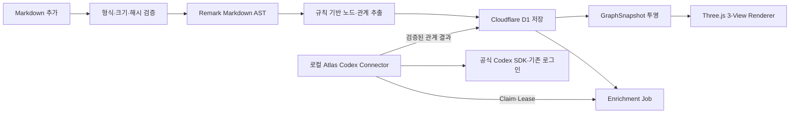

# AI Systems Atlas

Markdown 문서를 규칙 기반으로 파싱해 노드·관계를 만들고, 발광형 Three.js 지식 그래프에서 세 가지 관점으로 탐색하는 웹앱입니다.

외부 LightRAG 서버나 OpenAI API 키 없이 기본 인덱싱이 동작합니다. 선택형 Atlas Codex Connector는 로컬 `codex login` 상태를 사용해 문서 근거 기반 관계를 비동기로 보강합니다.

## 주요 화면

### `/` — 지식 그래프

- `별자리`: 기존 Force 3D 그래프를 유지하는 기본 보기
- `성운`: 지식 분야별 클러스터와 클러스터 사이 브리지 보기
- `궤도`: 선택 노드를 중심으로 1-hop과 2-hop 관계 보기
- `기본`, `브라이트`, `초신성` 발광 프리셋
- 필터, 검색, 상세 패널, 자동 회전, 라벨, 카메라 조작
- `V` 키로 보기 순환
- 공유 가능한 URL: `/?view=orbit&node=...`

### `/dashboard` — Atlas Control Room

- `.md`, `.mdx` 파일 추가
- 파일별 처리 상태, 노드·관계 수, 갱신 시각 확인
- 동일 파일 SHA-256 비교와 `unchanged` 처리
- 재인덱싱과 삭제
- 최근 처리 기록과 저장소 상태 확인
- `보강 대기·실행·완료·경고·실패` 상태와 Connector 온라인 여부 확인
- 실패·경고 작업은 최대 2회 수동 재시도, 대기·실행 작업은 취소

## 처리 구조



### 규칙 기반 추출

- 문서 루트와 제목 계층
- Markdown 링크
- 인라인 코드
- `기능:`, `모듈:`, `의존성:`, `결정:`, `위험:`, `도구:`, `개념:` 패턴
- 모든 기본 인덱싱은 외부 LLM 없이 완료

## 로컬 실행

```bash
npm install
npm run dev
```

- 그래프: `http://localhost:3000/`
- 대시보드: `http://localhost:3000/dashboard`

D1 스키마는 첫 저장소 접근 시 자동 생성됩니다. 정식 마이그레이션 SQL은 `drizzle/0001_atlas_documents.sql`, `drizzle/0002_codex_enrichment.sql`, `drizzle/0003_connector_dashboard.sql`에 있습니다.

다른 터미널에서 기존 ChatGPT/Codex 로그인을 사용하는 Connector를 실행합니다. OpenAI API 키는 사용하지 않습니다.

```bash
codex login status
npm run connector:start
```

한 작업만 처리하고 종료하려면 `npm run connector:once`, 실제 Codex 구조화 호출만 점검하려면 `npm run connector:smoke`를 사용합니다.

## 환경 변수

기본 실행에는 환경 변수가 필요하지 않습니다.

그래프와 대시보드 읽기는 공개로 두고 문서 추가·삭제·재인덱싱만 OAuth 프록시 뒤에 둘 때 다음 값을 사용합니다.

```bash
ATLAS_WRITE_ACCESS=authenticated
```

이 모드는 신뢰 가능한 프록시가 클라이언트가 보낸 사용자 식별 헤더를 제거한 뒤 `oai-authenticated-user-id`, `x-openai-user-id`, `cf-access-authenticated-user-email` 중 하나를 주입하는 환경에서만 활성화해야 합니다. 로컬 데모 기본값은 `public`입니다.

로컬 `localhost` 개발은 Connector 토큰 없이 동작합니다. 호스팅에서는 웹앱과 Connector에 같은 고엔트로피 애플리케이션 토큰을 설정해야 합니다.

```bash
ATLAS_CONNECTOR_TOKEN=
ATLAS_BASE_URL=http://localhost:3000
```

`ATLAS_CONNECTOR_TOKEN`은 OpenAI 키가 아니라 Atlas 작업 API만 보호하는 애플리케이션 자격증명입니다. Codex 로그인 토큰은 로컬 Connector 밖으로 전달되지 않고 브라우저·D1·웹앱 환경 변수에도 저장되지 않습니다. Connector는 OpenAI 키 환경 변수를 제거한 자식 환경에서 공식 SDK를 실행합니다.

## API

| Method | 경로 | 역할 |
|---|---|---|
| `GET` | `/api/graph` | 현재 그래프 snapshot |
| `GET` | `/api/documents` | 문서·작업·통계 목록 |
| `POST` | `/api/documents` | Markdown 추가·인덱싱 |
| `DELETE` | `/api/documents/:id` | 문서와 자동 그래프 데이터 삭제 |
| `POST` | `/api/documents/:id/reindex` | 저장 원문 재인덱싱 |
| `GET` | `/api/ingestion-jobs/:id` | 작업 상태 조회 |
| `POST` | `/api/enrichment-jobs/claim` | Connector가 작업 한 개 Claim |
| `POST` | `/api/enrichment-jobs/:id/start` | 작업 실행 시작 |
| `POST` | `/api/enrichment-jobs/:id/lease` | Lease 갱신 |
| `POST` | `/api/enrichment-jobs/:id/result` | 검증할 구조화 결과 제출 |
| `POST` | `/api/enrichment-jobs/:id/fail` | 제한된 실패·재시도 보고 |
| `POST` | `/api/enrichment-jobs/:id/cancel` | 사용자 작업 취소 |
| `POST` | `/api/enrichment-jobs/:id/retry` | 실패·경고 작업 수동 재시도(최대 2회) |
| `POST` | `/api/enrichment-jobs/heartbeat` | Connector 온라인·오프라인 신호 기록 |

## 핵심 파일

| 역할 | 파일 |
|---|---|
| 그래프 UI·Three.js 렌더러 | `app/knowledge-graph.tsx` |
| 그래프 레이아웃 전략 | `app/graph/layouts.ts` |
| 대시보드 | `app/dashboard/` |
| Markdown AST 파서 | `app/lib/markdown/parse-markdown.ts` |
| 규칙 추출기 | `app/lib/markdown/extract-graph.ts` |
| 문서 처리 서비스 | `app/lib/ingestion/ingestion-service.ts` |
| D1·메모리 저장소 | `app/lib/storage/graph-repository.ts` |
| 보강 작업 저장소 | `app/lib/storage/enrichment-job-repository.ts` |
| 결과 검증기 | `app/lib/llm/enrichment-result-validator.ts` |
| 로컬 Codex Connector | `connector/` |
| Drizzle 스키마 | `db/schema.ts` |
| D1 SQL | `drizzle/0001_atlas_documents.sql`, `drizzle/0002_codex_enrichment.sql`, `drizzle/0003_connector_dashboard.sql` |

## 검증

```bash
npx tsc --noEmit
npm run lint
npm test
```

`npm test`는 프로덕션·Connector 빌드 후 그래프, 대시보드, Markdown API, 작업 API, Lease 상태 전이, 결과 병합과 Connector 순차 실행을 확인합니다.

성능 HUD와 500 노드·2,000 관계 로컬 fixture는 개발 서버에서 다음 주소로 확인합니다.

```text
http://localhost:3000/?fixture=500x2000&perf=1
```

운영 OAuth 프록시가 공개 읽기·미인증 쓰기·위조 식별 헤더 정책을 지키는지는 staging 주소에서 검증합니다.

```bash
npm run verify:oauth -- --base-url=https://staging.example.com
```

## 배포

구현과 로컬 검증만 수행합니다. 별도 사용자 승인 전에는 배포하지 않습니다.
