<div align="center">

# ✦ AI Systems Atlas

### Markdown을 살아 있는 관계형 지식 우주로

문서 구조와 근거를 파싱해 노드·관계를 만들고, 빛나는 Three.js 그래프에서 지식을 탐색하는 로컬 우선 Knowledge Graph 웹앱입니다.

[](https://github.com/coreline-ai/memory_node_graph)
[](https://nextjs.org/)
[](https://react.dev/)
[](https://www.typescriptlang.org/)
[](https://threejs.org/)
[](https://developers.cloudflare.com/d1/)

[](#-데이터-기준선)
[](#-데이터-기준선)
[](#-데이터-기준선)
[](#-oauth와-api-경계)
[](#-검증)
[](https://github.com/coreline-ai/memory_node_graph/commits/main)

[빠른 시작](#-빠른-시작) · [화면 갤러리](#-화면-갤러리) · [처리 구조](#-처리-구조) · [대시보드](#-atlas-control-room) · [문서](#-관련-문서)

</div>

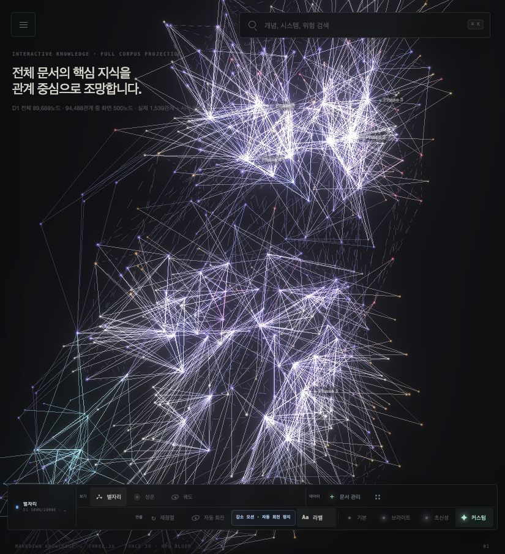

> [!IMPORTANT]
> **OpenAI API와 API Key를 사용하지 않습니다.** 기본 그래프는 Markdown AST와 규칙 추출만으로 완성됩니다. 현재 릴리스의 선택형 Codex 보강은 공식 `@openai/codex-sdk`와 기존 `codex login` OAuth 세션을 사용하는 로컬 Connector 방식입니다.

> [!NOTE]
> 승인된 다음 구조는 동일한 OAuth·검증 계약을 웹앱과 함께 실행되는 **통합 OAuth 런타임**으로 이전하여 수동 `npm run connector:start`, heartbeat, `NO SIGNAL` UI를 제거하는 것입니다. 기준 문서는 [현재 OAuth 런타임 방향](./docs/current-oauth-runtime.md)과 [최신 개발 계획](./dev-plan/implement_20260807_203534.md)입니다.

## 🌌 프로젝트 개요

AI Systems Atlas는 `README.md`, `dev-plan/**/*.md`, 수동 업로드 `.md/.mdx`를 다음과 같이 처리합니다.

1. Markdown을 Remark AST로 파싱합니다.
2. 문서·섹션·개념·Phase·Task·기술 노드를 추출합니다.
3. 구조·명시·추론 관계와 source block evidence를 분리합니다.
4. Cloudflare D1에 문서 단위 또는 저장소 단위로 원자 저장합니다.
5. 관계 중심 500노드·최대 2,000선 snapshot으로 브라우저에 투영합니다.
6. 사용자는 별자리·성운·궤도 보기에서 검색·필터·확대·이동·노드 관계 탐색을 수행합니다.

### 핵심 특징

- ✨ **GPU 발광 그래프** — Three.js 점광·후광·관계선·배경 입자 렌더링
- 🧭 **3가지 관점** — 별자리, 성운, 선택 노드 중심 궤도
- 🧠 **Markdown 지식 추출** — README와 개발 계획 전용 parser profile
- 🔗 **근거 관계** — commit·path·line이 고정된 GitHub source evidence
- 🧬 **관계 계층** — 구조, 명시, 추론, 비저장 화면 연결을 시각적으로 구분
- 🔭 **다중 Scope** — 전체 corpus, 저장소 overview, 단일 repository, Gold/max showcase
- 🎛️ **발광 제어** — 기본·브라이트·초신성·커스텀 프리셋
- 📚 **문서 관제실** — 업로드·재인덱싱·삭제·GitHub 동기화·작업 상태
- 🛡️ **안전한 기본값** — LLM/OAuth가 없어도 규칙 기반 그래프 정상 동작
- 🔍 **Graph RAG 검색** — FTS, 1/2-hop 확장, 관계 confidence, 인용 근거 반환

## 🖼️ 화면 갤러리

모든 이미지는 현재 로컬 D1과 실제 UI를 직접 캡처한 화면입니다. 그래프 6종은 과노출을 줄이기 위해 캡처 가능한 최저 발광값(`전체 50 · 관계선 20 · 후광 0 · 배경 입자 0`)으로 다시 촬영했습니다. 전체 캡처 목록과 재촬영 기준은 [스크린샷 카탈로그](./docs/screenshots/README.md)에 있습니다.

### 전체 지식 우주

<table>
  <tr>
    <td width="50%" align="center">
      
      <br /><strong>별자리 · 전체 Corpus</strong><br />89,669개 고유 엔티티에서 관계 중심 500노드 투영
    </td>
    <td width="50%" align="center">
      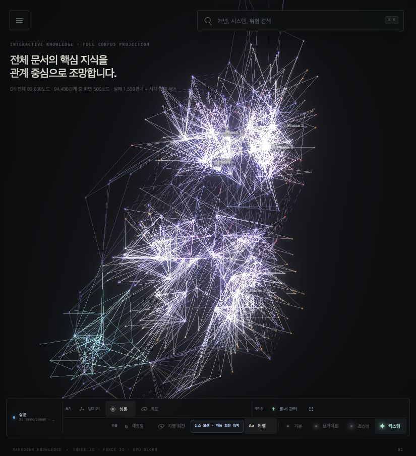
      <br /><strong>성운 · Knowledge Communities</strong><br />분야별 커뮤니티와 브리지 구조
    </td>
  </tr>
</table>

### 관계 탐색과 저장소 Scope

<table>
  <tr>
    <td width="50%" align="center">
      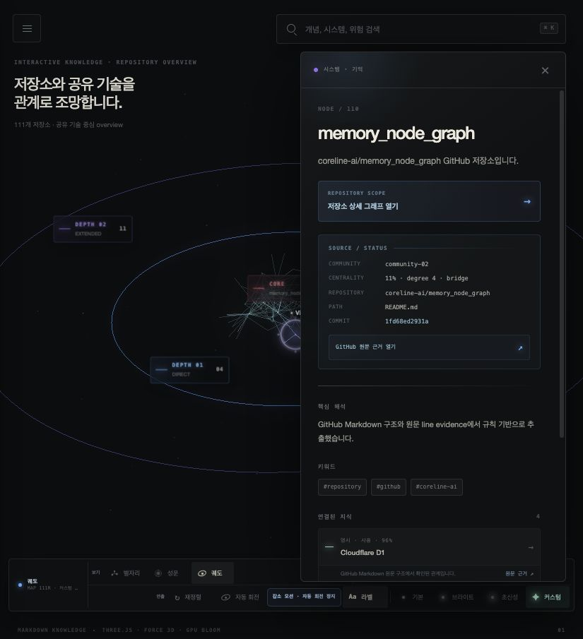
      <br /><strong>궤도 · Node Focus</strong><br />선택 노드의 CORE, 1-hop, 2-hop 관계와 원문 근거
    </td>
    <td width="50%" align="center">
      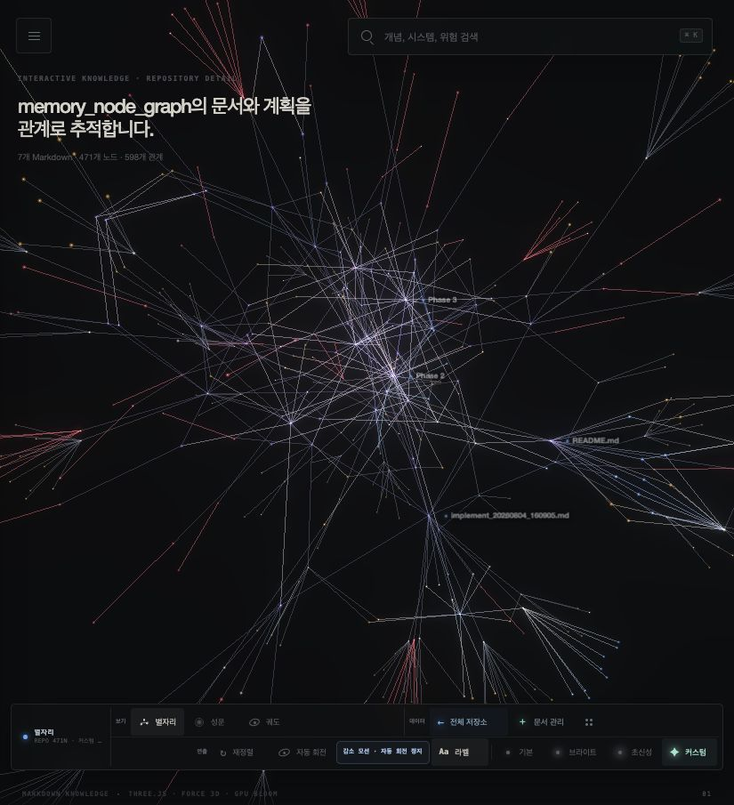
      <br /><strong>Repository Graph</strong><br />README·개발 계획·Phase·Task 상세 그래프
    </td>
  </tr>
</table>

### 검토용 데이터와 최대 밀도 연출

<table>
  <tr>
    <td width="50%" align="center">
      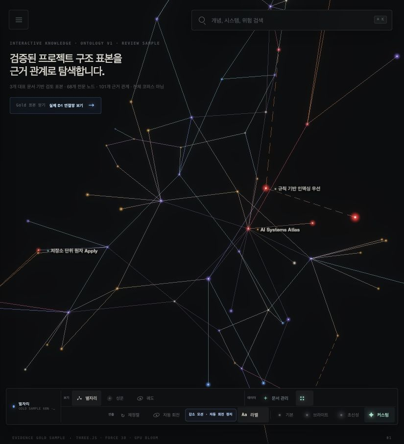
      <br /><strong>Ontology Gold Graph</strong><br />68노드·101개 근거 관계 정본 표본
    </td>
    <td width="50%" align="center">
      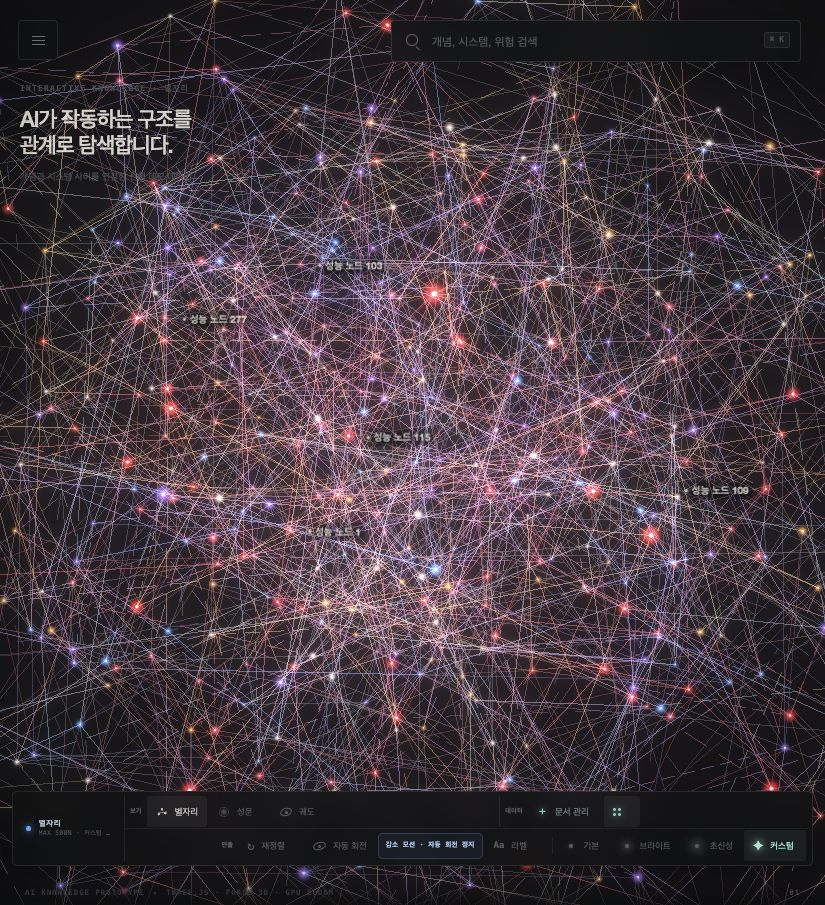
      <br /><strong>Max Density Showcase</strong><br />500노드·2,000선 시각 성능 fixture
    </td>
  </tr>
</table>

### Atlas Control Room

> [!WARNING]
> 아래 대시보드 캡처의 `NO SIGNAL`은 현재 분리형 Connector의 과거 운영 상태입니다. OAuth 통합 런타임 전환 후에는 `OAuth 연결됨`, `로그인 필요`, `처리 중`, `완료`, `재로그인 필요` 상태로 교체됩니다.

<table>
  <tr>
    <td width="50%" align="center">
      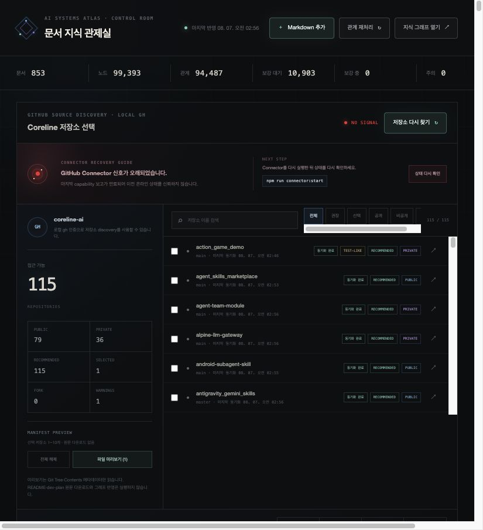
      <br /><strong>Control Room Overview</strong><br />문서·노드·관계·보강 대기 현황
    </td>
    <td width="50%" align="center">
      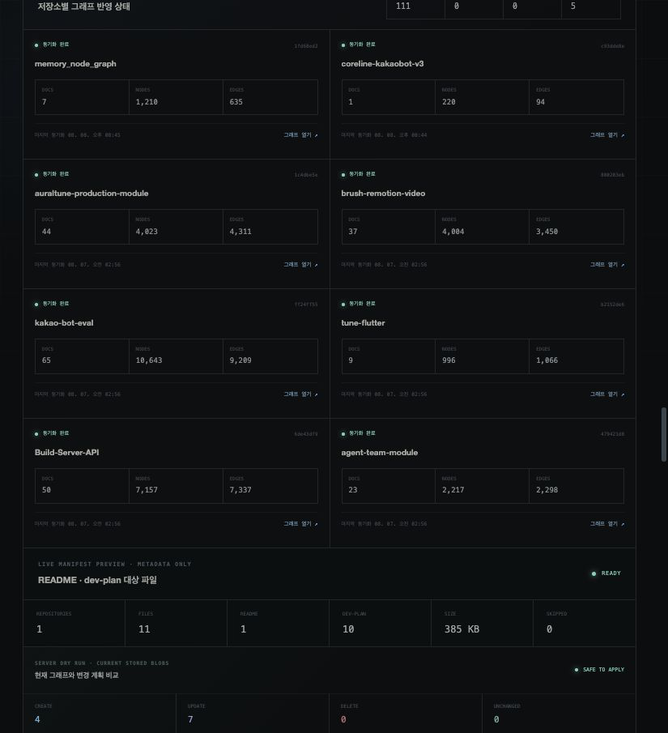
      <br /><strong>Repository Operations</strong><br />115개 저장소 선택과 동기화 상태
    </td>
  </tr>
  <tr>
    <td width="50%" align="center">
      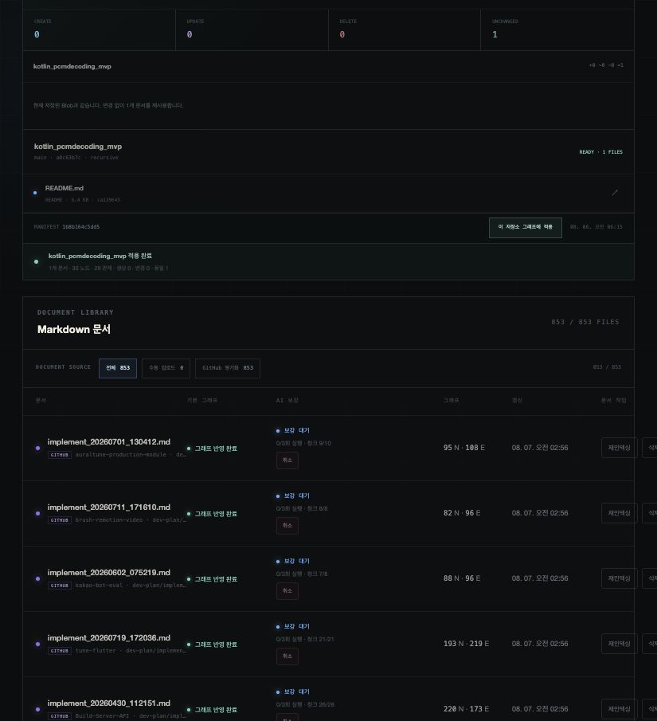
      <br /><strong>Target Markdown</strong><br />README·dev-plan 대상 파일과 적용 영수증
    </td>
    <td width="50%" align="center">
      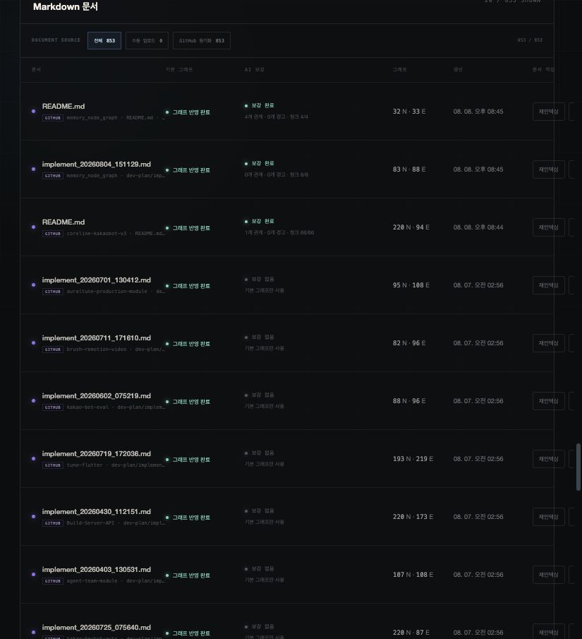
      <br /><strong>Document Library</strong><br />문서별 그래프 변환·보강 상태
    </td>
  </tr>
</table>

<p align="center">
  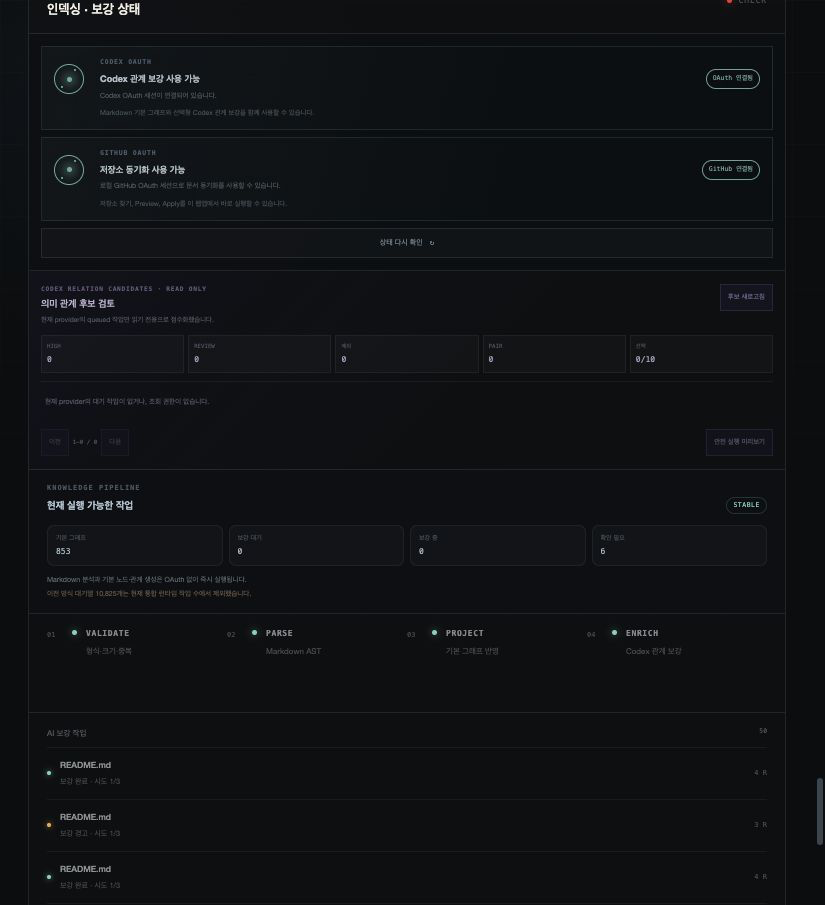
  <br /><strong>Indexing & Enrichment Status</strong> · 재시도·취소·진행 상태
</p>

## 🧭 그래프 보기와 조작

| 보기 | 역할 | 적합한 사용 |
|---|---|---|
| `별자리` | Force 3D 기반 전체 관계망 | 전체 구조, 허브, 관계 밀도 확인 |
| `성운` | 커뮤니티별 클러스터와 브리지 | 분야 경계와 교차 지식 탐색 |
| `궤도` | 선택 노드 중심 1-hop·2-hop | 특정 개념의 직접·간접 관계 분석 |

### 조작

- 드래그: 그래프 회전
- 우클릭 드래그: 상하좌우 이동
- 스크롤: 확대·축소
- 노드 클릭: 상세·근거·연결 관계 열기
- `⌘ K`: 지식 노드 검색
- `V`: 그래프 보기 순환
- URL 공유: scope·view·선택 node·showcase 상태 유지

### 화면 제어

- 렌즈: 전체 우주, 에이전트, 지능의 기억, 신뢰와 안전, AI 제품
- 필터: 분야, 노드 유형, 관계 계층, 관계 유형
- 연출: 재정렬, 자동 회전, 라벨, 관계 흐름
- 발광: 기본, 브라이트, 초신성, 커스텀
- 접근성: `prefers-reduced-motion`에서 자동 회전 기본 정지

## 📊 데이터 기준선

2026-08-07 로컬 D1 감사 기준입니다.

| 항목 | 수량 | 설명 |
|---|---:|---|
| GitHub Discovery | 115 저장소 | 공개 79 · 비공개 36 |
| 실제 저장소 | 111 저장소 | 대상 Markdown이 있는 저장소 |
| Markdown | 853 문서 | README 108 · dev-plan 745 |
| 근거 블록 | 148,655 | Remark AST source blocks |
| 문서별 노드 합계 | 99,393 | 대시보드 집계 |
| 고유 엔티티 | 89,669 | canonical entity 집계 |
| 규칙 관계 | 94,487 | 구조·명시 관계 |
| Codex 근거 관계 | 1 | 실제 OAuth smoke 결과 |
| 전체 저장 관계 | 94,488 | 규칙 + 검증된 Codex 관계 |
| Codex 청크 | 10,904 | 1개 완료 · 10,903개 대기 |

> [!TIP]
> 대시보드의 `99,393 노드`는 문서별 node count 합계이고, corpus의 `89,669 노드`는 같은 의미 mention을 통합한 고유 엔티티 수입니다.

### 화면 투영

| Scope | 현재 화면 |
|---|---:|
| 전체 `corpus` | 500노드 · 1,539 실제 관계 · 461 비저장 화면 연결 |
| 저장소 `overview` | 130노드 · 176관계 |
| `memory_node_graph` repository | 최대 500노드 · 관계 예산 내 투영 |
| Gold Graph | 68노드 · 101관계 |
| Max fixture | 500노드 · 2,000관계 |

`display` 연결은 분리된 실제 클러스터를 하나의 지식 우주로 읽기 위한 비저장 시각 계층입니다. D1, 분석 지표, RAG, 사실 관계 수에 포함하지 않습니다.

## 🏗️ 처리 구조

### 현재 구현

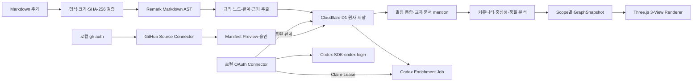

### 승인된 목표

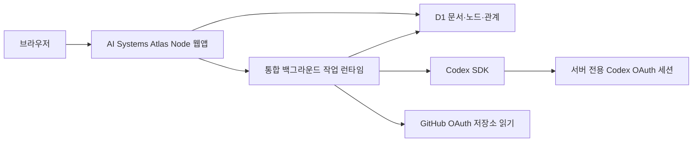

목표 구조는 외부 Connector 신호가 아니라 OAuth 세션과 실제 작업 상태만 표시합니다. 브라우저에는 Codex·GitHub 액세스 토큰을 전달하지 않습니다.

## 🧠 Markdown 지식 추출

### 규칙 추출

- 문서 루트와 제목 계층
- Markdown 링크와 인라인 코드
- `기능:`, `모듈:`, `의존성:`, `결정:`, `위험:`, `도구:`, `개념:` 패턴
- `Phase`, `P5-I`, `DEV-001` 식별자
- 선후·의존·차단·호출·검증·읽기·쓰기·산출·완화 관계
- API, 파일, DB table, package, 검증 명령
- source block·commit·path·line evidence

### Parser profile

| 입력 | Profile | 추출 초점 |
|---|---|---|
| 수동 `.md/.mdx` | `generic` | 제목·링크·명시 패턴 |
| GitHub `README.md` | `github-readme-v4` | 프로젝트·목적·기능·기술·설치·운영 |
| GitHub `dev-plan/**/*.md` | `github-dev-plan-v4` | Plan·Phase·Task·완료 상태·위험·결정·의존성 |

HTML·스크립트·명령형 문구는 실행하지 않고 불신 Markdown 텍스트로만 처리합니다.

## 🎛️ Atlas Control Room

`/dashboard`에서 다음 작업을 관리합니다.

- Markdown 추가·SHA-256 중복 확인
- 문서별 노드·관계·상태·갱신 시각
- 수동 업로드·GitHub 동기화 source filter
- 재인덱싱·삭제·실패 재시도·작업 취소
- 저장소 discovery·선택·manifest preview
- `README.md`, `dev-plan/**/*.md` 원자 Apply
- 생성·갱신·유지·삭제 영수증
- 저장소별 마지막 정상 그래프와 최신 오류 분리
- 전체 Markdown 관계 재처리 preview와 최대 20문서 안전 배치

GitHub Apply는 문서 경계 stage, chunk checksum, manifest digest, Blob SHA를 검증합니다. 실패하면 이전 정상 문서·노드·관계를 유지합니다.

## 🔍 Graph RAG

`/api/graph/query`는 질문을 실행 명령으로 사용하지 않고 검색어로만 정규화합니다.

1. 엔티티 label·summary·tag와 문서 block을 FTS 검색
2. 최대 2-hop 관계 확장
3. 키워드 적합도·confidence·중심성·근거 완전성 랭킹
4. 노드·관계·commit/line 고정 인용 반환
5. 선택적으로 OAuth Codex 구조화 답변 생성
6. 모든 claim의 citation ID를 서버에서 다시 검증

```bash
curl --get --data-urlencode 'q=에이전트 메모리 검색' \
  'http://localhost:3000/api/graph/query?nodes=12&relations=24&citations=8'
```

기본 요청은 검색 context만 반환하며 모델 호출을 수행하지 않습니다.

## 🔐 OAuth와 API 경계

- `OPENAI_API_KEY` 사용 안 함
- `LIGHTRAG_API_KEY` 사용 안 함
- 외부 LightRAG·Graph-RAG 서버 사용 안 함
- 기본 Markdown 인덱싱은 OAuth·LLM 없이 완료
- 선택형 Codex 기능은 공식 SDK와 Codex/ChatGPT OAuth 세션 사용
- OAuth 토큰은 브라우저·D1 일반 테이블·로그에 저장하지 않음
- 공개 그래프 읽기와 인증된 문서/GitHub 쓰기 분리

여기서 `API 미사용`은 **OpenAI 유료 API·API Key 기반 모델 호출을 사용하지 않는다**는 의미입니다. 브라우저와 서버가 사용하는 Atlas 내부 HTTP Route까지 제거한다는 의미는 아닙니다.

## 🚀 빠른 시작

### 요구사항

- Node.js `22.13+`
- npm
- 로컬 D1은 Wrangler/Miniflare가 자동 구성

### 설치와 실행

```bash
git clone https://github.com/coreline-ai/memory_node_graph.git
cd memory_node_graph
npm install
npm run dev
```

| 화면 | 주소 |
|---|---|
| 지식 그래프 | `http://localhost:3000/` |
| 대시보드 | `http://localhost:3000/dashboard` |
| 500×2,000 성능 fixture | `http://localhost:3000/?fixture=500x2000&perf=1` |
| Gold Graph | `http://localhost:3000/?showcase=gold&view=constellation` |

### 현재 분리형 OAuth Connector

> [!CAUTION]
> 다음 명령은 현재 릴리스용입니다. 통합 OAuth 런타임 전환이 완료되면 제거됩니다.

```bash
codex login status
npm run connector:start
```

제한 실행:

```bash
npm run connector:dry-run
npm run connector:batch
npm run connector:batch -- --max-jobs=5 --max-runtime-ms=900000
```

## ♻️ 문서 갱신과 전체 재처리

동일 파일은 SHA-256과 parser version을 비교해 `unchanged`로 처리합니다. 문서가 바뀌면 graph fingerprint가 변경되어 다음 corpus 요청에서 cache를 다시 계산합니다.

```bash
# 대상·블록·예상 청크 preview만 확인
npm run graph:reprocess

# D1 백업 후 20문서 안전 배치 실행
npm run graph:reprocess -- --execute

# corpus·overview·repository·Gold·max 감사
npm run graph:audit
```

새 문서가 D1에 저장되더라도 관계 중심 500노드 예산에 들지 않으면 기본 화면에 즉시 나타나지 않을 수 있습니다. 전체 저장 수량, repository scope, 검색 결과에서 반영 여부를 확인합니다.

## 🐙 GitHub Markdown 동기화

현재 수집 대상은 루트 `README.md`와 `dev-plan/**/*.md`입니다.

```bash
npm run github:preview-all
npm run github:collect-all -- --retry-failed
npm run github:audit-all
npm run github:analyze-corpus
```

후속 동기화는 `/api/github/incremental-sync`에서 저장소별 Preview와 승인된 Apply를 분리합니다.

- `manual`, `schedule`, `webhook`은 저장소별 Preview 작업 공유
- 변경 없음은 Apply 작업을 만들지 않음
- 변경 저장소만 사용자가 수동 승인
- 권한 상실·rate limit·원격 오류는 저장소별 격리
- 실패 시 마지막 정상 commit·manifest·문서·그래프 유지

## 🔌 주요 Route

| Method | Route | 역할 |
|---|---|---|
| `GET` | `/api/graph?scope=corpus` | 전체 D1 관계 중심 snapshot |
| `GET` | `/api/graph?scope=overview` | 저장소·공유 기술 overview |
| `GET` | `/api/graph?scope=repository&repositoryId=...` | 단일 저장소 evidence graph |
| `GET` | `/api/graph?showcase=gold` | 읽기 전용 Gold Graph |
| `GET·POST` | `/api/graph/query` | FTS·1/2-hop Graph RAG context |
| `GET·POST` | `/api/documents` | 문서 목록·Markdown 추가 |
| `POST` | `/api/documents/:id/reindex` | 저장 원문 재인덱싱 |
| `DELETE` | `/api/documents/:id` | 문서와 자동 그래프 삭제 |
| `GET·POST` | `/api/enrichment-jobs/reprocess` | 전체·저장소별 관계 재처리 |
| `GET·POST` | `/api/github/source-jobs` | discovery·preview·apply 작업 |
| `GET·POST` | `/api/github/incremental-sync` | 저장소별 증분 동기화 run |

작업 Claim·Lease·result·fail·retry·cancel Route는 enrichment, Graph RAG answer, GitHub source 작업별로 분리되어 있습니다.

## 🗂️ 핵심 구조

```text
app/
├── knowledge-graph.tsx            # Three.js 지식 그래프 UI
├── graph/layouts.ts               # 별자리·성운·궤도 전략
├── dashboard/                     # Atlas Control Room
├── api/                           # Graph·문서·작업·GitHub Route
└── lib/
    ├── graph/                     # 투영·분석·검색·Gold Graph
    ├── markdown/                  # Remark AST·parser profile·추출기
    ├── ingestion/                 # 문서 처리·보강 등록
    ├── llm/                       # Codex 계약·결과·인용 검증
    ├── github/                    # Preview·Apply·증분 동기화
    └── storage/                   # D1·메모리 저장소

connector/                         # 현재 분리형 OAuth 작업 실행기
db/                                # Drizzle schema
drizzle/                           # D1 migrations
docs/                              # 설계·QA·스크린샷
dev-plan/                          # 단계별 구현 계획
scripts/                           # 수집·재처리·감사 도구
tests/                             # 계약·API·D1·시각 데이터 테스트
```

## ⚙️ 환경 변수

기본 로컬 실행에는 환경 변수가 필요하지 않습니다.

```bash
# 신뢰 가능한 OAuth 프록시 뒤에서 쓰기 보호
ATLAS_WRITE_ACCESS=authenticated
```

현재 분리형 Connector 호스팅 호환 설정:

```bash
ATLAS_CONNECTOR_TOKEN=
ATLAS_BASE_URL=http://localhost:3000
```

`ATLAS_CONNECTOR_TOKEN`은 OpenAI API Key가 아니라 현재 Atlas 작업 Route만 보호하는 애플리케이션 자격증명입니다. 통합 OAuth 런타임 완료 후 외부 Connector 인증과 함께 제거할 대상입니다.

## 🧪 검증

```bash
npx tsc --noEmit
npm run lint
npm test
npm run graph:audit
```

검증 범위:

- production·Connector build
- corpus·overview·repository 예산과 cache fingerprint
- Gold Graph·500×2,000 fixture
- Markdown API·parser profile·evidence
- Graph RAG 검색·인용 재검증
- D1 원자 저장·Lease·retry·cancel
- GitHub preview·stage·apply·증분 변경 판정
- 대시보드·필터·URL 상태·Three.js 관계선

현재 전체 **153개 테스트를 통과**합니다.

## 🗺️ Roadmap

- [x] 발광형 Three.js 별자리 그래프
- [x] 성운·궤도 보기와 발광 프리셋
- [x] Markdown AST·D1 인덱싱
- [x] 115개 저장소 discovery·853문서 수집
- [x] parser v4·온톨로지·Gold Graph
- [x] 전체 corpus 500노드·2,000선 투영
- [x] Graph RAG retrieval·검증된 OAuth answer job
- [x] 저장소별 증분 Preview·승인 Apply
- [ ] 분리형 Connector를 통합 OAuth 런타임으로 이전
- [ ] `NO SIGNAL`·heartbeat·Connector token 제거
- [ ] GitHub `gh auth`를 서버 측 GitHub OAuth로 이전
- [ ] 공유 웹 공개 읽기·인증 쓰기 배포 검증

## 📚 관련 문서

| 문서 | 역할 |
|---|---|
| [현재 OAuth 런타임 방향](./docs/current-oauth-runtime.md) | 인증·배포·Markdown 갱신 정본 |
| [최신 구현 계획](./dev-plan/implement_20260807_203534.md) | Connector 제거와 통합 OAuth 단계 |
| [Knowledge Graph Ontology v1](./docs/knowledge-graph-ontology-v1.md) | 노드·관계·근거 계약 |
| [Gold Graph 시각 QA](./docs/gold-graph-visual-qa-20260806.md) | GUI 시각 회귀 기준 |
| [스크린샷 카탈로그](./docs/screenshots/README.md) | 현재 앱 화면과 재촬영 기준 |

## 📦 배포 원칙

현재 저장소는 구현과 로컬 검증을 우선하며 별도 승인 없이 외부 배포하지 않습니다.

공유 웹은 다음 조건을 충족해야 합니다.

- 그래프 읽기와 인증된 문서·GitHub 쓰기 분리
- Codex SDK 프로세스와 OAuth 세션을 지원하는 상시 Node 런타임
- 운영 D1 migration·backup·rollback
- 비공개 저장소 메타데이터 보호
- OAuth 토큰·원문·Codex 출력 로그 redaction
- OpenAI API Key와 LightRAG 미사용

---

<div align="center">

**AI Systems Atlas** · Evidence-backed Markdown Knowledge Graph

[Repository](https://github.com/coreline-ai/memory_node_graph) · [Issues](https://github.com/coreline-ai/memory_node_graph/issues) · [Roadmap](./dev-plan/implement_20260807_203534.md)

</div>
