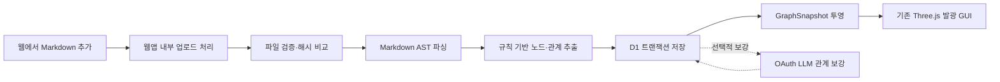

# implement_20260802_203615.md

작성 일시: `2026-08-02 20:36:15 KST`

> **역사 기록:** 이 문서의 OAuth LLM 방향은 초기 설계 이력이다. 현재 인증·실행 정본은 [현재 OAuth 런타임 방향](../docs/current-oauth-runtime.md), 후속 구현 계획은 [implement_20260807_203534.md](./implement_20260807_203534.md)를 따른다. OpenAI API·API Key는 사용하지 않으며 최종 목표는 별도 Connector와 `NO SIGNAL`이 없는 통합 OAuth 런타임이다.

이 문서는 이번 개발의 범위를 고정하고, 구현이 목적 밖으로 확장되지 않도록 하기 위한 작업 문서다.

## 개발 목적

현재 Three.js 발광형 지식 그래프 GUI를 유지하면서, 사용자가 웹에서 Markdown 문서를 추가하면 문서 구조를 자동 파싱하고 노드·관계를 생성하여 저장·표시하는 경량 지식 그래프 파이프라인을 구축한다.

LightRAG, 외부 Graph-RAG 서버, 벡터 검색 시스템을 사용하지 않는다. 기본 그래프는 규칙 기반 Markdown 파서만으로 항상 생성되어야 하며, OAuth 방식으로 접근하는 LLM은 별칭 병합·암시적 관계·요약을 보강하는 선택 기능으로 제한한다.

최종 목표 흐름은 다음과 같다.



## 개발 범위

- 현재 3D Force Graph, GPU Bloom, 회전·이동·확대, 검색·필터·상세 패널을 유지한다.
- 웹에서 `.md`, `.mdx` 파일을 추가하고 처리 상태를 확인할 수 있게 한다.
- Markdown AST에서 문서, 제목, 섹션, 목록, 링크, 코드 블록, 명시적 키워드를 추출한다.
- 규칙 기반으로 문서 포함 관계, 제목 계층, 링크, 개념 언급, 모듈·기능·결정·위험 관계를 생성한다.
- D1/SQLite에 원문, 문서 블록, 정규화 엔티티, 언급, 관계, 처리 작업을 저장한다.
- 동일 문서 재업로드 시 콘텐츠 해시를 비교하여 변경된 문서만 재인덱싱한다.
- 자동 생성 데이터와 수동 편집 데이터를 구분하여 재인덱싱 시 수동 데이터를 보호한다.
- 의미 타입과 GUI 시각 타입을 분리하여 새로운 노드 유형이 생겨도 렌더러를 변경하지 않게 한다.
- OAuth LLM 보강은 서버 전용 공급자 인터페이스 뒤에 배치하고, 실패해도 기본 그래프를 유지한다.
- 문서 목록, 인덱싱 상태, 재인덱싱, 삭제, 그래프 갱신 UI를 현재 디자인에 맞게 제공한다.
- 공개 그래프 조회와 문서 변경 권한을 분리한다.
- 기존에 잘못 추가된 LightRAG REST 연동 코드와 설정을 제거하거나 목적에 맞는 모듈로 교체한다.

## 제외 범위

- LightRAG, MiniRAG, GraphRAG 서버 및 관련 REST 연동
- LightRAG API 키 또는 별도 LightRAG 런타임
- 임베딩 생성, 벡터 데이터베이스, 리랭커
- 문서 기반 생성형 답변과 RAG Q&A
- PDF, DOCX, 이미지, 웹 URL 크롤링
- 로컬 폴더 감시 및 Git 저장소 전체 자동 스캔
- 완전 자동 온톨로지 학습
- 여러 사용자의 실시간 공동 편집
- Neo4j 등 별도 그래프 데이터베이스
- 배포 및 운영 데이터 마이그레이션 실행
- 현재 GUI의 전면 재설계

## 참조 문서

- [현재 프로젝트 README](../README.md)
- [현재 그래프 데이터 모델](../app/graph-data.ts)
- [현재 그래프 GUI](../app/knowledge-graph.tsx)
- [현재 문서 연결 패널](../app/ingestion-panel.tsx)
- [현재 RAG 계약](../app/lib/rag/contracts.ts)
- [현재 D1 접근 모듈](../db/index.ts)
- [현재 빈 D1 스키마](../db/schema.ts)
- [호스팅 바인딩 설정](../.openai/hosting.json)
- [remark 공식 문서](https://unifiedjs.com/explore/package/remark/)

## 문서 기반 제약 사항

- 현재 `.openai/hosting.json`의 `d1` 값은 `null`이므로 영구 저장 구현 전에 `DB` 바인딩이 필요하다.
- Cloudflare/Vinext 런타임에서 로컬 파일 시스템은 영구 저장소로 사용하지 않는다.
- 현재 `KnowledgeNode`의 `NodeKind`, `Domain`과 `KnowledgeEdge`의 `RelationKind`는 고정 열거형이므로 임의 프로젝트 문서에 그대로 적용하면 확장성이 제한된다.
- 현재 문서 업로드·상태·질의 UI는 LightRAG REST 응답을 전제로 작성되어 있어 그대로 재사용할 수 없다.
- 현재 OAuth 코드는 공개 OpenAI 호환 중계 경로를 제공한다. 새 구조에서는 브라우저 공개 중계가 아니라 서버 전용 관계 보강 클라이언트로 범위를 축소한다.
- 배포는 이 계획의 구현 완료와 별개의 사용자 승인 작업으로 취급한다.

## 확인 필요 사항 / 결정 기록

- **결정:** 제3자 LightRAG API는 사용하지 않는다. 웹 브라우저와 같은 웹앱 서버 사이의 내부 Route Handler만 사용한다.
- **결정:** 1차 저장소는 프로젝트에 이미 포함된 Drizzle + Cloudflare D1을 사용한다.
- **결정:** 1차 범위에서는 Markdown 원문도 D1에 저장하며 R2는 사용하지 않는다.
- **기본 제한:** 파일당 2MB, 한 번에 최대 20개, UTF-8 Markdown만 허용한다.
- **문서 식별:** 단일 지식 공간에서 정규화한 파일명을 문서 키로 사용한다. 같은 파일명 재업로드는 업데이트이며, 이름 변경은 신규 문서로 처리한다.
- **기본 인덱싱:** 규칙 기반 파싱은 항상 자동 수행한다.
- **LLM 보강:** `GRAPH_LLM_ENRICHMENT=enabled`일 때만 기본 인덱싱 뒤 자동 수행하며 기본값은 비활성화한다.
- **실패 정책:** LLM 보강 실패는 작업 전체 실패가 아니다. 규칙 기반 그래프를 완료 상태로 유지하고 보강 오류만 기록한다.
- **조회 권한:** 그래프 읽기는 공개 가능하게 유지한다.
- **변경 권한:** 업로드·재인덱싱·삭제는 인증 사용자 또는 서버 측 소유자 허용 목록만 가능하게 한다.
- **승인 게이트:** 이 계획 문서가 사용자에게 승인되기 전에는 아래 구현 Phase를 시작하지 않는다.

## 목표 데이터 계약

의미 데이터와 시각 데이터를 분리한다.

```ts
type GraphNode = {
  id: string;
  label: string;
  semanticType: string; // document, section, module, feature, decision, risk 등
  visualKind: "thesis" | "concept" | "system" | "tool" | "practice" | "risk";
  domain: string;
  summary: string;
  tags: string[];
  sourceRefs: SourceRef[];
  origin: "rule" | "llm" | "manual";
};

type GraphEdge = {
  id: string;
  source: string;
  target: string;
  semanticType: string; // contains, mentions, depends_on 등
  visualRelation: "supports" | "extends" | "requires" | "uses" | "mitigates" | "risks" | "contradicts";
  confidence: number;
  evidenceRefs: SourceRef[];
  origin: "rule" | "llm" | "manual";
};
```

- `semanticType`과 `domain`은 문서 내용에 따라 확장 가능해야 한다.
- `visualKind`와 `visualRelation`만 현재 렌더러의 색상·크기·선 스타일에 연결한다.
- 알려지지 않은 의미 타입은 안전한 기본 시각 타입으로 매핑한다.
- 모든 자동 관계는 최소 한 개의 문서·블록 근거를 가져야 한다.

## 목표 저장 구조

| 테이블 | 책임 |
|---|---|
| `documents` | 문서 키, 파일명, 원문, 해시, 파서 버전, 현재 상태, 오류, 갱신 시각 |
| `document_blocks` | 제목·문단·목록·코드·링크 등 AST 블록과 계층·순서 |
| `entities` | 문서 간 공유 가능한 정규화 노드와 시각 매핑 정보 |
| `entity_mentions` | 엔티티가 발견된 문서·블록·표면 문자열 |
| `relations` | 출발·도착 엔티티, 의미 관계, 시각 관계, 근거, 생성 출처 |
| `ingestion_jobs` | queued/parsing/indexed/enriching/completed/failed 처리 상태와 진행률 |

재인덱싱 시 문서 소유의 자동 `mentions`와 `relations`만 교체한다. 다른 문서도 참조하는 공유 엔티티와 `origin=manual` 데이터는 삭제하지 않는다. 자동 엔티티는 모든 언급과 관계가 사라진 경우에만 고아 정리한다.

## 예상 변경 파일 / 영향 범위

### 유지·수정

- `app/knowledge-graph.tsx`: 동적 의미 타입/도메인과 새 `GraphSnapshot` 소비
- `app/ingestion-panel.tsx`: LightRAG/RAG 표현 제거, 문서 관리·인덱싱 UI로 변경
- `app/graph-data.ts`: 데모 데이터와 시각 타입 정의 분리
- `app/globals.css`: 새 문서 상태 UI 스타일만 추가·조정
- `app/lib/llm/oauth-client.ts`: 서버 전용 OAuth 토큰 공급자로 축소
- `db/schema.ts`, `db/index.ts`: 그래프 저장 스키마와 저장소 연결
- `.openai/hosting.json`, `vite.config.ts`: D1 `DB` 바인딩 반영
- `.env.example`, `README.md`: LightRAG 설정 제거 및 새 구조 문서화
- `tests/rendered-html.test.mjs`: 실제 경량 파이프라인 계약에 맞게 교체

### 추가 예정

- `app/lib/graph/model.ts`: 의미/시각 그래프 계약
- `app/lib/graph/style-mapper.ts`: 의미 타입 → 현재 GUI 스타일 매핑
- `app/lib/markdown/parse-markdown.ts`: Markdown AST 파싱과 블록 정규화
- `app/lib/markdown/extract-graph.ts`: 규칙 기반 노드·관계 추출
- `app/lib/markdown/normalize.ts`: 키·라벨·해시·안정 ID 생성
- `app/lib/storage/graph-repository.ts`: D1 그래프 저장·조회·트랜잭션 경계
- `app/lib/ingestion/ingestion-service.ts`: 업로드·파싱·재인덱싱 오케스트레이션
- `app/lib/ingestion/job-status.ts`: 상태 전이와 오류 표현
- `app/lib/llm/graph-enrichment-provider.ts`: 교체 가능한 LLM 보강 계약
- `app/lib/llm/oauth-proxy-enrichment.ts`: OAuth 프록시 기반 구현
- `app/api/documents/route.ts`: 문서 목록·업로드
- `app/api/documents/[documentId]/route.ts`: 문서 상세·삭제
- `app/api/documents/[documentId]/reindex/route.ts`: 재인덱싱
- `app/api/ingestion-jobs/[jobId]/route.ts`: 처리 상태
- `app/api/graph/route.ts`: 현재 그래프 스냅샷 조회
- `tests/fixtures/*.md`: 파서·재인덱싱 테스트 문서
- `tests/markdown-graph.test.mjs`: 규칙 기반 추출 테스트
- `tests/reindex.test.mjs`: 멱등성·변경·삭제·공유 노드 테스트
- `drizzle/*.sql`: D1 마이그레이션

### 제거 예정

- `app/lib/rag/light-rag-adapter.ts`
- `app/lib/rag/light-rag-mapper.ts`
- LightRAG 전용 `app/lib/rag/config.ts`, `index.ts`, `demo-adapter.ts` 구조
- `app/api/rag/query/route.ts`
- `app/api/rag/health/route.ts`
- LightRAG 상태 추적을 전제로 한 기존 RAG Route Handler
- 공개 범용 `app/api/llm/v1/[...path]/route.ts`
- `.env.example`, `README.md`의 모든 LightRAG 변수와 설명

## 공통 진행 규칙

- 각 Phase는 앞선 Phase의 자체 테스트 완료 후에만 시작한다.
- 구현 중 발생한 이슈는 해당 Phase에서 수정하고 기록한다.
- 체크박스 상태를 실제 진행 상태와 맞게 업데이트한다.
- 문서에 없는 범위 확장은 하지 않는다.
- 요구사항이 불명확하면 가능한 케이스를 나누고 확인 후 진행한다.
- 한 기능은 유지보수 가능한 최소 책임 단위로 나누고, 각 단위의 역할과 경계를 계획에 적는다.
- 계획 밖 옵션/확장/부가 기능을 만들기 위한 분리는 하지 않는다.
- 공통화는 계획 범위 안의 중복을 줄일 때만 수행하고 과도한 추상화는 피한다.
- 기존 프로젝트 API, 공식 SDK, 표준 라이브러리를 우선 검토하고 새 의존성은 범위상 필요할 때만 포함한다.
- 기본 그래프 생성은 LLM 및 외부 서비스 장애와 무관하게 완료되어야 한다.
- 자동 추출 데이터에는 항상 문서 근거와 추출 버전을 기록한다.
- 파서·추출기·DB 저장소·GUI 렌더러의 책임을 섞지 않는다.
- 구현 완료 후에도 별도 승인 없이 배포하지 않는다.

## Phase 상태 요약

- [ ] Phase 1 완료 — LightRAG 구조 제거 및 계약 확정
- [ ] Phase 2 완료 — D1 저장 스키마와 저장소 구현
- [ ] Phase 3 완료 — Markdown AST 파서와 규칙 추출기 구현
- [ ] Phase 4 완료 — 업로드·자동 인덱싱·재인덱싱 구현
- [ ] Phase 5 완료 — 선택적 OAuth LLM 관계 보강 구현
- [ ] Phase 6 완료 — 현재 GUI와 문서 관리 UI 연결
- [ ] Phase 7 완료 — 보안·문서화·마이그레이션 정리
- [ ] Phase 8 완료 — 통합 QA와 최종 회귀 검증

## QA 관점

- [ ] 빈 파일, UTF-8 BOM, 잘못된 인코딩, 2MB 초과, 확장자 위조를 검증한다.
- [ ] 같은 파일을 반복 업로드해도 노드·관계가 중복되지 않는지 검증한다.
- [ ] 문서 일부를 삭제한 뒤 재인덱싱하면 오래된 자동 관계가 제거되는지 검증한다.
- [ ] 두 문서가 같은 엔티티를 공유할 때 한 문서 삭제가 공유 노드를 손상시키지 않는지 검증한다.
- [ ] 수동 노드·관계가 재인덱싱으로 삭제되지 않는지 검증한다.
- [ ] LLM 타임아웃·OAuth 실패·잘못된 JSON이 기본 그래프를 실패시키지 않는지 검증한다.
- [ ] 근거가 없는 LLM 관계가 저장되지 않는지 검증한다.
- [ ] Markdown의 HTML·스크립트 텍스트가 실행되거나 GUI에 위험하게 주입되지 않는지 검증한다.
- [ ] 그래프가 0개, 1개, 수백 개 노드일 때 렌더러가 오류 없이 동작하는지 검증한다.
- [ ] 노드 선택·검색·필터·회전·이동·확대·Bloom 효과의 기존 동작을 검증한다.
- [ ] 모바일 패널과 데스크톱 패널이 그래프 제어를 가리지 않는지 검증한다.
- [ ] 익명 사용자가 문서 업로드·삭제·재인덱싱을 실행할 수 없는지 검증한다.
- [ ] 브라우저 번들에 OAuth Client Secret, 액세스 토큰, 원문 전체가 포함되지 않는지 검증한다.
- [ ] 빌드·타입·린트·마이그레이션·자동 테스트가 모두 통과하는지 검증한다.

## Phase 1. LightRAG 구조 제거 및 그래프 계약 확정

### 목표

- 잘못 추가된 외부 LightRAG 의존 방향을 제거한다.
- GUI가 경량 로컬 그래프만 소비하도록 의미/시각 데이터 계약을 확정한다.

### 구현 태스크

- [ ] 현재 미커밋 변경을 보존한 상태에서 LightRAG 전용 파일과 참조 목록을 확정한다.
- [ ] `GraphNode`, `GraphEdge`, `GraphSnapshot`, `SourceRef` 계약을 `app/lib/graph/model.ts`로 이동한다.
- [ ] `semanticType`과 `visualKind`, `semanticType`과 `visualRelation`을 분리한다.
- [ ] `GraphSnapshot.meta.source`를 `demo | local`로 제한한다.
- [ ] 현재 데모 데이터를 새 계약으로 변환하는 어댑터를 작성한다.
- [ ] LightRAG 전용 어댑터·매퍼·환경 변수·질의 계약을 제거한다.
- [ ] `RagAdapter` 명칭을 `GraphRepository` 또는 `GraphDataSource` 책임으로 교체한다.
- [ ] 의미 타입을 GUI 스타일로 변환하는 기본 매핑표와 unknown fallback을 정의한다.

### 자체 테스트

- [ ] `npx tsc --noEmit`이 통과한다.
- [ ] 기존 44개 데모 노드와 74개 관계가 새 계약에서도 동일하게 렌더링된다.
- [ ] 알려지지 않은 노드·관계 타입을 넣어도 기본 색상·선 스타일로 렌더링된다.
- [ ] 코드와 환경 예제에서 `LIGHTRAG_*` 참조가 0건인지 검사한다.

### 이슈 및 수정

- [ ] 발견 이슈 없음

### 완료 조건

- [ ] 구현 완료
- [ ] 자체 테스트 완료
- [ ] 다음 Phase 진행 가능

## Phase 2. D1 저장 스키마와 저장소 구현

### 목표

- 문서, 구조 블록, 노드, 언급, 관계, 처리 상태를 영구 저장한다.
- Route Handler와 파서가 SQL 세부 구현을 직접 알지 않게 한다.

### 구현 태스크

- [ ] `.openai/hosting.json`에 D1 `DB` 바인딩을 구성하되 배포는 수행하지 않는다.
- [ ] `documents`, `document_blocks`, `entities`, `entity_mentions`, `relations`, `ingestion_jobs` Drizzle 스키마를 정의한다.
- [ ] 문서 키·콘텐츠 해시·canonical entity key·관계 고유 키에 unique index를 정의한다.
- [ ] 문서/블록/언급/관계 삭제를 위한 foreign key와 cascade 정책을 명시한다.
- [ ] 공유 엔티티와 수동 데이터를 보호할 수 있도록 `origin`, `document_id`, `extractor_version`을 저장한다.
- [ ] 그래프 전체 조회, 문서별 자동 데이터 교체, 고아 엔티티 정리를 `graph-repository.ts`에 구현한다.
- [ ] 파싱 결과 저장은 부분 데이터가 노출되지 않도록 트랜잭션 경계를 설정한다.
- [ ] Drizzle SQL 마이그레이션을 생성하고 로컬 D1에 적용한다.

### 자체 테스트

- [ ] 빈 DB에서 마이그레이션이 한 번에 성공한다.
- [ ] 같은 마이그레이션을 중복 적용하지 않아도 정상 시작된다.
- [ ] 문서 2개가 하나의 엔티티를 공유할 수 있다.
- [ ] 한 문서의 자동 데이터를 교체해도 다른 문서와 수동 데이터가 유지된다.
- [ ] 트랜잭션 중 오류를 발생시키면 이전 그래프가 그대로 유지된다.

### 이슈 및 수정

- [ ] 발견 이슈 없음

### 완료 조건

- [ ] 구현 완료
- [ ] 자체 테스트 완료
- [ ] 다음 Phase 진행 가능

## Phase 3. Markdown AST 파서와 규칙 추출기 구현

### 목표

- LLM 없이 Markdown만으로 설명 가능한 기본 지식 그래프를 생성한다.

### 구현 태스크

- [ ] `unified`, `remark-parse`, `remark-gfm`, `unist-util-visit` 도입 필요성을 최종 확인하고 최소 의존성만 추가한다.
- [ ] 입력 확장자, MIME, 파일 크기, UTF-8, 빈 문서를 검증한다.
- [ ] BOM과 개행을 정규화하고 SHA-256 콘텐츠 해시를 생성한다.
- [ ] heading, paragraph, list, link, code block을 순서와 부모 계층이 있는 `DocumentBlock`으로 변환한다.
- [ ] 문서와 모든 제목을 기본 노드로 생성한다.
- [ ] 제목 계층에서 `contains` 관계를 생성한다.
- [ ] Markdown 링크에서 `references` 관계와 대상 노드 후보를 생성한다.
- [ ] 목록의 명시적 패턴 `기능:`, `의존성:`, `결정:`, `위험:` 등을 의미 타입으로 분류한다.
- [ ] 반복되는 핵심 명사구와 인라인 코드 식별자는 보수적인 개념·모듈 후보로 생성한다.
- [ ] NFKC, 공백, 대소문자, 기호를 정규화하여 canonical key와 안정 ID를 만든다.
- [ ] 모든 노드·관계에 문서 ID, 블록 ID, 추출 규칙, 파서 버전을 기록한다.
- [ ] 과도한 완전 연결을 막기 위해 문서별 노드·관계 상한과 반복 언급 병합 규칙을 적용한다.

### 자체 테스트

- [ ] README 형태의 fixture에서 문서·섹션 계층이 예상대로 생성된다.
- [ ] GFM 목록·표·링크·코드 블록이 파서 오류 없이 처리된다.
- [ ] 동일 입력을 두 번 파싱하면 동일 ID와 동일 순서 결과가 생성된다.
- [ ] 위험한 HTML과 스크립트 문자열은 실행 없이 텍스트/무시 대상으로 처리된다.
- [ ] 긴 단일 문단과 제목 없는 문서에서도 최소 문서 노드가 생성된다.
- [ ] 노드·관계 상한을 넘는 입력이 명확한 오류 또는 제한 결과를 반환한다.

### 이슈 및 수정

- [ ] 발견 이슈 없음

### 완료 조건

- [ ] 구현 완료
- [ ] 자체 테스트 완료
- [ ] 다음 Phase 진행 가능

## Phase 4. 업로드·자동 인덱싱·재인덱싱 구현

### 목표

- 웹에서 문서를 추가하면 규칙 기반 그래프가 자동 생성되고 변경 문서만 안전하게 갱신되게 한다.

### 구현 태스크

- [ ] `POST /api/documents` 내부 경로에서 파일 검증, 권한 검사, 문서 upsert, 작업 생성을 수행한다.
- [ ] 같은 문서 키와 같은 해시는 `unchanged`로 종료하고 중복 데이터를 만들지 않는다.
- [ ] 같은 문서 키와 다른 해시는 새 revision으로 재파싱한다.
- [ ] 작업 상태를 `queued → parsing → indexed → enriching? → completed`로 제한한다.
- [ ] 파싱 실패 시 새 데이터는 롤백하고 직전 정상 그래프를 유지한다.
- [ ] `GET /api/ingestion-jobs/[jobId]`에서 단계·진행률·사용자용 오류를 반환한다.
- [ ] `POST /api/documents/[documentId]/reindex`에서 파서 버전 변경 또는 수동 재처리를 지원한다.
- [ ] `DELETE /api/documents/[documentId]`에서 해당 문서 파생 데이터와 고아 자동 엔티티를 정리한다.
- [ ] `GET /api/documents`에서 문서별 상태·노드 수·관계 수·마지막 갱신 시각을 반환한다.
- [ ] `GET /api/graph`에서 D1 데이터를 GUI `GraphSnapshot`으로 투영한다.
- [ ] D1이 비어 있으면 데모 데이터를 표시할지 빈 그래프를 표시할지 UI 정책을 적용한다. 기본값은 문서 추가 안내가 있는 빈 그래프다.

### 자체 테스트

- [ ] 최초 업로드 후 문서·노드·관계가 저장되고 그래프 조회에 나타난다.
- [ ] 같은 파일 재업로드가 `unchanged`가 되고 행 수가 증가하지 않는다.
- [ ] 내용 변경 후 사라진 섹션·관계가 제거되고 새 관계가 추가된다.
- [ ] 파싱 실패 시 이전 정상 그래프가 유지된다.
- [ ] 문서 삭제 후 공유 노드와 수동 데이터가 유지된다.
- [ ] 인증되지 않은 변경 요청이 거부되고 그래프 읽기는 유지된다.

### 이슈 및 수정

- [ ] 발견 이슈 없음

### 완료 조건

- [ ] 구현 완료
- [ ] 자체 테스트 완료
- [ ] 다음 Phase 진행 가능

## Phase 5. 선택적 OAuth LLM 관계 보강 구현

### 목표

- 기본 파이프라인과 분리된 선택 기능으로만 LLM을 사용한다.
- OAuth 프록시나 LLM 장애가 문서 인덱싱을 중단시키지 않게 한다.

### 구현 태스크

- [ ] `GraphEnrichmentProvider` 인터페이스에 입력 블록, 기존 노드, 제안 노드·관계, 근거 반환 계약을 정의한다.
- [ ] 현재 공개 범용 LLM 중계 Route를 제거하고 서버 전용 OAuth 프록시 클라이언트로 교체한다.
- [ ] OAuth client credentials 토큰 캐시·만료 전 갱신·동시 재발급 단일화를 유지한다.
- [ ] LLM 호출 대상 URL과 허용 동작을 관계 보강 한 종류로 제한한다.
- [ ] 입력을 문서 전체가 아닌 관련 블록 묶음으로 제한하고 민감정보 로그를 남기지 않는다.
- [ ] LLM 출력에 JSON Schema 검증을 적용한다.
- [ ] 제안 관계는 source/target 존재, 허용 타입, confidence 범위, evidence block 존재를 검증한다.
- [ ] 별칭 병합은 원본 엔티티와 근거를 남기고 되돌릴 수 있게 한다.
- [ ] 타임아웃, OAuth 실패, 429, 5xx, 잘못된 JSON을 보강 실패로 기록하고 기본 그래프를 완료 처리한다.
- [ ] 동일 문서·동일 extractor version의 보강 결과를 재사용하여 불필요한 호출을 막는다.

### 자체 테스트

- [ ] 가짜 OAuth 서버에서 토큰 발급·캐시·갱신이 예상대로 동작한다.
- [ ] LLM 보강 비활성화 상태에서는 외부 네트워크 호출이 0회다.
- [ ] 정상 제안만 `origin=llm`과 evidence로 저장된다.
- [ ] 근거 없는 관계, 존재하지 않는 노드, 허용되지 않은 타입이 거부된다.
- [ ] OAuth/LLM 실패 후에도 작업이 기본 그래프 완료 상태로 종료된다.
- [ ] 브라우저 응답과 클라이언트 번들에 OAuth 비밀정보가 포함되지 않는다.

### 이슈 및 수정

- [ ] 발견 이슈 없음

### 완료 조건

- [ ] 구현 완료
- [ ] 자체 테스트 완료
- [ ] 다음 Phase 진행 가능

## Phase 6. 현재 GUI와 문서 관리 UI 연결

### 목표

- 기존 시각 품질을 유지하면서 실제 문서 그래프의 추가·갱신·삭제 상태를 명확하게 보여준다.

### 구현 태스크

- [ ] `KnowledgeGraph`가 `GET /api/graph`의 local `GraphSnapshot`을 소비하게 한다.
- [ ] 동적 domain 목록·개수·색상을 생성하고 알 수 없는 domain에 안정적인 팔레트를 배정한다.
- [ ] `semanticType`은 상세 패널에 표시하고 `visualKind`는 렌더링에만 사용한다.
- [ ] 현재 `문서 → LightRAG → 그래프`, `RAG 질문`, `MIX MODE` 문구와 UI를 제거한다.
- [ ] 문서 패널에 파일 선택, 업로드, 진행 단계, 완료·실패, 문서 목록을 표시한다.
- [ ] 문서별 재인덱싱·삭제 버튼과 실행 확인을 추가한다.
- [ ] 기본 인덱싱 완료 즉시 그래프를 갱신하고 선택·필터 상태를 안전하게 초기화한다.
- [ ] 선택 노드 상세에 원문 파일명·섹션·근거 위치를 표시한다.
- [ ] 빈 그래프에는 문서 추가 안내를 표시하고 WebGL 렌더러 오류가 없게 한다.
- [ ] 기존 오비트·라벨·재정렬·검색·필터·툴팁 동작을 유지한다.
- [ ] 데스크톱·태블릿·모바일에서 문서 패널과 노드 상세 패널이 충돌하지 않게 한다.

### 자체 테스트

- [ ] 업로드 직후 상태가 queued/parsing/completed 순서로 UI에 반영된다.
- [ ] 완료 후 새 노드·관계 수와 그래프 화면이 자동 갱신된다.
- [ ] unchanged, parsing failure, enrichment warning이 서로 다른 메시지로 표시된다.
- [ ] 문서 삭제·재인덱싱 후 그래프가 오래된 선택 노드를 참조하지 않는다.
- [ ] 0개, 1개, 50개, 500개 노드 fixture가 렌더링된다.
- [ ] 브라우저 콘솔 오류와 WebGL 리소스 누수가 없는지 확인한다.
- [ ] 기존 3D 이동·확대·축소·Bloom·필터 회귀 테스트를 통과한다.

### 이슈 및 수정

- [ ] 발견 이슈 없음

### 완료 조건

- [ ] 구현 완료
- [ ] 자체 테스트 완료
- [ ] 다음 Phase 진행 가능

## Phase 7. 보안·문서화·마이그레이션 정리

### 목표

- 잘못된 LightRAG 설명과 비밀정보 노출 가능성을 제거하고 운영자가 재현 가능한 문서를 제공한다.

### 구현 태스크

- [ ] `.env.example`에서 모든 `LIGHTRAG_*`, 공개 프록시 공유 키 설정을 제거한다.
- [ ] Markdown 제한, D1 바인딩, OAuth 보강 옵션, 권한 정책을 환경 변수 예제로 정리한다.
- [ ] README를 경량 Markdown Graph Pipeline 구조와 실행 순서로 다시 작성한다.
- [ ] 내부 Route와 외부 제3자 API의 차이를 문서에 명시한다.
- [ ] D1 마이그레이션 생성·로컬 적용·운영 적용 절차를 작성한다.
- [ ] 문서 원문·OAuth 비밀정보·LLM 응답이 로그에 기록되지 않게 점검한다.
- [ ] 업로드 파일명, 오류 메시지, Markdown 텍스트 출력의 escaping을 점검한다.
- [ ] 공개 읽기/보호된 쓰기 정책을 테스트와 README에 동기화한다.
- [ ] 기존 LightRAG 관련 코드·설명·테스트가 남지 않았는지 전체 검색한다.

### 자체 테스트

- [ ] `rg -n 'LightRAG|LIGHTRAG_'` 결과가 역사 설명을 제외하고 0건이다.
- [ ] 새 환경 변수만으로 로컬 실행과 테스트가 재현된다.
- [ ] 인증·권한 실패 응답에 내부 오류와 비밀정보가 포함되지 않는다.
- [ ] 빈 DB와 fixture DB에서 README 절차대로 실행된다.
- [ ] 별도 배포 명령이 실행되지 않았음을 확인한다.

### 이슈 및 수정

- [ ] 발견 이슈 없음

### 완료 조건

- [ ] 구현 완료
- [ ] 자체 테스트 완료
- [ ] 다음 Phase 진행 가능

## Phase 8. 통합 QA와 최종 회귀 검증

### 목표

- 실제 사용 흐름과 실패 흐름을 검증하고 구현이 계획 범위를 벗어나지 않았는지 확인한다.

### 구현 태스크

- [ ] 대표 README·매뉴얼 fixture 3종으로 신규 업로드 E2E를 실행한다.
- [ ] 동일 파일 업로드, 수정 재업로드, 강제 재인덱싱, 삭제 E2E를 실행한다.
- [ ] 두 문서의 공유 엔티티와 상충 관계를 확인한다.
- [ ] OAuth 보강 OFF, 정상, 타임아웃, 잘못된 출력 시나리오를 확인한다.
- [ ] 데스크톱과 모바일에서 문서 패널·그래프·상세 패널을 시각 검수한다.
- [ ] 성능 측정 기준을 기록한다: 2MB 이내 문서 파싱 시간, 500노드 초기 렌더 시간, 그래프 새로고침 시간.
- [ ] 테스트 중 발견한 문제를 해당 Phase로 되돌려 수정하고 체크박스를 갱신한다.
- [ ] 구현 결과와 잔여 리스크를 이 계획 하단에 기록한다.

### 자체 테스트

- [ ] `npx tsc --noEmit` 통과
- [ ] `npm run lint` 통과
- [ ] `npm test` 통과
- [ ] `npm run build` 통과
- [ ] D1 마이그레이션 검증 통과
- [ ] 브라우저 콘솔 오류 0건
- [ ] 주요 화면 시각 QA 통과
- [ ] LightRAG 런타임·API 키·벡터 저장 의존성 0건

### 이슈 및 수정

- [ ] 발견 이슈 없음

### 완료 조건

- [ ] 구현 완료
- [ ] 자체 테스트 완료
- [ ] 전체 개발 완료

## 최종 완료 기준

- [ ] 사용자가 웹에서 Markdown 파일을 추가하면 별도 외부 RAG 서버 없이 자동으로 기본 노드·관계가 생성된다.
- [ ] 같은 문서를 다시 추가하면 해시를 비교해 중복 없이 변경분만 재인덱싱된다.
- [ ] 모든 자동 노드·관계가 원문 근거로 추적 가능하다.
- [ ] LLM/OAuth가 없어도 기본 그래프가 정상 동작한다.
- [ ] OAuth LLM 보강을 켜면 검증된 관계만 추가되고 실패 시 기본 그래프가 보존된다.
- [ ] 현재 발광형 GUI의 핵심 시각 효과와 조작 기능이 유지된다.
- [ ] LightRAG 관련 런타임, API 키, 서버 의존성이 완전히 제거된다.
- [ ] 구현·테스트·문서 상태가 이 계획의 체크박스와 일치한다.
- [ ] 사용자 별도 승인 전에는 배포하지 않는다.

## 잔여 리스크 / 후속 과제

- 규칙 기반 명사구 추출은 범용 NLP가 아니므로 문서 형식에 따라 노드 품질 차이가 날 수 있다. 초기 fixture 결과를 기준으로 규칙을 좁게 조정한다.
- D1에 원문을 저장하는 1차 구조는 대형 문서나 바이너리 문서에 적합하지 않다. 실제 사용량이 커질 때만 R2 분리를 별도 계획으로 검토한다.
- 여러 문서에서 같은 의미지만 표기가 다른 엔티티 병합은 규칙만으로 한계가 있다. OAuth LLM 보강 또는 수동 별칭 UI는 후속 범위로 평가한다.
- 500개를 크게 넘는 노드에서는 현재 Three.js 초기 force simulation과 라벨 정책의 성능 조정이 필요할 수 있다. 대규모 최적화는 별도 계획으로 분리한다.
- 문서 Q&A가 실제 핵심 요구가 되는 시점에만 임베딩·검색·RAG를 독립 기능으로 재검토한다.
