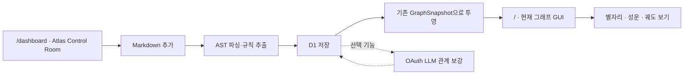

# implement_20260802_205103.md

작성 일시: `2026-08-02 20:51:03 KST`

최근 업데이트: `2026-08-02 22:04:56 KST` — 로컬 하드닝 구현·성능 계측·D1 fault-injection·번들 분할 결과 반영

이 문서는 이번 개발의 범위를 고정하고, 구현이 목적 밖으로 확장되지 않도록 하기 위한 작업 문서다.

이 계획은 `implement_20260802_203615.md`의 경량 Markdown 그래프 방향을 유지하되, **현재 데모 그래프를 기본 `별자리` 보기로 보존하고 별도 관리 대시보드와 선택형 그래프 보기를 추가한다**는 최신 요구를 반영한 실행 기준이다. 이전 계획은 개발 이력으로 보존하고 실제 구현 체크박스는 이 문서에서 관리한다.

## 개발 목적

현재 발광형 Three.js 지식 그래프 화면의 디자인·배치·조작 기능을 기본 `별자리` 보기의 회귀 기준으로 유지하면서, 같은 다크 테마의 별도 관리 대시보드 `Atlas Control Room`을 추가한다. 그래프에는 동일 데이터를 서로 다른 관점으로 탐색하는 `별자리`, `성운`, `궤도` 보기를 선택 기능으로 제공하고 밝기 프리셋을 분리한다.

사용자는 대시보드에서 Markdown 문서를 추가하고, 규칙 기반 자동 파싱·노드 생성·관계 생성·저장·재인덱싱 상태를 관리한다. 완성된 그래프 데이터만 기존 그래프 화면으로 전달한다. LightRAG와 외부 Graph-RAG 서버는 사용하지 않으며 OAuth LLM은 선택적인 관계 보강에만 사용한다.



## 개발 범위

- 현재 `/` 그래프 화면을 기본 `별자리` 보기의 시각·상호작용 기준선으로 고정한다.
- 동일한 그래프 데이터와 렌더러를 공유하는 `별자리`, `성운`, `궤도` 보기 선택 기능을 추가한다.
- `기본`, `브라이트`, `초신성` 밝기 프리셋을 제공하고 권장 기본값은 `브라이트`로 한다.
- 기존 하단 컨트롤의 시각 언어를 유지한 보기 선택기를 추가한다.
- 별도 `/dashboard` 관리 화면을 추가한다.
- 대시보드 디자인은 현재 그래프의 다크 테마, 색상, 테두리, 타이포그래피, 상태 표현을 재사용한다.
- 대시보드에서 `.md`, `.mdx` 파일을 추가한다.
- Markdown AST를 규칙 기반으로 파싱하여 문서·섹션·개념·모듈·기능·결정·위험 노드를 생성한다.
- 제목 계층, 포함, 링크, 언급, 의존, 위험 등 관계를 생성한다.
- D1에 문서 원문, 해시, 블록, 엔티티, 언급, 관계, 처리 상태를 저장한다.
- 동일 문서 재업로드 시 해시 비교 후 변경된 문서만 재인덱싱한다.
- 대시보드에서 문서 목록·상태·재인덱싱·삭제·오류를 관리한다.
- OAuth LLM 관계 보강은 설정된 경우에만 서버에서 실행한다.
- 기존 그래프 데이터 타입에 맞게 서버 투영 계층에서 의미 타입을 시각 타입으로 변환한다.
- 그래프 읽기는 공개로 유지하고 대시보드의 변경 작업은 권한을 분리한다.

## 제외 범위

- 기본 `별자리` 보기의 기존 레이아웃·조작 방식 교체
- 그래프 왼쪽 필터 사이드바 재설계
- 그래프 상단 검색·라벨·재정렬·상세 패널 재설계
- 네 번째 이상의 그래프 보기 또는 사용자가 직접 만드는 임의 레이아웃
- Three.js 렌더링 엔진 전면 교체 또는 별도 그래프 시각화 라이브러리 도입
- 모든 노드·관계에 상시 고강도 발광·파티클을 적용하는 연출
- 그래프 화면 안에 대시보드 카드나 전역 내비게이션 삽입
- 대시보드 안에 축소된 3D 그래프 미리보기 삽입
- LightRAG, MiniRAG, GraphRAG 서버 또는 API 키
- 임베딩, 벡터 데이터베이스, 리랭커, RAG 질의
- PDF, DOCX, 이미지, URL 크롤링
- Neo4j 등 별도 그래프 DB
- 다중 사용자 실시간 협업
- 외부 디자인 스킬의 무승인 설치
- 별도 사용자 승인 없는 배포

## 참조 문서

- [이전 경량 그래프 계획](./implement_20260802_203615.md)
- [현재 프로젝트 README](../README.md)
- [현재 그래프 컴포넌트](../app/knowledge-graph.tsx)
- [현재 그래프 데이터](../app/graph-data.ts)
- [현재 전역 디자인 토큰](../app/globals.css)
- 기존에 잘못 추가되었던 LightRAG 문서 패널은 구현 과정에서 제거됨
- [현재 D1 스키마](../db/schema.ts)
- [현재 D1 접근 모듈](../db/index.ts)
- [호스팅 바인딩](../.openai/hosting.json)
- [Anthropic frontend-design](https://skills.sh/anthropics/skills/frontend-design)
- [Impeccable](https://skills.sh/pbakaus/impeccable/impeccable)
- [Vercel Web Design Guidelines](https://skills.sh/vercel-labs/agent-skills/web-design-guidelines)

## 공통 진행 규칙

- 사용자의 구현 승인 전에는 Phase 1을 시작하지 않는다.
- 각 Phase는 앞선 Phase의 자체 테스트 완료 후에만 시작한다.
- 구현 중 발생한 이슈는 해당 Phase에서 수정하고 기록한다.
- 체크박스 상태를 실제 진행 상태와 맞게 업데이트한다.
- 문서에 없는 범위 확장은 하지 않는다.
- 요구사항이 불명확하면 가능한 케이스를 나누고 확인 후 진행한다.
- 한 기능은 유지보수 가능한 최소 책임 단위로 나누고 각 역할과 경계를 지킨다.
- 기본 `별자리` 보기의 레이아웃·조작·패널을 회귀 기준으로 보존하고, 새 보기와 발광 효과는 독립 모듈로 제한한다.
- 그래프에 필요한 데이터 변환은 서버의 projection 계층에서 해결한다.
- 디자인 스킬은 설계·비평·QA 지침으로만 사용하고 앱 런타임 의존성으로 추가하지 않는다.
- 새 UI 라이브러리, 차트 라이브러리, 모션 라이브러리를 추가하지 않는다.
- 규칙 기반 인덱싱은 OAuth·LLM 장애와 무관하게 완료되어야 한다.
- 구현 완료 후에도 별도 승인 없이 배포하지 않는다.

## 핵심 결정 기록

### 화면 경계

- `/`: 현재 지식 그래프 화면. 기존 GUI는 기본 `별자리` 보기로 유지하고 선택형 보기를 제공한다.
- `/dashboard`: 새 문서 관리 대시보드.
- 그래프 화면에서 대시보드로 진입할 기존 버튼이 있다면 버튼의 위치·스타일은 유지하고 동작만 `/dashboard` 이동으로 연결한다.
- 대시보드의 `지식 그래프 열기`는 `/`로 이동한다.

### 그래프 보기 경계

- 그래프 데이터, 필터, 검색, 선택 상태, 상세 패널은 세 보기에서 공유한다.
- 보기 전환은 씬 전체를 재생성하지 않고 layout strategy가 계산한 목표 좌표로 이동한다.
- 현재 그래프는 `constellation`의 기준선이며 새 기능 때문에 기본 배치가 달라지지 않게 한다.
- `nebula`는 클러스터 분포를, `orbit`는 선택 노드 주변 관계를 읽는 보조 관점이다.
- 보기와 밝기 설정은 렌더링 표현 상태이며 저장된 지식 데이터 구조를 변경하지 않는다.
- UI 상태는 URL query로 직렬화하고 데이터 API 계약과 분리한다.

### 디자인 경계

- 주 설계 기준은 현재 설치된 `web-product-designer`와 `frontend-design`이다.
- Impeccable의 `shape/critique/distill/polish` 원칙을 디자인 검토 기준으로 사용한다.
- Vercel Web Design Guidelines는 최종 접근성·상호작용 QA 기준으로 사용한다.
- Taste Skill은 대시보드용 주 스킬로 사용하지 않고 다음 수치만 참고한다.
  - Design Variance: `3/10`
  - Motion Intensity: `2/10`
  - Visual Density: `7/10`

### 저장·처리 경계

- 저장소는 Drizzle + Cloudflare D1을 사용한다.
- 1차 범위에서는 Markdown 원문도 D1에 저장하며 R2는 사용하지 않는다.
- 파일 제한은 파일당 2MB, 한 번에 최대 20개, UTF-8 `.md/.mdx`로 한다.
- 정규화된 파일명이 같은 문서는 업데이트로 처리한다.
- 같은 해시는 `unchanged`, 다른 해시는 재인덱싱한다.
- OAuth LLM 보강 기본값은 비활성화한다.
- LLM 실패는 기본 인덱싱 실패로 처리하지 않는다.

## 그래프 GUI 기준선

다음 항목은 구현 전 `별자리` 보기의 기준 스크린샷·DOM·동작 체크리스트로 기록하고 최종 QA에서 회귀 여부를 확인한다.

- [ ] 데스크톱 그래프 전체 화면 캡처
- [ ] 모바일 그래프 전체 화면 캡처
- [ ] 왼쪽 필터 사이드바 폭·배치
- [ ] 상단 검색 위치·크기
- [ ] 그래프 제목 블록
- [ ] 하단 컨트롤 위치·버튼 순서
- [ ] 노드 상세 패널 위치·크기
- [ ] 노드 색상·크기·라벨 스타일
- [ ] 관계선 밝기·색상·포커스 효과
- [ ] Bloom 강도와 배경 분위기
- [ ] 드래그 회전·우클릭 이동·스크롤 확대
- [ ] 오비트·라벨·재정렬 기능

기능 데이터와 선택 보기가 추가되더라도 `별자리 + 기본 밝기` 조합에서는 위 항목의 시각 결과와 상호작용을 바꾸지 않는다. `브라이트`는 권장 사용자 프리셋이지만 기존 화면과의 정확한 비교를 위해 `기본` 프리셋을 별도로 유지한다.

## 선택형 그래프 보기 사양

### 보기 구성

| 보기 | 내부 값 | 목적 | 배치·표현 | 주요 상호작용 |
|---|---|---|---|---|
| 별자리 | `constellation` | 전체 지식 관계 자유 탐색 | 현재 Force 3D 배치와 발광 노드 유지 | 드래그·패닝·줌·검색·필터·재정렬 |
| 성운 | `nebula` | 문서·도메인별 밀도와 고립 영역 파악 | 클러스터별 저투명 성운·먼지, 클러스터 사이 브리지 | 클러스터 포커스·필터·선택 |
| 궤도 | `orbit` | 선택 노드의 직접·간접 관계 해석 | 선택 노드 중심, 1-hop 안쪽 링, 2-hop 바깥 링, 나머지 감광 | 노드 클릭 재중심·breadcrumb·뒤로 이동 |

### 보기 선택 UI와 상태

- 하단 기존 컨트롤과 동일한 버튼·테두리·타이포그래피로 `[별자리] [성운] [궤도] | 재정렬 오비트 라벨` 순서를 제안한다.
- 첫 진입 기본값은 `constellation`이다.
- 키보드 `V`로 세 보기를 순환하고 각 버튼은 텍스트 이름, 선택 상태, 접근 가능한 이름을 제공한다.
- URL 상태는 `/?view=constellation`, `/?view=nebula`, `/?view=orbit&node={nodeId}` 형식으로 공유 가능하게 한다.
- 보기별 카메라 위치를 세션 동안 보존하여 왕복 시 탐색 맥락을 유지한다.
- 필터·검색·선택 노드는 보기 전환 전후에 유지한다. `orbit` 진입 시 선택 노드가 없으면 중심성 상위 노드 또는 현재 포커스 노드를 안전한 기본값으로 사용한다.

### Enhanced Luminous Rendering

- 발광 강도를 보기와 분리된 `normal | bright | supernova` 프리셋으로 관리하며 UI에는 `기본 | 브라이트 | 초신성`으로 표시한다.
- 권장 기본값은 `bright`이고, `normal`은 현재 GUI 회귀 비교용, `supernova`는 데스크톱 고성능 환경의 선택 효과로 제한한다.
- 노드 발광은 `선명한 코어 → 색상 코로나 → 선택적 회절 스파크 → 저속 펄스` 4단계로 구성한다.
- 선택 노드와 핵심 이웃은 순차적으로 빛이 전달되는 효과를 사용한다.
- 선택 경로의 관계선에는 이동 광자 효과를 적용하되 전체 관계의 약 `5~8%`만 동시에 활성화한다.
- `nebula`의 성운은 카드형 hull이 아니라 저투명 색상 필드와 먼지로 표현하여 현재 우주 분위기를 유지한다.
- Bloom 수치만 높이지 않고 코어·코로나·스파크 레이어를 분리해 글자와 관계선이 뭉개지지 않게 한다.
- 빨간색 고속 점멸은 금지하고 `prefers-reduced-motion`에서는 펄스·광자 이동·보간을 축소 또는 제거한다.

### 렌더링·레이아웃 구조

```text
GraphRenderer
├─ ConstellationLayout
├─ NebulaClusterLayout
└─ OrbitalFocusLayout

GraphViewMode = "constellation" | "nebula" | "orbit"
GraphLayoutStrategy.calculatePositions(graph, context) → TargetPosition[]
```

- 렌더러와 그래프 데이터는 하나만 유지하고 보기마다 좌표 계산 strategy만 교체한다.
- 보기 전환 시 `BufferGeometry`, `ShaderMaterial`, 노드 ID와 선택 상태를 재사용한다.
- 위치 전환은 `600~900ms` 보간을 기본으로 하고 전환 중 중복 클릭을 잠근다.
- reduced-motion 사용자는 즉시 좌표를 전환한다.
- 노드는 가능한 한 하나의 `THREE.Points`, 광자도 하나의 Points buffer로 배치하고 중요한 라벨만 sprite를 사용한다.
- 모바일에서는 먼지 수, 광자 수, 회절 스파크, pixel ratio를 단계적으로 줄이며 `supernova`를 숨기거나 자동 하향한다.

### 성능 목표

| 환경 | 목표 |
|---|---|
| 데스크톱 GPU | 평균 60fps |
| 일반 노트북 | 평균 45fps 이상 |
| 모바일 | 평균 30fps 이상 |
| 데이터 규모 | 500 노드에서 원활한 전환, 2,000 관계에서 선택 경로 위주 모션 |

- FPS가 기준 아래로 내려가면 발광 레이어 → 먼지 → 광자 순으로 자동 품질을 낮추고 레이아웃·선택 기능은 유지한다.
- 성능 측정은 `normal`, `bright`, `supernova`와 세 보기 조합을 분리해 기록한다.

## 대시보드 디자인 사양

### 디자인 명칭

`Atlas Control Room`

그래프가 지식 우주를 탐색하는 화면이라면 대시보드는 그 우주에 들어가는 문서를 관리하는 관제실로 표현한다.

### 데스크톱 정보 구조

```text
┌─────────────────────────────────────────────────────────────┐
│ AI Systems Atlas     마지막 동기화      [문서 추가] [그래프] │
├─────────────────────────────────────────────────────────────┤
│ 12 문서 · 352 노드 · 1,665 관계 · 1 처리 중 · 1 오류        │
├────────────────────────────────────┬────────────────────────┤
│ DOCUMENT LIBRARY                   │ INGESTION ACTIVITY     │
│                                    │                        │
│ 파일명 / 상태 / 노드 / 관계 / 갱신 │ 현재 처리 단계         │
│                                    │ 최근 처리 기록         │
│                                    │ 오류·경고              │
└────────────────────────────────────┴────────────────────────┘
```

### 핵심 컴포넌트

1. `DashboardHeader`
   - 기존 브랜드 마크·제품명 재사용
   - 마지막 동기화
   - `Markdown 추가`
   - `지식 그래프 열기`
2. `StatusStrip`
   - 문서·노드·관계·처리 중·오류 수를 한 줄로 표시
   - 큰 KPI 카드 사용 금지
3. `DocumentLibrary`
   - 파일명, 처리 상태, 노드 수, 관계 수, 크기, 갱신 시각
   - 재인덱싱·삭제·그래프 열기 작업
4. `IngestionActivity`
   - 현재 처리 단계, 진행률, 발견된 구조 수
   - 최근 완료와 오류
5. `UploadDrawer`
   - 오른쪽 슬라이드 패널
   - 파일 선택, 검증 결과, 중복·변경 여부, 처리 시작
6. `ConfirmDialog`
   - 문서 삭제와 데이터 영향 확인
7. `DashboardEmptyState`
   - 첫 Markdown 추가 안내
8. `DashboardErrorState`
   - 실패 이유, 이전 정상 그래프 유지 여부, 재시도

### 디자인 토큰

기존 `app/globals.css`의 값을 읽어 대시보드 scoped CSS에서 그대로 사용한다.

| 용도 | 토큰/값 |
|---|---|
| 배경 | `--bg: #07090b` |
| 기본 표면 | `--surface` |
| 높은 표면 | `--surface-strong` |
| 경계 | `--border`, `--border-strong` |
| 주 텍스트 | `--text` |
| 보조 텍스트 | `--text-2`, `--text-3` |
| 처리 중 | `--blue` |
| 완료 | `--mint` |
| 경고 | `--amber` |
| 오류 | `--red` |
| 보강 | `--violet` |

- 패널 반경은 `4~6px`로 제한한다.
- 카드 안에 카드를 중첩하지 않는다.
- 강한 glow는 상태 점과 핵심 CTA에만 사용한다.
- 배경 그라디언트와 장식용 차트를 추가하지 않는다.
- 작은 모노스페이스 라벨은 실제 상태·수치·시각에만 사용한다.
- 화면 여백과 행 높이는 현재 그래프 사이드바 밀도에 맞춘다.

### 반응형

- `>= 1280px`: 문서 라이브러리와 활동 패널 2열
- `768~1279px`: 활동 패널을 우측 슬라이드 또는 하단 영역으로 전환
- `< 768px`: 1열 문서 목록, UploadDrawer는 전체 높이 bottom sheet
- 모바일에서도 파일명·상태·주요 작업이 먼저 보이고 보조 수치는 상세에서 표시한다.

### 상태 문구

| 내부 상태 | 사용자 문구 |
|---|---|
| `queued` | 처리 대기 |
| `validating` | 파일 확인 중 |
| `parsing` | 문서 구조 분석 중 |
| `indexed` | 기본 그래프 생성 완료 |
| `enriching` | 관계를 보강하는 중 |
| `unchanged` | 변경된 내용 없음 |
| `completed` | 그래프 반영 완료 |
| `failed` | 처리하지 못함 |

## 데이터 모델 요약

| 테이블 | 역할 |
|---|---|
| `documents` | 문서 키, 파일명, 원문, 해시, 상태, parser version |
| `document_blocks` | Markdown 제목·문단·목록·링크·코드 블록 |
| `entities` | 정규화된 의미 노드 |
| `entity_mentions` | 문서·블록별 노드 근거 |
| `relations` | 의미 관계, 시각 관계, 근거, origin |
| `ingestion_jobs` | 처리 단계, 진행률, 오류, 시작·완료 시각 |

DB의 의미 타입은 자유롭게 저장하지만 그래프 화면에 전달할 때 현재 타입으로 변환한다.

```text
semantic node type → thesis/concept/system/tool/practice/risk
semantic relation  → supports/extends/requires/uses/mitigates/risks/contradicts
```

기존 그래프 컴포넌트가 새로운 임의 타입을 직접 처리하지 않게 한다.

## 예상 변경 파일 / 영향 범위

### 실제 추가

- `app/dashboard/`: 대시보드 페이지, 상태·문서·업로드·확인 UI, scoped CSS
- `app/graph/layouts.ts`: 세 보기의 타입과 결정적 좌표 전략
- `app/lib/graph/model.ts`: 그래프·문서·작업 API 계약
- `app/lib/markdown/`: Markdown 정규화, AST 파싱, 규칙 추출
- `app/lib/ingestion/ingestion-service.ts`: 검증·해시·인덱싱·재인덱싱 흐름
- `app/lib/storage/graph-repository.ts`: D1 우선 저장과 테스트용 메모리 fallback
- `app/lib/auth/write-access.ts`: 공개 읽기와 OAuth 프록시 기반 쓰기 분리
- `app/lib/llm/`: 선택적 OAuth 관계 보강 provider
- `app/api/`: 그래프, 문서, 재인덱싱, 작업 조회 Route
- `drizzle/0001_atlas_documents.sql`: 로컬·호스팅 D1 스키마
- `.env.example`: 쓰기 권한과 선택적 OAuth 보강 설정

### 제한적으로 수정

- `app/knowledge-graph.tsx`: 기존 조작을 유지하고 공용 씬에 보기 strategy·발광 preset·광자·성운·궤도 표현 연결
- `app/globals.css`: 기존 토큰 유지, 하단 보기·발광 선택기와 모바일 표현만 추가
- `db/schema.ts`, `.openai/hosting.json`: D1 테이블과 `DB` 바인딩 추가
- `README.md`, `package.json`, `tests/rendered-html.test.mjs`

### 제거·교체

- `app/lib/rag/light-rag-adapter.ts`
- `app/lib/rag/light-rag-mapper.ts`
- LightRAG 전용 config/factory/demo adapter
- LightRAG 전용 `/api/rag/*` Route Handler
- 공개 범용 `/api/llm/v1/[...path]/route.ts`
- 그래프 내부에 잘못 추가된 LightRAG 업로드·RAG 질문 패널
- `.env.example`, `README.md`의 `LIGHTRAG_*` 설정

## Phase 상태 요약

- [x] Phase 1 완료 — 기준선 동결 및 잘못된 LightRAG 구조 정리
- [x] Phase 2 완료 — 그래프 계약·D1 저장소 구현
- [x] Phase 3 완료 — Markdown 파서·규칙 추출기 구현
- [x] Phase 4 완료 — 문서 처리·재인덱싱·선택적 OAuth 보강 구현
- [x] Phase 5 완료 — Atlas Control Room 디자인 시스템·셸 구현
- [x] Phase 6 완료 — 대시보드 문서 관리 기능 연결
- [x] Phase 7 완료 — 기존 그래프 데이터 브리지·회귀 보호
- [x] Phase 8 완료 — 선택형 3-View Graph·발광 렌더링 구현
- [x] Phase 9 완료 — 쓰기 권한 분리·접근성·통합 QA·문서화

## 구현 결과 업데이트

### 완료된 핵심 결과

- [x] 기존 발광형 그래프를 기본 `별자리` 보기로 유지했다.
- [x] 동일 데이터에서 `별자리`, `성운`, `궤도`를 전환하며 URL query와 `V` 키를 지원한다.
- [x] `기본`, `브라이트`, `초신성` 프리셋과 코어·코로나·스파크·광자·성운 필드를 구현했다.
- [x] 모바일에서 초신성 품질을 자동 하향하고 reduced-motion 분기를 적용했다.
- [x] `/dashboard`에 동일한 다크 테마의 Atlas Control Room을 구현했다.
- [x] `.md/.mdx` 업로드, AST 파싱, 규칙 기반 노드·관계 생성, SHA-256 중복 방지, 재인덱싱, 삭제를 연결했다.
- [x] D1 저장을 기본으로 사용하고 테스트 환경에서는 메모리 저장소로 같은 계약을 검증했다.
- [x] 그래프 읽기는 공개로 유지하고 쓰기는 `ATLAS_WRITE_ACCESS=authenticated`일 때 신뢰 가능한 OAuth 프록시 식별 헤더를 요구한다.
- [x] LightRAG 런타임, 관련 API Route, API 키 설정, 공개 범용 LLM proxy를 제거했다.
- [x] OAuth LLM 보강은 서버 전용 선택 기능이며 실패해도 규칙 기반 인덱싱이 완료된다.
- [x] 데스크톱·모바일 그래프와 대시보드를 브라우저에서 확인하고 콘솔 오류 0건을 확인했다.
- [x] `npx tsc --noEmit`, `npm run lint`, 프로덕션 build, 자동 테스트 6개가 통과했다.
- [x] 테스트 중 생성한 로컬 D1 문서를 삭제해 기본 데모 상태로 복원했다.
- [x] 배포 명령은 실행하지 않았다.

### 계획 대비 의도적 단순화

- 대시보드 하위 컴포넌트는 데모 단계의 변경 응집도를 고려해 `dashboard-client.tsx`에 모았다.
- 세 layout은 독립 함수 계약을 유지하면서 `app/graph/layouts.ts` 한 파일에 모았다.
- 문서 처리는 현재 규모에서 즉시 완료되는 동기 흐름으로 구현했다. 작업 조회 API는 유지하지만 불필요한 클라이언트 polling은 추가하지 않았다.
- 규칙 추출 결과를 현재 `KnowledgeNode/KnowledgeEdge` 계약으로 바로 정규화해 별도 중간 projection 패키지를 만들지 않았다.

### 하드닝 결과 정본

기능 구현과 로컬 품질 하드닝 결과를 아래에 기록한다. 이후 작업에서는 이 표를 하드닝 상태의 정본으로 사용한다.

| ID | 우선순위 | 상태 | 작업 | 완료 조건 |
|---|---:|---|---|---|
| `H-01` | P1 | 완료 | 500 노드·2,000 관계 성능 계측 | 브라우저 FPS/P95/heap HUD, CPU layout benchmark, 자동 품질 하향 구현·검증 |
| `H-02` | P1 | 완료 | Markdown 경계 입력 검증 강화 | BOM, 빈 파일, 2MB 초과, 잘못된 UTF-8, 확장자 위조 자동 테스트 통과 |
| `H-03` | P1 | 완료 | 저장소 fault-injection 확대 | 공유 엔티티와 이전 그래프 보존 자동 테스트, D1 staging swap·강제 commit 실패 검증 통과 |
| `H-04` | P2 | 도구 완료·환경 대기 | 운영 OAuth 프록시 검증 | 로컬 권한 테스트와 staging 검증 스크립트 완료. 실제 프록시 환경 확인만 남음 |
| `H-05` | P2 | 완료 | 클라이언트 번들 분할 | 최대 client chunk 343,877 bytes, Vite 500kB 경고 제거 |

### 성능 계측 결과

| 환경·보기 | FPS | P95 frame | 품질 | JS heap |
|---|---:|---:|---|---:|
| 데스크톱 별자리 | 60.0 | 17.3ms | HIGH | 20.6MB |
| 모바일 390×844 별자리 | 60.0 | 17.4ms | BALANCED | 20.4MB |
| 모바일 390×844 성운 | 60.0 | 17.7ms | BALANCED | - |
| 모바일 390×844 궤도 | 59.5 | 17.1ms | BALANCED | - |

- 500/2,000 CPU layout benchmark P95: 성운 약 `0.28ms`, 궤도 약 `0.61ms`.
- 2초 단위 FPS 창을 기준으로 `high → balanced → low` 품질을 자동 조정한다.
- 품질 하향 시 pixel ratio, bloom, 먼지, 광자, 관계선 갱신 빈도를 단계적으로 줄인다.
- 성능 fixture와 HUD: `/?fixture=500x2000&perf=1`이며 개발 환경에서만 활성화된다.

### D1 fault-injection 결과

- D1 staging 테이블에 새 그래프를 먼저 적재하고 마지막 짧은 batch에서 활성 데이터와 교체한다.
- 최종 `relations` commit을 SQLite trigger로 강제 실패시킨 결과 기존 문서 hash·원문·5개 노드·4개 관계가 유지됐다.
- 실패 후 staging block/entity/mention/relation 잔여 행은 모두 `0`건이었다.
- 검증용 문서는 삭제해 로컬 D1을 기본 데모 상태로 복원했다.

### 현재 작업 경계

- `H-01`, `H-02`, `H-03`, `H-05`는 완료됐다.
- `H-04`의 애플리케이션 코드·자동 테스트·검증 명령은 완료됐다.
- 실제 OAuth 프록시가 위조 헤더를 제거하는지 확인하는 작업만 staging 환경 생성 이후 실행한다.
- staging 검증 명령: `npm run verify:oauth -- --base-url=https://staging.example.com`
- 배포는 계속 제외 범위다.

이하 Phase별 상세 체크리스트는 최초 설계 의도와 추적성을 위한 원안이다. 실제 완료 범위는 `구현 결과 업데이트`, 하드닝 상태는 위 `하드닝 결과 정본`을 기준으로 관리한다.

## QA 관점

- [x] 기존 그래프 데스크톱·모바일 화면의 시각 회귀를 확인한다.
- [x] 기존 그래프의 드래그·패닝·줌·오비트·검색·필터·상세 기능을 확인한다.
- [x] `별자리 + 기본`이 기존 그래프 기준선과 일치하는지 확인한다.
- [x] 세 보기에서 필터·검색·선택·상세 상태가 유지되는지 확인한다.
- [x] URL query와 키보드 `V`로 보기를 전환할 수 있는지 확인한다.
- [x] `orbit`의 1-hop·2-hop 분류와 재중심 동작을 확인한다.
- [x] `nebula`의 클러스터 분류와 클러스터 간 브리지를 확인한다.
- [x] 발광 프리셋이 가독성을 해치지 않고 모바일·저성능 환경에서 하향되는지 확인한다.
- [x] 500 노드·2,000 관계 성능 예산과 보기 전환 중 리소스 재사용을 확인한다.
- [x] 대시보드 스타일이 기존 그래프 CSS에 영향을 주지 않는지 확인한다.
- [x] 빈 문서, BOM, 잘못된 UTF-8, 확장자 위조, 2MB 초과를 검증한다.
- [x] 동일 문서 반복 업로드에서 중복 데이터가 생성되지 않는지 확인한다.
- [x] 변경 재인덱싱 시 오래된 자동 관계만 제거되는지 확인한다.
- [x] 공유 엔티티와 수동 데이터가 문서 삭제로 손상되지 않는지 확인한다.
- [x] OAuth·LLM 실패가 기본 인덱싱과 기존 그래프를 손상시키지 않는지 확인한다.
- [x] 대시보드의 loading/error/empty/disabled/unchanged 상태를 확인한다.
- [x] 파일 업로드와 삭제 작업이 인증·권한 정책을 따르는지 확인한다.
- [x] 키보드 탐색, focus-visible, 스크린리더 이름, 대비를 확인한다.
- [x] `prefers-reduced-motion`에서 패널 모션이 축소되는지 확인한다.
- [x] 브라우저 번들에 OAuth 비밀정보와 원문 전체가 포함되지 않는지 확인한다.
- [x] 외부 디자인 스킬이 앱 dependency나 배포 산출물에 포함되지 않는지 확인한다.

## Phase 1. 기준선 동결 및 잘못된 LightRAG 구조 정리

### 목표

- 기존 그래프 GUI를 회귀 기준으로 고정한다.
- 외부 LightRAG REST 전제를 제거하고 새 기능을 시작할 안전한 상태를 만든다.

### 구현 태스크

- [ ] 그래프 화면의 데스크톱·모바일 기준 캡처와 DOM 체크리스트를 기록한다.
- [ ] 그래프 조작 기능의 수동 테스트 결과를 기록한다.
- [ ] 현재 미커밋 LightRAG 관련 파일과 변경점을 목록화한다.
- [ ] LightRAG 어댑터·매퍼·query/status/health 경로를 제거한다.
- [ ] 그래프 내부의 LightRAG 업로드/RAG 질문 패널을 제거하고 원래 GUI 배치를 복원한다.
- [ ] 기존 `GraphSnapshot` 데모 응답은 유지하여 그래프가 계속 실행되게 한다.
- [ ] OAuth 토큰 로직은 다음 Phase에서 재사용할 부분만 보존한다.
- [ ] 이전 README의 LightRAG 설명을 임시 경고 또는 새 구조 설명으로 교체한다.

### 자체 테스트

- [ ] 기존 그래프 기준 캡처와 복원 후 캡처에 의미 있는 시각 차이가 없다.
- [ ] 44개 노드·74개 관계 데모가 렌더링된다.
- [ ] 그래프 콘솔 오류가 0건이다.
- [ ] `rg -n 'LIGHTRAG_|LightRagAdapter|mapLightRagGraph' app` 결과가 0건이다.
- [ ] `npx tsc --noEmit`과 `npm run lint`가 통과한다.

### 이슈 및 수정

- [ ] 발견 이슈 없음

### 완료 조건

- [ ] 구현 완료
- [ ] 자체 테스트 완료
- [ ] 다음 Phase 진행 가능

## Phase 2. 의미 그래프 모델과 D1 저장소 구현

### 목표

- 문서 그래프는 확장 가능한 의미 모델로 저장하고 기존 GUI에는 고정 시각 모델로 제공한다.

### 구현 태스크

- [ ] 의미 노드, 의미 관계, SourceRef, ingestion job 계약을 정의한다.
- [ ] 의미 타입 → 기존 `NodeKind/Domain/RelationKind` projection 규칙을 정의한다.
- [ ] `documents`, `document_blocks`, `entities`, `entity_mentions`, `relations`, `ingestion_jobs` 스키마를 작성한다.
- [ ] unique index, foreign key, origin, extractor version, evidence 필드를 정의한다.
- [ ] `.openai/hosting.json`에 논리적 D1 `DB` 바인딩을 구성하되 배포는 하지 않는다.
- [ ] 문서 upsert, 자동 데이터 교체, 공유 엔티티 보호, 고아 정리를 repository로 구현한다.
- [ ] 저장 교체 작업을 트랜잭션으로 묶는다.
- [ ] Drizzle 마이그레이션을 생성하고 내용을 검토한다.

### 자체 테스트

- [ ] 빈 DB 마이그레이션이 성공한다.
- [ ] 의미 타입이 현재 그래프 시각 타입으로 항상 투영된다.
- [ ] unknown 타입이 안전한 기본 시각 타입을 사용한다.
- [ ] 한 문서 교체가 다른 문서·수동 데이터에 영향을 주지 않는다.
- [ ] 저장 실패 시 이전 정상 그래프가 유지된다.

### 이슈 및 수정

- [ ] 발견 이슈 없음

### 완료 조건

- [ ] 구현 완료
- [ ] 자체 테스트 완료
- [ ] 다음 Phase 진행 가능

## Phase 3. Markdown 파서와 규칙 추출기 구현

### 목표

- 외부 RAG와 LLM 없이 Markdown에서 기본 노드·관계를 자동 생성한다.

### 구현 태스크

- [ ] `unified`, `remark-parse`, `remark-gfm`, `unist-util-visit` 최소 의존성을 검토·추가한다.
- [ ] 확장자, 크기, UTF-8, 빈 파일을 검증한다.
- [ ] BOM·개행·Unicode를 정규화하고 SHA-256 해시를 만든다.
- [ ] 제목·문단·목록·링크·코드 블록을 계층형 block으로 변환한다.
- [ ] 문서·섹션 노드와 `contains` 관계를 만든다.
- [ ] Markdown 링크에서 `references` 관계를 만든다.
- [ ] `기능:`, `모듈:`, `의존성:`, `결정:`, `위험:` 패턴을 보수적으로 분류한다.
- [ ] 인라인 코드와 반복 명사를 개념·모듈 후보로 생성한다.
- [ ] 안정 ID와 canonical key를 생성한다.
- [ ] 모든 자동 노드·관계에 문서·block 근거와 규칙 버전을 기록한다.
- [ ] 문서별 최대 노드·관계 수를 제한해 과도한 완전 연결을 방지한다.

### 자체 테스트

- [ ] README fixture에서 문서·제목 계층이 예상대로 생성된다.
- [ ] 링크·목록·코드 블록 fixture가 예상 관계를 생성한다.
- [ ] 동일 입력은 동일 ID·동일 결과를 생성한다.
- [ ] 제목 없는 문서에서도 최소 문서 노드가 생성된다.
- [ ] HTML·스크립트 문자열이 실행되지 않는다.
- [ ] 상한 초과 입력이 안전하게 제한된다.

### 이슈 및 수정

- [ ] 발견 이슈 없음

### 완료 조건

- [ ] 구현 완료
- [ ] 자체 테스트 완료
- [ ] 다음 Phase 진행 가능

## Phase 4. 문서 처리·재인덱싱·선택적 OAuth 보강 구현

### 목표

- 대시보드가 사용할 내부 문서 처리 기능을 완성한다.

### 구현 태스크

- [ ] 문서 업로드·목록·삭제·재인덱싱 Route Handler를 구현한다.
- [ ] 작업 상태를 `queued → validating → parsing → indexed → enriching? → completed`로 제한한다.
- [ ] 같은 해시는 `unchanged`로 종료한다.
- [ ] 다른 해시는 새 결과가 성공한 뒤 기존 자동 데이터를 교체한다.
- [ ] 파싱 실패 시 이전 정상 그래프를 유지한다.
- [ ] ingestion job 조회에서 단계·진행률·사용자용 오류를 반환한다.
- [ ] 서버 전용 `GraphEnrichmentProvider` 계약을 정의한다.
- [ ] 공개 범용 LLM proxy Route를 제거하고 OAuth 프록시 호출을 서버 모듈로 한정한다.
- [ ] LLM JSON 출력, evidence, node/edge 존재, confidence를 검증한다.
- [ ] LLM 실패는 warning으로 저장하고 기본 인덱싱을 완료한다.
- [ ] 그래프 조회 Route에서 DB 결과를 기존 `KnowledgeNode/KnowledgeEdge`로 투영한다.

### 자체 테스트

- [ ] 최초 업로드·unchanged·변경 재업로드가 예상 상태로 완료된다.
- [ ] 파싱 실패와 LLM 실패가 구분된다.
- [ ] 삭제 후 공유 노드가 유지된다.
- [ ] 근거 없는 LLM 관계가 저장되지 않는다.
- [ ] LLM 비활성화 시 외부 호출이 0회다.
- [ ] 그래프 조회 응답을 현재 GUI가 수정 없이 소비한다.

### 이슈 및 수정

- [ ] 발견 이슈 없음

### 완료 조건

- [ ] 구현 완료
- [ ] 자체 테스트 완료
- [ ] 다음 Phase 진행 가능

## Phase 5. Atlas Control Room 디자인 시스템과 셸 구현

### 목표

- 기존 그래프와 동일한 시각 언어를 가진 별도 대시보드 화면을 만든다.

### 구현 태스크

- [ ] 기존 CSS 변수, 타이포그래피, 패널, 상태 점, 버튼 스타일을 디자인 inventory로 기록한다.
- [ ] `/dashboard` 페이지와 scoped dashboard stylesheet를 만든다.
- [ ] `DashboardHeader`, `StatusStrip`, 2열 본문 셸을 구현한다.
- [ ] 큰 KPI 카드 없이 한 줄 상태 스트립을 구현한다.
- [ ] `DocumentLibrary`와 `IngestionActivity`의 정적 상태별 레이아웃을 구현한다.
- [ ] `UploadDrawer`, `ConfirmDialog`, empty/error/loading 상태를 구현한다.
- [ ] 기존 그래프 색상 토큰을 변경하지 않고 재사용한다.
- [ ] 데스크톱·태블릿·모바일 breakpoint를 구현한다.
- [ ] motion intensity를 낮게 유지하고 reduced-motion을 지원한다.
- [ ] Impeccable 기준으로 hierarchy·density·copy·affordance critique를 1회 수행한다.

### 자체 테스트

- [ ] 그래프와 대시보드를 나란히 비교했을 때 같은 제품으로 인식된다.
- [ ] 대시보드가 일반적인 밝은 SaaS 카드 UI로 보이지 않는다.
- [ ] 데스크톱 2열과 모바일 1열 레이아웃이 overflow 없이 동작한다.
- [ ] empty/loading/error/disabled 상태가 모두 시각적으로 구분된다.
- [ ] 대시보드 CSS 로딩 전후 그래프 화면 픽셀이 변하지 않는다.
- [ ] 키보드 focus가 명확하고 색상만으로 상태를 구분하지 않는다.

### 이슈 및 수정

- [ ] 발견 이슈 없음

### 완료 조건

- [ ] 구현 완료
- [ ] 자체 테스트 완료
- [ ] 다음 Phase 진행 가능

## Phase 6. 대시보드 문서 관리 기능 연결

### 목표

- 정적 대시보드를 실제 문서 처리 흐름과 연결한다.

### 구현 태스크

- [ ] 초기 문서 목록·상태 통계를 서버에서 로드한다.
- [ ] 파일 선택·검증·업로드를 UploadDrawer에 연결한다.
- [ ] 파일별 중복·변경·오류 상태를 표시한다.
- [ ] ingestion job 상태를 필요한 동안만 폴링하고 완료 후 중단한다.
- [ ] 처리 단계와 진행률을 IngestionActivity에 반영한다.
- [ ] 완료 후 문서 목록·상태 스트립을 갱신한다.
- [ ] 재인덱싱 작업을 연결한다.
- [ ] 삭제 확인과 삭제 결과를 연결한다.
- [ ] `지식 그래프 열기`를 `/`로 연결한다.
- [ ] 실패 시 이전 그래프가 유지되었다는 메시지와 재시도 동작을 제공한다.

### 자체 테스트

- [ ] 첫 문서 업로드가 완료되고 대시보드 통계가 갱신된다.
- [ ] 여러 파일이 독립 상태로 표시된다.
- [ ] unchanged가 오류가 아닌 정상 정보로 표시된다.
- [ ] 재인덱싱·삭제가 문서 행과 통계에 반영된다.
- [ ] 새로고침 후에도 D1 상태가 유지된다.
- [ ] 네트워크 실패·권한 실패·서버 오류가 구분된다.
- [ ] polling timer와 abort controller가 패널 종료 시 정리된다.

### 이슈 및 수정

- [ ] 발견 이슈 없음

### 완료 조건

- [ ] 구현 완료
- [ ] 자체 테스트 완료
- [ ] 다음 Phase 진행 가능

## Phase 7. 기존 그래프 데이터 브리지와 회귀 보호

### 목표

- 실제 문서 데이터가 기본 `별자리` 그래프에 표시되면서도 기존 GUI 기준선이 유지되게 한다.

### 구현 태스크

- [ ] D1 의미 노드를 기존 `KnowledgeNode`로 변환한다.
- [ ] D1 의미 관계를 기존 `KnowledgeEdge`로 변환한다.
- [ ] 그래프 endpoint가 비어 있음·데모·실제 데이터 상태를 명확히 반환한다.
- [ ] 기존 그래프의 fetch 경로만 새 endpoint로 연결한다.
- [ ] 기존 그래프에 문서 관리 UI를 새로 삽입하지 않는다.
- [ ] 기존 문서 연결 버튼이 유지되는 경우 `/dashboard` 이동만 연결한다.
- [ ] 데이터 갱신 후 존재하지 않는 선택 노드 참조를 안전하게 해제한다.
- [ ] 0개·1개·50개·500개 projection fixture를 검증한다.
- [ ] 그래프 endpoint와 보기 상태를 분리해 `view` query가 데이터 응답을 바꾸지 않게 한다.
- [ ] 새 보기 구현 전 사용할 안정적인 node ID·domain·document cluster key를 projection에 포함한다.

### 자체 테스트

- [ ] 기준선 캡처와 실제 데이터 연결 후 `별자리 + 기본` 캡처의 GUI 배치가 동일하다.
- [ ] 데이터 브리지 자체는 CSS·WebGL 파라미터를 변경하지 않는다.
- [ ] 오비트·라벨·재정렬·검색·필터·상세가 동일하게 동작한다.
- [ ] 0개·1개·500개 노드에서 렌더 오류가 없다.
- [ ] 그래프 화면 콘솔 오류가 0건이다.

### 이슈 및 수정

- [ ] 발견 이슈 없음

### 완료 조건

- [ ] 구현 완료
- [ ] 자체 테스트 완료
- [ ] 다음 Phase 진행 가능

## Phase 8. 선택형 3-View Graph와 발광 렌더링 구현

### 목표

- 현재 그래프를 기본 `별자리` 보기로 보존하면서 `성운`, `궤도` 보기를 선택할 수 있게 한다.
- 과도한 Bloom 없이 더 밝고 선명한 발광을 제공하고 장치 성능·접근성에 맞게 자동 조정한다.

### 구현 태스크

- [ ] `GraphViewMode`, `GraphLayoutStrategy`, layout context와 target position 계약을 정의한다.
- [ ] 현재 Force 3D 좌표와 재정렬 동작을 `ConstellationLayout`으로 감싸되 결과를 변경하지 않는다.
- [ ] 문서·도메인 cluster key와 안정적인 seed를 사용하는 `NebulaClusterLayout`을 구현한다.
- [ ] 선택 노드, 1-hop, 2-hop, 나머지를 분류하는 `OrbitalFocusLayout`을 구현한다.
- [ ] 궤도 반지름과 노드 간격을 노드 수에 따라 조정하고 과밀 시 sector 또는 spiral 보정을 적용한다.
- [ ] 하단 기존 컨트롤 스타일의 `별자리/성운/궤도` 선택기를 추가한다.
- [ ] `V` 키 순환, URL query, 브라우저 history, 보기별 카메라 상태를 연결한다.
- [ ] 보기 전환 중 기존 geometry/material을 재사용하고 목표 좌표를 `600~900ms`로 보간한다.
- [ ] 전환 중 중복 클릭을 잠그고 완료 후 focus·pointer 상호작용을 복구한다.
- [ ] `normal`, `bright`, `supernova` luminosity preset과 장치별 상한을 정의한다.
- [ ] 코어·코로나·회절 스파크·펄스 레이어를 shader/points 중심으로 구현한다.
- [ ] 선택 경로 광자 buffer와 활성 관계 `5~8%` 제한을 구현한다.
- [ ] `nebula`용 저투명 색상 필드·먼지를 구현하고 텍스트·관계선 대비를 유지한다.
- [ ] 선택 노드 중심의 이웃 순차 발광과 `orbit` breadcrumb·재중심 동작을 구현한다.
- [ ] `prefers-reduced-motion` 즉시 전환과 정적 발광 표현을 구현한다.
- [ ] 모바일·저성능 장치의 자동 품질 하향과 `supernova` 제한을 구현한다.
- [ ] 세 보기에서 필터·검색·선택·상세 패널·라벨 설정을 공유한다.
- [ ] 렌더 루프 dispose, buffer 재할당, 이벤트 리스너 중복을 계측한다.

### 자체 테스트

- [ ] `constellation + normal` 스크린샷과 Phase 1 기준선에 의미 있는 시각 차이가 없다.
- [ ] 세 보기의 동일 노드 ID·관계 수·필터 결과가 일치한다.
- [ ] `nebula`의 같은 cluster는 가까이 배치되고 cluster 간 관계는 브리지로 보인다.
- [ ] `orbit`에서 선택 노드·1-hop·2-hop 순서와 클릭 재중심이 정확하다.
- [ ] 보기 왕복 후 카메라·선택·검색·필터 맥락이 유지된다.
- [ ] `/?view=orbit&node={id}` 직접 진입과 잘못된 query fallback이 안전하다.
- [ ] 보기 전환 중 WebGL scene·geometry·material 전체 재생성이 발생하지 않는다.
- [ ] `bright`와 `supernova`에서도 라벨·관계선·선택 상태가 식별된다.
- [ ] reduced-motion에서 위치 보간·광자 이동·펄스가 제거 또는 최소화된다.
- [ ] 데스크톱 60fps, 일반 노트북 45fps, 모바일 30fps 목표를 계측하고 미달 시 품질이 자동 하향된다.
- [ ] 500 노드·2,000 관계 fixture에서 메모리 누수와 콘솔 오류가 없다.

### 이슈 및 수정

- [ ] 발견 이슈 없음

### 완료 조건

- [ ] 구현 완료
- [ ] 자체 테스트 완료
- [ ] 다음 Phase 진행 가능

## Phase 9. 보안·접근성·통합 QA·문서화

### 목표

- 전체 기능과 디자인을 검증하고 운영자가 재현 가능한 문서를 제공한다.

### 구현 태스크

- [ ] 공개 그래프 읽기와 보호된 대시보드 쓰기 권한을 검증한다.
- [ ] Markdown 파일명·원문·오류 문구의 escaping을 검증한다.
- [ ] OAuth Client Secret·토큰·원문 전체가 브라우저·로그에 노출되지 않는지 확인한다.
- [ ] Vercel Web Design Guidelines 기준으로 대시보드 접근성 audit를 수행한다.
- [ ] 그래프 보기 선택기가 텍스트·키보드·focus-visible·선택 상태를 제공하는지 audit한다.
- [ ] 색상 외에 노드·관계선 스타일로 상태를 구분하고 고속 적색 점멸이 없는지 확인한다.
- [ ] 그래프 세 보기·세 밝기 프리셋과 대시보드의 데스크톱·모바일 시각 QA를 수행한다.
- [ ] D1 마이그레이션과 로컬 초기화 절차를 검증한다.
- [ ] `.env.example`과 README에서 LightRAG 설정을 제거한다.
- [ ] README에 `/` 그래프의 세 보기·밝기 설정과 `/dashboard` 역할, 업로드·재인덱싱·OAuth 보강을 문서화한다.
- [ ] 외부 디자인 스킬은 개발 참고 도구이며 앱 의존성이 아님을 기록한다.
- [ ] 이 계획의 실제 진행 상태와 체크박스를 동기화한다.

### 자체 테스트

- [ ] `npx tsc --noEmit` 통과
- [ ] `npm run lint` 통과
- [ ] `npm test` 통과
- [ ] `npm run build` 통과
- [ ] D1 마이그레이션 테스트 통과
- [ ] 그래프 시각 회귀 테스트 통과
- [ ] 그래프 보기 상태·layout 단위 테스트 통과
- [ ] 그래프 성능·메모리·reduced-motion QA 통과
- [ ] 대시보드 접근성·반응형 QA 통과
- [ ] 브라우저 콘솔 오류 0건
- [ ] `LIGHTRAG_*` 및 LightRAG 런타임 참조 0건
- [ ] 별도 배포 명령 실행 0건

### 이슈 및 수정

- [ ] 발견 이슈 없음

### 완료 조건

- [ ] 구현 완료
- [ ] 자체 테스트 완료
- [ ] 전체 개발 완료

## 최종 완료 기준

- [x] 기존 발광형 그래프 GUI는 `별자리 + 기본` 보기에서 배치·색상·Bloom·조작 회귀가 없다.
- [x] `별자리`, `성운`, `궤도` 세 보기를 하단 선택기·키보드·URL로 전환할 수 있다.
- [x] 세 보기에서 동일한 지식 데이터, 필터, 검색, 선택, 상세 상태가 유지된다.
- [x] `기본`, `브라이트`, `초신성` 발광 프리셋이 제공되고 권장 기본값은 `브라이트`다.
- [ ] 코어·코로나·회절·광자 효과가 가독성과 성능 예산을 침해하지 않는다.
- [x] reduced-motion과 모바일 자동 품질 하향이 동작한다.
- [x] `/dashboard`에 같은 다크 테마의 `Atlas Control Room`이 제공된다.
- [x] 대시보드에서 Markdown 추가·상태 확인·재인덱싱·삭제가 가능하다.
- [x] Markdown 추가 후 외부 RAG 서버 없이 기본 노드·관계가 자동 생성된다.
- [x] 같은 문서는 해시를 비교해 중복 없이 처리된다.
- [ ] 모든 자동 관계는 문서·블록 근거를 가진다.
- [x] 의미 그래프는 확장 가능하고 기존 GUI에는 고정 시각 모델로 투영된다.
- [x] OAuth LLM이 없어도 기본 그래프가 정상 동작한다.
- [x] OAuth LLM 실패 시 기본 그래프와 이전 정상 데이터가 유지된다.
- [x] 그래프 읽기와 대시보드 변경 권한이 분리된다.
- [x] LightRAG 런타임·API 키·REST 의존성이 제거된다.
- [ ] 테스트·문서·계획 체크박스가 실제 구현 상태와 일치한다.
- [x] 사용자 별도 승인 전에는 배포하지 않는다.

## 잔여 리스크 / 후속 과제

- D1에 원문을 저장하는 방식은 대형 문서에 적합하지 않다. 실제 사용량 증가 시 R2 분리를 별도 계획으로 검토한다.
- 규칙 기반 명사 추출은 문서 작성 방식에 따라 품질 편차가 생길 수 있다. 초기 fixture 기반으로 보수적으로 조정한다.
- 표기가 다른 동일 엔티티의 완전 자동 병합은 별도 수동 별칭 기능 또는 LLM 보강이 필요할 수 있다.
- 클러스터 분류 품질은 Markdown projection의 domain/document key에 영향을 받는다. 키가 부족하면 규칙 기반 fallback을 사용하고 LLM 분류를 필수 조건으로 만들지 않는다.
- 500개를 크게 넘는 노드 또는 2,000개를 크게 넘는 관계는 장치별 품질 편차가 예상된다. 초기 범위는 선택적 관계 모션과 단계적 품질 하향으로 보호하고 대규모 LOD는 후속 계획으로 분리한다.
- `supernova`는 저사양 장치에서 가독성·발열·배터리 비용이 크므로 자동 비활성화될 수 있음을 UI에서 명확히 한다.
- RAG 질의와 벡터 검색은 실제 필요성이 확인된 후 독립 기능으로 검토한다.
