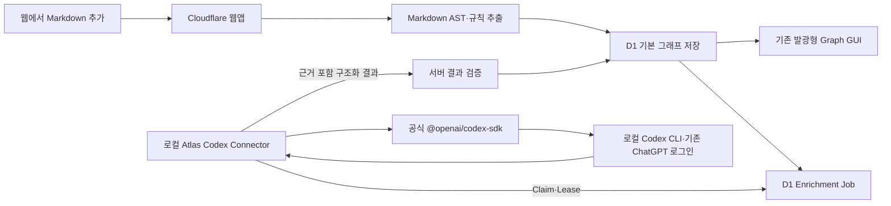

# implement_20260802_221947.md

작성 일시: `2026-08-02 22:19:47 KST`

최근 업데이트: `2026-08-02 23:01:53 KST` — Phase 3·4 Connector, 작업 API, 공식 Codex SDK 실제 호출과 원자적 결과 병합 구현 완료

이 문서는 현재 AI Systems Atlas의 규칙 기반 Markdown 지식 그래프에 **공식 Codex CLI/SDK 기반 비동기 관계 보강 기능**을 연결하기 위한 개발 범위를 고정하고, 구현이 목적 밖으로 확장되지 않도록 하기 위한 작업 문서다.

이 계획은 기존 그래프 GUI·대시보드·Markdown AST·D1 저장 구조를 유지하며, 기존 `client_credentials` OAuth 보강 경로를 `@openai/codex-sdk + 로컬 Connector + D1 작업 큐` 구조로 교체하는 신규 작업 흐름이다. 사용자의 선 검증 요청으로 Phase 1 Spike를 완료했고, 후속 승인으로 Phase 2 저장 기반까지 구현했다. Phase 3 이후는 별도 요청 전까지 진행하지 않는다.

## 개발 목적

사용자가 웹에서 Markdown 문서를 추가하면 규칙 기반 노드·관계를 즉시 저장하고 표시한 뒤, 별도의 로컬 `Atlas Codex Connector`가 D1 작업 큐에서 보강 작업을 가져가 기존 `codex login` 인증으로 관계 후보를 추출하도록 한다.

Codex 결과는 문서 블록 근거와 함께 구조화된 JSON으로 반환하고, 웹앱이 허용된 노드·관계·근거만 검증하여 저장한다. Codex가 꺼져 있거나 로그인·추론·네트워크가 실패해도 규칙 기반 그래프와 현재 발광형 GUI는 정상 동작해야 한다.



## 개발 범위

- 현재 `/`의 `별자리`, `성운`, `궤도` 그래프 GUI와 발광 렌더링을 그대로 유지한다.
- 현재 `/dashboard`의 문서 추가·재인덱싱·삭제·처리 기록 기능을 유지한다.
- 규칙 기반 Markdown 인덱싱을 항상 기본 경로로 유지하고 Codex 보강보다 먼저 완료한다.
- 공식 `@openai/codex-sdk`를 사용하는 독립 Node.js Connector를 추가한다.
- Connector는 기존 로컬 `codex login` 상태를 사용하고 OpenAI API 키를 요구하지 않는다.
- 웹앱과 Connector 사이에 D1 기반 비동기 작업 등록·Claim·Lease·결과 제출 흐름을 추가한다.
- Codex 입력에 노드·기존 관계뿐 아니라 문서 블록 근거를 포함한다.
- Codex 출력은 JSON Schema로 제한하고 서버에서 다시 검증한다.
- 관계에 `origin`, Provider·Prompt 버전, 근거 블록, 생성 시각을 기록한다.
- 동일 문서 해시와 동일 보강 버전의 작업은 중복 실행하지 않는다.
- 재인덱싱으로 문서 해시가 바뀌면 이전 보강 작업·결과를 안전하게 무효화한다.
- 대시보드에 `보강 대기`, `보강 중`, `보강 완료`, `보강 경고`, `Connector 오프라인` 상태를 표시한다.
- 로컬 실행과 향후 호스팅 환경에서 같은 작업 계약을 사용한다.
- 구현 완료 후 타입·린트·빌드·테스트·로컬 통합 검증을 수행한다.

## 제외 범위

- 현재 그래프의 Three.js 렌더러·레이아웃·발광 프리셋 재설계
- LightRAG, GraphRAG, MiniRAG 서버 재도입
- 임베딩 생성, 벡터 데이터베이스, 리랭커, 생성형 RAG 질의 화면
- OpenAI API 키, `LIGHTRAG_API_KEY`, OAuth Client Secret 기반 LLM 호출
- ChatGPT/Codex 인증 토큰을 브라우저·D1·웹앱 환경 변수에 저장하는 기능
- `~/.codex/auth.json`을 직접 파싱·복사·업로드하는 기능
- Codex App Server 또는 CLIProxyAPI 포트를 공용 인터넷에 노출하는 기능
- CLIProxyAPI의 다중 계정·라운드로빈·관리 대시보드 도입
- Markdown 외 PDF, DOCX, 이미지, URL 크롤링
- 사용자가 직접 관계를 편집하는 그래프 에디터
- 다중 사용자 실시간 협업과 조직 단위 Connector 풀
- 별도 승인 없는 운영 배포·D1 운영 마이그레이션 실행

## 참조 문서

- [현재 프로젝트 README](../README.md)
- [기존 GUI·대시보드·Markdown 파이프라인 계획](./implement_20260802_205103.md)
- [기존 경량 Markdown 그래프 계획](./implement_20260802_203615.md)
- [공식 Codex TypeScript SDK](https://github.com/openai/codex/blob/main/sdk/typescript/README.md)
- [공식 Codex CLI](https://github.com/openai/codex)
- [공식 Codex App Server 프로토콜](https://github.com/openai/codex/blob/main/codex-rs/app-server/README.md)
- [공식 Codex MCP 인터페이스](https://github.com/openai/codex/blob/main/codex-rs/docs/codex_mcp_interface.md)
- [Cloudflare Workers Node.js 호환성](https://developers.cloudflare.com/workers/runtime-apis/nodejs/)
- [비교 검토용 CLIProxyAPI](https://github.com/router-for-me/CLIProxyAPI)

## 공통 진행 규칙

- Phase 1은 사용자 요청에 따른 프로젝트 외부 임시 Spike로 완료했으며, 별도 구현 승인 전에는 Phase 2를 시작하지 않는다.
- 각 Phase는 앞선 Phase의 자체 테스트 완료 후에만 시작한다.
- 구현 중 발생한 이슈는 해당 Phase에서 수정하고 기록한다.
- 체크박스 상태를 실제 진행 상태와 맞게 업데이트한다.
- 문서에 없는 범위 확장은 하지 않는다.
- 요구사항이 불명확하면 가능한 케이스를 나누고 확인 후 진행한다.
- 한 기능은 유지보수 가능한 최소 책임 단위로 나누고 각 역할과 경계를 지킨다.
- 공통화는 계획 범위 안의 중복을 줄일 때만 수행하고 과도한 Provider 프레임워크를 만들지 않는다.
- 공식 Codex SDK와 현재 프로젝트 API를 우선 사용하고 비공식 토큰 처리나 범용 프록시를 기본 경로에 넣지 않는다.
- 규칙 기반 인덱싱 성공 여부와 Codex 보강 성공 여부를 분리한다.
- Codex가 생성한 관계는 검증 전까지 후보 데이터로 취급한다.
- 브라우저는 Codex CLI와 직접 통신하지 않는다.
- Connector는 웹앱으로 아웃바운드 요청만 보내며 로컬 수신 포트를 공용으로 열지 않는다.
- Connector 실행은 작업별 격리 디렉터리와 `read-only`를 기본으로 하며, 세션 지속 여부를 명시적으로 통제한다.
- 개발 중에도 ChatGPT/Codex 토큰 원문을 로그에 남기지 않는다.
- 기존 GUI 데이터 계약 변경은 필요한 메타데이터 추가로 제한하고 렌더링 동작은 변경하지 않는다.
- 구현 완료 후에도 별도 승인 없이 배포하지 않는다.

## 문서 기반 제약 사항

- 현재 앱은 Vinext·Cloudflare Workers·D1 구조이며 Worker에서 로컬 Codex CLI 프로세스를 실행할 수 없다.
- `@openai/codex-sdk`는 내부적으로 Codex CLI 자식 프로세스와 JSONL로 통신하므로 독립 Node.js Connector에서만 실행한다.
- 현재 `GraphEnrichmentProvider.enrich()`는 업로드 요청 안에서 동기 호출되므로 장시간 Codex 작업에 적합하지 않다.
- 현재 보강 입력은 노드·기존 관계만 포함하고 `ExtractedGraph.blocks`를 포함하지 않으므로 근거 기반 검증이 불가능하다.
- 현재 `KnowledgeEdge` 화면 계약은 시각화에 필요한 필드만 포함한다. Provider·근거·버전 메타데이터는 저장 모델에서 관리하고 그래프 투영 시 필요한 필드만 전달한다.
- 현재 `DocumentStatus`는 보강 상태를 표현하지 못한다. 문서 처리 상태와 보강 작업 상태를 별도 모델로 유지한다.
- 현재 `oauth-client.ts`는 OAuth `client_credentials` 흐름이며 Codex CLI의 ChatGPT 로그인 재사용 구조와 다르다.
- 그래프 읽기는 공개로 유지할 수 있지만 작업 Claim·결과 제출은 Connector 전용 권한이 필요하다.

## 핵심 결정 기록

### 기본 Provider

- 기본 관계 보강 엔진은 공식 `@openai/codex-sdk`다.
- SDK에는 `apiKey`와 임의 `baseUrl`을 전달하지 않고 로컬 Codex 인증 상태를 사용한다.
- Codex 인증 확인과 실제 무키 실행 여부는 Phase 1 기술 검증의 통과 조건으로 고정한다.
- Codex CLI 버전과 Connector가 기대하는 Schema·행동을 기록하여 버전 변경에 따른 회귀를 확인한다.

### 실행 방식

- 웹앱 서버가 Connector의 localhost로 접근하지 않는다.
- Connector가 웹앱의 작업 API를 주기적으로 조회하거나 long polling하여 작업을 Claim한다.
- 한 작업은 Lease를 가진 Connector 하나만 처리하며 Lease 만료 시에만 재처리한다.
- 초기 구현은 동시 실행 1개를 기본값으로 하여 Codex 사용량과 중복 작업을 제한한다.

### 인증 경계

- Codex 인증은 로컬 Codex CLI가 소유한다.
- Atlas 웹앱 로그인·쓰기 권한과 Codex ChatGPT 로그인은 서로 다른 책임으로 유지한다.
- Connector 권한은 `작업 조회`, `작업 Claim`, `Lease 갱신`, `결과 제출`로만 제한한다.
- Connector 자격증명은 LLM API 키가 아니라 Atlas 작업 연결 자격증명이며 취소·회전 가능해야 한다.
- 로컬 전용 개발 모드는 loopback과 단일 사용자 조건으로 단순화할 수 있지만, 호스팅 연결에서는 인증 없는 Claim·결과 제출을 허용하지 않는다.

### 실패 정책

- Codex 오프라인·미로그인·사용 한도·Schema 오류·타임아웃은 기본 문서 인덱싱 실패로 처리하지 않는다.
- 기본 그래프는 즉시 `completed`로 저장하고 보강 작업만 `queued`, `leased`, `running`, `completed`, `warning`, `failed`, `stale`로 관리한다.
- 제한 횟수 재시도 후에도 실패하면 규칙 기반 그래프를 유지하고 대시보드에 보강 경고를 표시한다.
- 문서 해시가 달라진 결과는 저장하지 않고 `stale`로 종료한다.

## 목표 책임 구조

```text
Web App
├─ MarkdownIngestionService        # 기본 AST·규칙 추출과 저장
├─ EnrichmentJobDispatcher         # D1 작업 등록·멱등성
├─ EnrichmentJobRepository         # Claim·Lease·상태 전이
├─ EnrichmentResultValidator       # 후보 관계·근거 검증
└─ EnrichmentResultMerger          # 검증 결과 원자적 병합

Atlas Codex Connector
├─ ConnectorClient                 # 작업 조회·Lease·결과 제출
├─ CodexGraphEnrichmentEngine      # 공식 SDK 실행
├─ EnrichmentPromptBuilder         # 신뢰하지 않는 문서 데이터 격리
└─ EnrichmentSchemaValidator       # 로컬 선검증
```

- 전송 책임과 추론 책임을 분리한다.
- 웹앱은 어떤 모델이 결과를 만들었는지와 무관하게 같은 결과 계약을 검증한다.
- Connector는 D1에 직접 접근하지 않고 웹앱의 제한된 API만 사용한다.
- `GraphEnrichmentProvider`는 동기 HTTP Provider가 아니라 Connector 측 `EnrichmentEngine` 계약으로 재정의하거나 역할에 맞는 새 인터페이스로 교체한다.

## 목표 작업 계약

```ts
type EnrichmentJobInput = {
  jobId: string;
  idempotencyKey: string;
  document: {
    id: string;
    name: string;
    hash: string;
    parserVersion: string;
  };
  nodes: KnowledgeNode[];
  existingEdges: KnowledgeEdge[];
  evidenceBlocks: Array<{
    id: string;
    type: string;
    depth: number;
    text: string;
    ordinal: number;
  }>;
  constraints: {
    allowedRelationTypes: RelationKind[];
    maxNewRelations: number;
  };
};

type EnrichmentResult = {
  jobId: string;
  documentHash: string;
  provider: "codex-cli";
  providerVersion: string;
  promptVersion: string;
  relations: Array<{
    source: string;
    target: string;
    type: RelationKind;
    confidence: number;
    evidenceBlockIds: string[];
    reason: string;
  }>;
  warnings: string[];
};
```

검증 기준:

- `source`와 `target`은 현재 문서 작업에 포함된 노드 ID여야 한다.
- `source !== target`이어야 한다.
- 관계 유형은 허용 목록 안에 있어야 한다.
- `evidenceBlockIds`는 실제 입력 블록을 한 개 이상 참조해야 한다.
- 현재 문서 해시·작업 ID·Prompt 버전이 일치해야 한다.
- 기존 동일 관계와 중복되거나 문서별 상한을 넘는 후보는 거부한다.
- 관계 근거 문장은 길이 제한과 안전한 텍스트 정규화를 거친다.

## 목표 저장 구조

| 테이블·필드 | 책임 |
|---|---|
| `enrichment_jobs` | 작업 ID, 문서·해시, 멱등 키, 상태, 시도 수, Lease, Provider·Prompt 버전, 오류, 시간 |
| `relations.origin` | `rule`, `codex`, 향후 `manual` 출처 구분 |
| `relations.provider_version` | 관계를 생성한 Codex Connector/CLI 버전 |
| `relations.prompt_version` | 재보강 판단을 위한 Prompt 버전 |
| `relations.evidence_json` 또는 별도 근거 테이블 | 관계가 참조하는 문서 블록 ID와 설명 |
| `connector_registrations` | 호스팅 Connector 연결을 구현할 경우 제한된 등록·폐기 상태 저장 |

- 구현 전 D1 마이그레이션은 실제 조회 패턴과 원자적 Claim 가능성을 기준으로 최소 스키마를 확정한다.
- `connector_registrations`는 호스팅 인증을 이번 범위에서 구현할 때만 추가하고 로컬 전용 검증에는 만들지 않는다.
- 그래프 화면으로 투영하는 `KnowledgeEdge`에는 기존 렌더링 필드만 유지한다.

## 예상 변경 파일 / 영향 범위

### 신규 추가 예정

- `connector/package.json`: 웹앱 번들과 분리된 Connector 패키지
- `connector/src/worker.ts`: Claim·Lease·재시도 실행 루프
- `connector/src/codex-engine.ts`: `@openai/codex-sdk` 호출과 격리 실행
- `connector/src/prompt.ts`: 관계 추출 프롬프트와 Prompt 버전
- `connector/src/schemas.ts`: 입출력 JSON Schema·런타임 검증
- `connector/src/client.ts`: Atlas 작업 API 클라이언트
- `app/lib/llm/enrichment-contracts.ts`: 웹앱과 Connector가 공유하는 직렬화 계약
- `app/lib/llm/enrichment-job-repository.ts`: 작업 등록·Claim·Lease·상태 저장
- `app/lib/llm/enrichment-result-validator.ts`: 서버 최종 검증
- `app/lib/llm/enrichment-result-merger.ts`: 검증된 관계 병합
- `app/api/enrichment-jobs/claim/route.ts`: Connector 작업 Claim
- `app/api/enrichment-jobs/[jobId]/lease/route.ts`: Lease 갱신
- `app/api/enrichment-jobs/[jobId]/result/route.ts`: 결과 제출
- `app/api/enrichment-jobs/[jobId]/route.ts`: 상태·오류 조회 또는 취소
- `tests/connector-contract.test.mjs`: Connector 계약 검증
- `tests/enrichment-jobs.test.mjs`: 상태 전이·Lease·멱등성 검증
- `tests/enrichment-validation.test.mjs`: 악성·잘못된 후보 거부 검증
- `drizzle/0002_codex_enrichment.sql`: 확정된 D1 마이그레이션

### 수정 예정

- `app/lib/ingestion/ingestion-service.ts`: 동기 보강을 제거하고 기본 저장 후 작업 등록
- `app/lib/llm/graph-enrichment-provider.ts`: 동기 HTTP 책임 제거 또는 Connector 엔진 계약으로 교체
- `app/lib/graph/model.ts`: 문서 상태와 분리된 보강 상태 계약 추가
- `app/lib/storage/graph-repository.ts`: 보강 작업과 근거 포함 관계 저장·조회
- `app/dashboard/dashboard-client.tsx`: 보강 상태·재시도·Connector 상태 표시
- `app/dashboard/dashboard.css`: 기존 다크 테마 안에서 상태 표현만 추가
- `db/schema.ts`: 작업·근거·버전 스키마 추가
- `.env.example`: 기존 OAuth Client Secret 변수 제거, Connector 모드 설명으로 교체
- `package.json`: Connector 개발·검증 명령 추가
- `README.md`: 무키 Codex Connector 실행·로그인·장애 복구 절차 문서화
- `dev-plan/implement_20260802_205103.md`: 이전 계획은 이력으로 보존하고 수정하지 않는다.

### 제거 또는 기본 경로 제외 예정

- `app/lib/llm/oauth-client.ts`
- `app/lib/llm/oauth-proxy-enrichment.ts`
- `OAUTH_TOKEN_URL`
- `OAUTH_CLIENT_ID`
- `OAUTH_CLIENT_SECRET`
- `OAUTH_SCOPE`
- `OAUTH_AUDIENCE`
- `OAUTH_CLIENT_AUTH_MODE`
- `LLM_UPSTREAM_BASE_URL`
- `LLM_GRAPH_ENRICHMENT_PATH`
- `scripts/verify-oauth-proxy.mjs`와 `verify:oauth` 스크립트

CLIProxyAPI 비교 어댑터를 추후 검토하더라도 위 파일을 이름만 바꿔 기본 경로에 유지하지 않는다.

## Phase 상태 요약

- [x] Phase 1 완료 — 공식 Codex SDK 무키 기술 검증
- [x] Phase 2 완료 — 보강 계약·D1 비동기 작업 모델 구현
- [x] Phase 3 완료 — 로컬 Atlas Codex Connector 구현
- [x] Phase 4 완료 — 작업 API·Lease·결과 검증·병합 구현
- [ ] Phase 5 완료 — Markdown 파이프라인·대시보드 연결
- [ ] Phase 6 완료 — 보안·장애 복구·성능·회귀 QA·문서화

## Phase 1 선 검증 결과 업데이트

검증은 프로젝트 의존성과 코드를 변경하지 않고 `/private/tmp/atlas-codex-sdk-spike.uKjcSv`의 임시 Node.js 패키지에서 수행했다.

### 환경·버전

- 현재 시스템 CLI: `codex-cli 0.145.0`
- 공식 SDK: `@openai/codex-sdk 0.146.0`, Apache-2.0
- SDK 번들 CLI: `codex-cli 0.146.0`
- Node.js: `v24.13.1`
- 인증 상태: `Logged in using ChatGPT`
- `OPENAI_API_KEY`, `CODEX_API_KEY`, `OPENAI_BASE_URL`: 모두 없는 상태

### 성공 결과

- `new Codex()`에 `apiKey`와 `baseUrl`을 전달하지 않은 호출이 기존 ChatGPT 로그인을 재사용하여 성공했다.
- SDK 번들 CLI `0.146.0` 실행이 약 `10.0초`에 완료되었다.
- 현재 설치 CLI `0.145.0`을 `codexPathOverride`로 지정한 실행이 약 `14.4초`에 완료되었다.
- SDK 번들 CLI 사용량은 입력 `12,673`, 출력 `297`, reasoning 출력 `88` 토큰이었다.
- 현재 설치 CLI 사용량은 입력 `12,673`, 출력 `370`, reasoning 출력 `141` 토큰이었다.
- 두 실행 모두 한국어 문서 데이터에서 JSON Schema에 맞는 관계 배열과 경고 배열을 반환했다.
- 기존 관계는 반복하지 않았고, 존재하는 노드 ID·근거 블록 ID만 사용했다.
- 검증된 예: `검색 증강 생성 uses 벡터 데이터베이스`, `변경 문서 재인덱싱 mitigates 오래된 인덱스`.
- 이벤트 항목은 최종 `agent_message` 한 개였고 결과를 `JSON.parse()`로 정상 처리했다.
- 격리된 `task/` 디렉터리의 생성 파일 수는 `0`으로 `read-only` 쓰기 차단을 확인했다.

### 확인된 제한과 계획 반영

- TypeScript SDK `0.146.0`의 `ThreadOptions`에는 `ephemeral` 옵션이 없으며 실행 후 `~/.codex/sessions`에 세션이 저장된다.
- 따라서 구현 전 세션 정책을 확정해야 한다. 기본안은 작업별 단일 Turn과 보존 기간·정리 정책이며, 세션 비저장이 필수이면 공식 App Server의 ephemeral thread 또는 `codex exec --ephemeral` 최소 어댑터를 별도 비교한다.
- SDK는 인증 상태 조회 API를 제공하지 않는다. Connector 시작 시 CLI의 `codex login status`를 선행 검사하여 `Not logged in`을 `connector_auth_required`로 변환한다.
- 빈 `CODEX_HOME`에 대한 `codex login status`는 `Not logged in`, 종료 코드 `1`을 반환하는 것을 확인했다.
- 최신 SDK가 번들 CLI를 포함하므로 Connector는 SDK·CLI 호환 버전을 함께 고정하고, 시스템 CLI 사용은 명시적 `codexPathOverride` 선택으로 제한한다.
- 작은 샘플에도 약 `12.7K` 입력 토큰의 고정 컨텍스트 비용이 관찰되었으므로 문서별 무제한 호출은 피하고 배치 크기·작업 합치기·사용량 상한을 Phase 3과 Phase 6에서 계측한다.
- 위 제한은 무키 인증 성공을 막지 않지만 Phase 3 Connector 구현 전에 세션 보존 정책을 완료 조건으로 추가한다.

## QA 관점

- [ ] Codex CLI가 설치되지 않은 환경에서도 기본 그래프가 정상 생성되는지 검증한다.
- [ ] Codex 미로그인·로그인 만료·사용 한도 초과를 보강 경고로 처리하는지 검증한다.
- [x] OpenAI API 키와 OAuth Client Secret 없이 SDK 호출이 성공하는지 검증한다.
- [ ] Connector 종료 중 Lease가 만료되면 작업이 한 번만 안전하게 재처리되는지 검증한다.
- [ ] 두 Connector가 같은 작업을 동시에 Claim하지 못하는지 검증한다.
- [ ] 동일 문서·해시·Parser·Prompt 버전에서 중복 작업과 중복 관계가 생성되지 않는지 검증한다.
- [ ] 실행 중 문서가 재인덱싱되면 이전 결과가 `stale`로 거부되는지 검증한다.
- [ ] 존재하지 않는 노드·블록, 자기 관계, 허용되지 않은 관계 유형을 거부하는지 검증한다.
- [ ] 근거 없는 관계와 문서 내용에 없는 추론을 저장하지 않는지 검증한다.
- [ ] Markdown 안의 프롬프트 인젝션 문장이 Connector 지침이나 출력 계약을 바꾸지 못하는지 검증한다.
- [ ] 2MB 문서, 220개 노드, 긴 블록, 빈 블록, 다국어 텍스트에서 입력 상한과 분할 정책을 검증한다.
- [ ] JSON Schema 불일치·중간 메시지·빈 최종 응답·부분 결과를 안전하게 실패 처리하는지 검증한다.
- [ ] 작업 제한 시간과 재시도 횟수를 초과했을 때 무한 루프가 발생하지 않는지 검증한다.
- [ ] Connector 권한으로 문서 삭제·일반 그래프 수정·다른 관리 API를 호출할 수 없는지 검증한다.
- [ ] 브라우저 번들·Worker 로그·D1에 ChatGPT/Codex 토큰이 포함되지 않는지 검증한다.
- [ ] Connector 로그에 문서 원문 전체·토큰·민감 헤더가 남지 않는지 검증한다.
- [ ] 기존 업로드·재인덱싱·삭제·그래프 읽기·3개 보기·발광 프리셋이 회귀하지 않는지 검증한다.
- [ ] Connector 오프라인 상태가 그래프 조작과 대시보드 문서 관리 기능을 막지 않는지 검증한다.
- [ ] 기존 500 노드·2,000 관계 fixture와 렌더링 성능이 보강 메타데이터 추가로 저하되지 않는지 검증한다.
- [ ] 타입 검사·린트·프로덕션 빌드·전체 자동 테스트가 모두 통과하는지 검증한다.

## Phase 1. 공식 Codex SDK 무키 기술 검증

### 목표

- 현재 환경의 `codex login` 인증을 API 키 없이 공식 TypeScript SDK가 재사용할 수 있는지 확인한다.
- 구현 전체를 시작하기 전에 구조화 출력, 격리 실행, 한국어 관계 추출의 기술 위험을 제거한다.

### 구현 태스크

- [x] 현재 Codex CLI 버전과 로그인 상태를 비밀값 없이 확인한다.
- [x] 프로젝트 본체와 분리된 임시 Spike에서 `@openai/codex-sdk`를 설치한다.
- [x] `new Codex()`에 `apiKey`와 `baseUrl`을 전달하지 않고 한 번의 Turn을 실행한다.
- [x] 작업 디렉터리를 격리하고 `read-only`, 단일 Turn으로 실행한다.
- [x] TypeScript SDK의 `ephemeral` 지원 여부와 세션 저장 동작을 확인한다.
- [x] 관계 결과용 최소 JSON Schema를 적용한다.
- [x] 한국어 Markdown 블록·노드·기존 관계 샘플로 결과를 생성한다.
- [x] 최종 응답 외 중간 이벤트가 결과 파서에 섞이지 않도록 처리 기준을 확정한다.
- [x] 실행 시간, 출력 크기, 토큰 사용 정보, 실패 형태를 기록한다.
- [x] Codex CLI 버전 차이와 SDK 버전 고정 정책을 결정한다.

### 자체 테스트

- [x] OpenAI API 키가 없는 환경에서 기존 Codex 로그인으로 Turn이 성공한다.
- [x] JSON Schema에 맞는 최종 결과만 파싱한다.
- [x] SDK가 웹앱 Worker 번들에 포함되지 않고 별도 Node 프로세스에서만 실행된다.
- [x] `read-only` 실행에서 프로젝트 파일 쓰기가 발생하지 않는다.
- [x] Codex 미로그인 상태를 `codex login status` 선행 검사로 감지할 수 있다.
- [x] 미로그인 종료 코드 `1`을 향후 `connector_auth_required`로 매핑하는 기준을 확정한다.

### 이슈 및 수정

- [x] SDK `0.146.0`에 `ephemeral` Thread 옵션이 없음을 확인하고 세션 보존 정책을 Phase 3에 추가한다.

### 완료 조건

- [x] API 키 없는 공식 SDK 호출이 검증되었다.
- [x] 구조화 관계 추출의 성공·실패 계약이 확정되었다.
- [x] 기술 검증 결과를 이 문서에 기록했다.
- [x] Phase 2 진행 가능

## Phase 2. 보강 계약과 D1 비동기 작업 모델 구현

### 목표

- 웹앱과 Connector가 공유할 입력·출력 계약과 작업 상태를 확정한다.
- 동기 LLM 호출을 제거할 수 있는 D1 작업 큐·멱등성·Lease 기반을 만든다.

### 구현 태스크

- [x] `EnrichmentJobInput`, `EnrichmentResult`, 오류 코드 계약을 추가한다.
- [x] 문서 블록을 근거 입력으로 직렬화하되 크기·개수 상한을 적용한다.
- [x] `enrichment_jobs` 상태 전이표를 구현한다.
- [x] 멱등 키를 `documentHash + parserVersion + promptVersion + providerVersion` 기준으로 생성한다.
- [x] Claim·Lease·Lease 만료·재시도·취소·stale 전이를 저장소 책임으로 구현한다.
- [x] 관계의 출처·Provider·Prompt·근거 메타데이터 저장 구조를 추가한다.
- [x] D1 마이그레이션과 메모리 fallback 저장소를 같은 계약으로 갱신한다.
- [x] 기존 그래프 투영은 추가 메타데이터를 무시하고 같은 `KnowledgeEdge`를 반환하게 한다.

### 자체 테스트

- [x] 같은 멱등 키 작업을 두 번 등록해도 활성 작업이 한 개만 생성된다.
- [x] Lease 소유자가 아닌 Connector의 갱신·결과 제출이 거부된다.
- [x] Lease 만료 후에만 다른 Connector가 작업을 재Claim할 수 있다.
- [x] 문서 해시가 바뀐 작업 결과가 `stale`로 종료된다.
- [x] 메모리 저장소와 D1 저장소의 상태 전이가 동일하다.
- [x] 기존 그래프 API 응답 형식과 GUI가 변하지 않는다.

### 이슈 및 수정

- [x] Lease 만료 후 `leased/running -> leased` 재Claim 전이가 상태표에 빠진 문제를 테스트에서 발견해 명시적 전이로 보완했다.

### 완료 조건

- [x] 보강 계약과 저장 모델 구현 완료
- [x] 마이그레이션·멱등성·Lease 테스트 완료
- [x] 기존 그래프 회귀 없음
- [x] Phase 3 진행 가능

## Phase 3. 로컬 Atlas Codex Connector 구현

### 목표

- 웹앱 번들과 분리된 Node.js Connector가 작업을 가져가 Codex로 처리하고 결과를 제출하도록 한다.

### 구현 태스크

- [x] `connector/` 패키지와 실행 명령을 추가한다.
- [x] Atlas 작업 API용 제한된 `ConnectorClient`를 구현한다.
- [x] Claim 후 처리 중 Lease를 주기적으로 갱신한다.
- [x] 작업별 임시 디렉터리를 생성하고 완료 후 안전하게 정리한다.
- [x] 문서 데이터는 명령으로 실행되지 않도록 JSON 데이터 블록으로만 전달한다.
- [x] 문서 안의 지시를 따르지 않는 Prompt 경계와 Prompt 버전을 정의한다.
- [x] Codex SDK를 `read-only`, 단일 Turn 작업 모드로 실행한다.
- [x] SDK 세션 보존 기간·정리 정책을 구현하고, 세션 비저장이 필수이면 공식 ephemeral 대안을 검증해 선택한다.
- [x] 출력 Schema와 로컬 런타임 검증을 모두 적용한다.
- [x] 작업당 입력 크기·관계 수·최대 사용량을 제한하고 실제 사용량을 작업 결과에 기록한다.
- [x] 제한된 재시도, 지수 백오프, Graceful shutdown을 구현한다.
- [x] 인증 필요·사용 한도·타임아웃·Schema 오류를 안정적인 오류 코드로 변환한다.
- [x] Connector 로그에서 토큰·헤더·문서 원문을 제거한다.

### 자체 테스트

- [x] 로컬 웹앱에서 하나의 보강 작업을 Claim하고 결과를 제출한다.
- [x] Connector를 중간 종료해도 Lease 만료 후 작업이 복구된다.
- [x] 두 작업이 기본 동시성 1로 순차 처리된다.
- [x] 잘못된 Codex 출력은 서버에 성공 결과로 제출되지 않는다.
- [x] SIGINT·SIGTERM 시 새 작업 Claim을 중단하고 현재 Lease를 정리한다.
- [x] 작업 임시 디렉터리와 SDK 세션 외 프로젝트 밖 산출물을 만들지 않고, 두 임시 자원을 종료 시 정리한다.

### 이슈 및 수정

- [x] TypeScript SDK가 생성하는 `~/.codex/sessions` 파일을 Thread ID로 한정해 작업 종료 후 즉시 정리하도록 보완했다.

### 완료 조건

- [x] Connector 실행 루프 구현 완료
- [x] Codex 추출·재시도·종료 테스트 완료
- [x] 토큰과 문서 원문 로그 노출 없음
- [x] Phase 4 진행 가능

## Phase 4. 작업 API·결과 검증·관계 병합 구현

### 목표

- Connector 전용 API와 서버 최종 검증을 구현하여 신뢰할 수 있는 관계만 원자적으로 저장한다.

### 구현 태스크

- [x] 작업 Claim API를 추가하고 한 번에 Claim할 수 있는 작업 수를 제한한다.
- [x] Lease 갱신·작업 실패·결과 제출 API를 추가한다.
- [x] Connector 권한 범위를 작업 API로 제한한다.
- [x] 요청 본문 크기, 빈도, 작업 소유권, 문서 해시를 검증한다.
- [x] 노드 ID·관계 유형·신뢰도·근거 블록·중복·관계 수 상한을 검증한다.
- [x] 검증 통과 관계만 D1 트랜잭션으로 병합한다.
- [x] 일부 후보가 거부되어도 유효한 관계와 경고를 구분해 기록한다.
- [x] 작업 완료와 관계 병합 사이의 원자성·재시도 안전성을 확보한다.
- [x] 로컬 개발 Connector 인증과 호스팅용 제한 자격증명 경계를 구현 범위에 맞게 확정한다.

### 자체 테스트

- [x] 인증 없는 Claim·결과 제출 요청이 거부된다.
- [x] Connector가 일반 문서 관리 API 권한을 얻지 못한다.
- [x] 존재하지 않는 노드·근거 블록·관계 유형이 거부된다.
- [x] 같은 결과를 반복 제출해도 관계가 중복되지 않는다.
- [x] 결과 병합 중 fault injection 시 부분 관계가 남지 않는다.
- [x] 문서 삭제·재인덱싱과 동시에 결과가 도착해도 고아 관계가 생성되지 않는다.

### 이슈 및 수정

- [x] 관계 삽입 뒤 작업 완료 갱신 실패 가능성을 D1 batch와 조건부 삽입으로 묶고 fault injection 회귀 테스트를 추가했다.

### 완료 조건

- [x] Connector API와 권한 분리 완료
- [x] 서버 최종 검증·원자적 병합 완료
- [x] 악성·중복·stale 결과 테스트 완료
- [x] Phase 5 진행 가능

### Phase 3·4 실제 검증 기록

- 공식 `@openai/codex-sdk@0.146.0`을 프로젝트 의존성으로 고정하고 OpenAI API 키 환경 변수를 제거한 자식 환경에서 실행했다.
- `npm run connector:smoke` 실제 호출이 완료됐으며 관계 1개, 입력 12,613 토큰, 출력 107 토큰을 기록했다.
- 로컬 D1 웹앱에 Markdown을 추가한 뒤 `npm run connector:once`로 Claim → running → 결과 제출 → 관계 병합을 완료했다.
- 실제 E2E 작업은 관계 1개, 입력 13,500 토큰, 출력 180 토큰을 기록했고 검증 후 테스트 문서와 작업 데이터를 삭제했다.
- 로컬 개발은 loopback에서 별도 토큰 없이 허용하고, 호스팅은 `ATLAS_CONNECTOR_TOKEN`이 없으면 작업 API를 거부한다. 이 토큰은 OpenAI 자격증명이 아니라 Atlas 작업 API 전용이다.
- `npm audit --omit=dev`에서 기존 `next@16.2.6` 계열 취약점 3건이 확인됐으며, Next 패치 업그레이드는 Phase 6 보안 검토 항목으로 남긴다.

## Phase 5. Markdown 파이프라인과 대시보드 연결

### 목표

- 기본 인덱싱 완료 후 보강 작업을 자동 등록하고 사용자에게 상태를 명확하게 보여준다.

### 구현 태스크

- [x] `ingestMarkdown()`에서 동기 OAuth 보강 호출을 제거한다.
- [x] 기본 문서·노드·관계 저장이 성공한 뒤 보강 작업을 등록한다.
- [x] Connector가 없어도 업로드 응답은 즉시 기본 그래프 완료로 반환한다.
- [x] 재인덱싱 시 이전 활성 작업과 Codex 자동 관계를 문서 해시 기준으로 교체한다.
- [x] 문서 삭제 시 해당 보강 작업·근거·자동 관계를 정리한다.
- [x] 대시보드 문서 행 또는 처리 기록에 보강 상태를 표시한다.
- [x] 실패·경고 작업에 제한된 재시도와 취소 기능을 연결한다.
- [x] Connector 오프라인을 문서 실패가 아닌 별도 상태로 표현한다.
- [ ] 그래프 갱신 후 새 관계가 세 보기에서 같은 방식으로 표시되는지 확인한다.

### 자체 테스트

- [x] Connector 없이 Markdown 업로드·재인덱싱·삭제가 정상 동작한다.
- [ ] Connector 실행 시 대기 → 실행 → 완료 상태가 대시보드에 반영된다.
- [x] 보강 완료 전후 기본 노드·관계가 사라지거나 중복되지 않는다.
- [x] 재시도 버튼을 연속 클릭해도 중복 작업이 생기지 않는다.
- [ ] 보강 관계가 `별자리`, `성운`, `궤도`에서 정상 표시된다.
- [ ] 작은 화면·키보드 탐색·스크린 리더 상태 문구가 기존 접근성을 유지한다.

### 이슈 및 수정

- [x] 단순 작업 상태만으로 Connector 생존 여부를 판단하면 유휴 상태와 오프라인을 구분할 수 없어 15초 Heartbeat와 45초 만료 기준을 추가했다.
- [x] 경고 결과를 재시도할 때 이전 Codex 관계가 남는 문제를 막기 위해 작업 재큐잉과 해당 Provider·Prompt 관계 제거를 D1 원자 배치로 처리했다.
- [x] 수동 재시도는 작업당 최대 2회로 제한하고 실행 시도 수를 초기화하되 수동 재시도 횟수는 별도로 영속화했다.
- [x] 브라우저 시각 검증은 서버 기동 전 오류 탭이 브라우저 URL 정책에 차단되어 자동 스크린샷까지 진행하지 못했다. SSR 마커·상태 API·빌드·자동 테스트로 기능을 확인했으며 작은 화면 최종 시각 검수는 남겼다.

### 완료 조건

- [x] 자동 작업 등록과 상태 UI 연결 완료
- [ ] Connector 유무에 따른 사용자 흐름 검증 완료
- [ ] 현재 GUI 회귀 없음
- [ ] Phase 6 진행 가능

## Phase 6. 보안·장애 복구·성능·회귀 QA·문서화

### 목표

- 실제 Markdown 입력과 Codex 장애 조건에서 시스템이 안전하게 저하되고 기존 앱을 손상시키지 않는지 최종 검증한다.

### 구현 태스크

- [ ] Markdown 프롬프트 인젝션·대형 입력·잘못된 UTF-8·빈 근거 테스트를 추가한다.
- [ ] Codex 미설치·미로그인·세션 만료·사용 한도·네트워크 단절 테스트를 추가한다.
- [ ] Lease 만료·중복 Connector·중복 결과·stale 결과·D1 오류 테스트를 추가한다.
- [ ] Connector 작업 입력 크기와 문서 분할 기준을 계측하고 상한을 확정한다.
- [ ] 20개 파일 동시 추가 시 기본 인덱싱과 보강 큐가 분리되는지 확인한다.
- [ ] 500 노드·2,000 관계 fixture의 렌더링 성능을 다시 측정한다.
- [ ] `oauth-client.ts`, OAuth 환경 변수와 검증 스크립트를 제거하거나 기본 경로에서 완전히 분리한다.
- [ ] `.env.example`, `README.md`, 실행 명령과 문제 해결 절차를 갱신한다.
- [ ] 공식 Codex SDK·CLI 버전 갱신 절차와 호환성 검증 방법을 문서화한다.
- [ ] 별도 승인 없는 배포 금지 규칙을 유지한다.

### 자체 테스트

- [ ] `npx tsc --noEmit` 통과
- [ ] `npm run lint` 통과
- [ ] `npm test` 통과
- [ ] Connector 단위·계약·통합 테스트 통과
- [ ] 로컬 실제 Codex 로그인 통합 테스트 통과
- [ ] 브라우저 번들·로그·D1 비밀정보 검색 결과 0건
- [ ] 기본 업로드·대시보드·그래프·3개 보기·발광 프리셋 회귀 없음
- [ ] 기존 성능 목표 유지

### 이슈 및 수정

- [ ] 발견 이슈 없음

### 완료 조건

- [ ] 보안·장애 복구·성능 QA 완료
- [ ] 문서와 환경 예제 정리 완료
- [ ] 전체 자동·수동 검증 통과
- [ ] 구현 범위 완료, 배포는 별도 승인 대기

## 최종 완료 기준

- [ ] OpenAI API 키와 OAuth Client Secret 없이 기존 Codex 로그인으로 관계 보강이 동작한다.
- [ ] 웹앱 Worker에 Codex SDK나 로컬 프로세스 실행 코드가 포함되지 않는다.
- [ ] 규칙 기반 그래프가 Codex 상태와 무관하게 즉시 생성된다.
- [ ] Connector가 D1 작업을 Claim·Lease하고 결과를 안전하게 제출한다.
- [ ] 모든 Codex 관계가 유효한 노드와 문서 블록 근거를 가진다.
- [ ] 중복·stale·근거 없음·허용되지 않은 관계가 저장되지 않는다.
- [ ] 재인덱싱·삭제 시 Codex 자동 관계와 작업이 일관되게 정리된다.
- [ ] Connector 인증이 일반 웹앱 관리 권한과 분리된다.
- [ ] Codex 토큰이 브라우저·웹앱·D1·로그에 노출되지 않는다.
- [ ] 현재 그래프 GUI와 대시보드의 핵심 기능·디자인·성능이 유지된다.
- [ ] README와 로컬 실행 절차만으로 Connector를 시작·중지·복구할 수 있다.
- [ ] 타입·린트·빌드·전체 테스트가 통과한다.
- [ ] 사용자 승인 없이 배포하지 않는다.

## 잔여 리스크 / 후속 과제

- 공식 Codex SDK·App Server는 빠르게 변경될 수 있으므로 버전 고정과 호환성 테스트가 필요하다.
- ChatGPT 플랜 사용 한도와 Codex 처리 시간은 앱이 보장할 수 없으므로 대시보드에서 명확히 구분해야 한다.
- 대형 문서의 교차 섹션 관계 품질을 높이려면 추후 별도 배치·요약 전략이 필요할 수 있다.
- 여러 사용자와 Connector를 지원하는 호스팅 Pairing·폐기 UI는 실제 운영 요구가 확정된 뒤 별도 계획으로 분리한다.
- 그래프 기반 자연어 질의, 임베딩 검색, RAG 답변 기능은 이번 범위 밖이며 필요 시 별도 개발 계획을 만든다.
- CLIProxyAPI 비교 실험은 공식 SDK가 요구 성능·안정성을 충족하지 못할 때만 별도 승인 후 진행한다.
