# implement_20260805_201928.md

작성 일시: `2026-08-05 20:19:28 KST`

최근 업데이트: `2026-08-07 06:17:30 KST` — Phase 1-A~10 구현과 853개 Markdown parser v4 전수 재처리를 완료했다. 현재 D1은 89,669개 엔티티·94,487개 규칙 관계·1개 Codex 관계를 보유하며, 10,903개 Codex 청크는 로컬 OAuth Connector의 영속 대기열에 있다.

> **데이터 기준선 / 런타임 전환:** 이 문서의 853문서·89,669엔티티·94,488관계 결과는 현재 데이터 기준선으로 유효하다. 로컬 Connector 대기열 운영은 역사 기록이며, 후속 인증·실행 전환은 [현재 OAuth 런타임 방향](../docs/current-oauth-runtime.md)과 [implement_20260807_203534.md](./implement_20260807_203534.md)를 따른다.

이 문서는 현재 Markdown 목차형 그래프를 문서 근거가 있는 의미 관계형 지식 그래프로 보강하기 위한 구현 우선순위와 검증 경계를 고정한다. 현재 발광형 Three.js GUI는 시각 기준선으로 유지하며, 노드 수를 임의로 늘리는 대신 엔티티 추출·관계 보강·중복 해소·커뮤니티 투영을 순서대로 개선한다.

## 개발 목적

- 최신 Discovery 115개 저장소의 대상 Markdown을 먼저 수집하고 실제 내용·현재성·반복 패턴·전문 용어를 분석한 뒤 노드·관계 모델을 설계한다.
- GitHub에서 적용된 `README.md`와 `dev-plan/**/*.md`도 기존 Codex Connector 관계 보강 흐름을 실제로 거치게 한다.
- 현재 관계의 대부분을 차지하는 Markdown `contains` 트리에 문서 근거가 있는 명시·의미·교차 문서 관계를 추가한다.
- 저장소·문서·섹션·작업의 원본 노드는 보존하면서 기술·컴포넌트·API·데이터·결정·위험 같은 공용 엔티티를 정규화한다.
- 저장소가 하나뿐이어도 overview가 두 노드와 한 관계로 축소되지 않도록, 저장소 내부 커뮤니티와 대표 의미 노드를 투영한다.
- 사실 관계와 화면 연출용 유사 관계를 구분하여 시각적 밀도를 높이면서도 그래프가 거짓 관계를 사실처럼 표시하지 않게 한다.
- 각 증분을 하나씩 구현·검증한 뒤 사용자 확인을 받고 다음 Phase로 진행할 수 있게 한다.

권장 설계·구현 흐름은 다음과 같다. 자동 파서와 Codex 보강 계약은 현재 다운로드된 문서의 분석 결과와 Gold Graph를 승인한 뒤에만 변경한다.

```mermaid
flowchart LR
  A["GitHub Discovery 115개"] --> B["12개 Batch Metadata Preview"]
  B --> C["전체 Manifest·용량·차단 검토"]
  C --> D["저장소별 순차 Markdown 수집"]
  D --> E["전체 다운로드 코퍼스 분석"]
  E --> F["노드·관계 온톨로지"]
  F --> G["Gold Graph 표본"]
  G --> H["사용자 구조·시각 승인"]
  H --> I["규칙 기반 엔티티·명시 관계"]
  I --> J["Codex 청크별 의미 추출"]
  J --> K["GitHub Apply 보강 연결"]
  K --> L["엔티티 정규화·문서 간 통합"]
  L --> M["커뮤니티·중심성 계산"]
  M --> N["overview·repository 투영"]
  N --> O["기존 Three.js 발광 GUI"]
```

## 수집 전 기준선

2026-08-05 전체 수집 전에 로컬 D1을 직접 조회한 결과다. 아래 값은 이후 개선 효과를 비교하기 위한 역사적 회귀 기준이며 현재 D1 수량이 아니다.

| 항목 | 현재 값 | 판정 |
|---|---:|---|
| 적용 저장소 | 1개 | `memory_node_graph`만 실제 그래프에 적용됨 |
| GitHub Discovery | 115개 | 최신 Discovery에서 115개 모두 선택 표시됨 |
| 전체 저장소 Preview | 1개 | `memory_node_graph`만 metadata-only Preview 실행됨 |
| 고유 엔티티 | 1,152개 | 노드 수 자체는 충분함 |
| 전체 관계 | 1,176개 | 노드 수와 거의 같아 트리형 연결에 가까움 |
| `contains` 관계 | 1,105개, 약 94% | 구조 관계에 과도하게 편중 |
| `risks` 관계 | 35개 | 의미 관계 일부 존재 |
| `uses` 관계 | 17개 | 기술·참조 관계 추출 부족 |
| 연결 차수 1 노드 | 955개, 약 83% | 대부분 말단 노드 |
| 공용 기술 엔티티 | 1개 | `Drizzle ORM`만 overview에 노출 |
| Codex 보강 작업 | 0개 | GitHub Apply 이후 보강 미등록 |
| overview 투영 | 2노드·1관계 | 저장소 1개 환경에서 탐색 가치 부족 |
| repository 투영 | 280노드·281관계 | 노드는 많지만 의미 교차 관계가 빈약함 |

현재 핵심 원인은 다음과 같다.

1. Discovery에서는 115개가 선택됐지만 이후 Preview 요청을 1개 저장소로 축소했고, 단일 저장소 Apply만 반복 실행했다.
2. Preview 계약은 한 작업당 최대 10개, Apply 계약은 한 작업당 정확히 1개 저장소이지만 전체 선택을 순차 처리하는 coordinator가 없다.
3. GitHub Apply가 `prepareMarkdownIngestion`과 저장소 교체까지만 수행하고 Enrichment Job을 등록하지 않는다.
4. GitHub parser profile은 제목·체크박스 구조와 제한된 기술 별칭을 중심으로 추출한다.
5. Codex 출력 계약이 이미 존재하는 노드 사이의 관계만 허용하고, 긴 문서는 앞부분 입력 상한의 영향을 받는다.
6. 동일 개념이 문서마다 source-local 섹션·작업으로 반복되지만 공용 개념 노드로 연결되지 않는다.
7. overview projector가 저장소와 `shared technology`만 허용하므로 단일 저장소에서는 풍성한 화면을 만들 수 없다.

## 개발 범위

- 최신 Discovery의 115개 선택 저장소 전체를 최대 10개씩 나눈 metadata-only Preview로 검증한다.
- Preview에서는 원문을 다운로드하지 않고 저장소별 README·dev-plan 파일 수, 총용량, commit, 차단·생략 사유만 집계한다.
- 전체 Preview 결과를 사용자와 검토한 뒤 ready 저장소를 하나씩 순차 Apply하여 대상 Markdown 원문을 다운로드·저장한다.
- 저장소별 Apply는 checkpoint·재시도·중단 후 재개·개별 실패 격리를 지원하고, 전체 성공처럼 잘못 집계하지 않는다.
- 전체 수집 완료 후 실제 다운로드된 모든 `README.md`와 `dev-plan/**/*.md` 원문·블록·구조 그래프를 읽기 전용으로 분석한다.
- 문서를 현재 아키텍처, 기능, 컴포넌트, 처리 흐름, API·DB·파일, 기술, 결정, 위험, 테스트, 진행 이력, 대체된 계획으로 분류한다.
- 실제 문서에서 반복·연결 가치·원본 근거를 확인한 뒤 노드 타입, 관계 타입, alias, 승격·제외 기준을 확정한다.
- 대표 README와 개발 계획 일부로 사람이 검토 가능한 Gold Graph를 만들고 현재 GUI에서 시각 확인한다.
- Gold Graph 승인 전에는 의미 재처리와 대량 Enrichment Job을 실행하지 않는다. Phase 1 수집은 현재 규칙 기반 구조 그래프까지만 저장한다.
- GitHub Apply 완료 후 생성·변경 문서에만 Enrichment Job을 안전하게 등록한다.
- 기존 적용 문서에 대해 사용자가 명시적으로 실행할 수 있는 관계 보강 재처리 경로를 제공한다.
- 구조·명시·추론·표시 관계의 출처와 의미를 구분한다.
- 컴포넌트, 기능, API, 파일, 데이터 저장소, 기술, 테스트, 결정, 위험, 단계 ID를 규칙 기반으로 추출한다.
- 긴 Markdown을 근거 블록 경계로 나눠 Codex에 전달하고, 결과를 문서 단위로 병합한다.
- 문서별 후보를 저장소 범위에서 정규화하고 교차 문서 관계를 생성한다.
- 모든 LLM 관계에 문서 블록·GitHub line URL·confidence·Provider·Prompt 버전을 보존한다.
- 단일 저장소 overview에 커뮤니티와 대표 노드를 투영한다.
- Graphology의 Louvain·중심성·연결성 기능 도입 여부를 구현 Phase에서 검증한다.
- 기존 500노드·2,000관계 렌더링 예산과 발광·이동·확대·보기 전환을 유지한다.
- 관계 계층과 근거를 확인할 수 있는 최소한의 필터·범례·상세 정보를 현재 GUI에 추가한다.

## 제외 범위

- LightRAG, Microsoft GraphRAG, Neo4j 서버를 애플리케이션 런타임으로 도입하는 작업
- 벡터 데이터베이스, 임베딩 검색, 리랭커, RAG 질의·답변 기능
- OpenAI API 키 또는 별도 LLM API 키를 요구하는 구조
- 현재 Three.js 렌더러, 발광 테마, 별자리·성운·궤도 보기의 전면 재설계
- 근거 없는 무작위 관계를 저장하거나 사실 관계처럼 표시하는 기능
- 최신 Discovery 115개 밖의 저장소 또는 이후 새로 발견된 저장소의 무단 Apply
- GitHub 원격 저장소 변경, 운영 배포, 운영 D1 마이그레이션 실행
- 무제한 노드·관계를 한 장면에 모두 렌더링하는 기능

## 참조 문서

- [프로젝트 README](../README.md)
- [GitHub Markdown 수집·투영 계획](./implement_20260804_160905.md)
- [Codex Connector 관계 보강 계획](./implement_20260802_221947.md)
- [Markdown 그래프·대시보드 계획](./implement_20260802_205103.md)
- [Neo4j Knowledge Graph Builder](https://neo4j.com/docs/neo4j-graphrag-python/current/user_guide_kg_builder.html) — splitter·schema·extractor·resolver·pruner 단계 참고
- [Microsoft GraphRAG Outputs](https://microsoft.github.io/graphrag/index/outputs/) — 엔티티·관계·근거 text unit·커뮤니티 모델 참고
- [Graphology Standard Library](https://graphology.github.io/standard-library/) — Louvain·중심성·연결성·밀도 계산 후보
- [LightRAG](https://github.com/HKUDS/LightRAG) — 전체 런타임 도입 대상이 아닌 비교 참고

## 공통 진행 규칙

- 각 Phase는 앞선 Phase의 자체 테스트와 사용자 화면 확인이 끝난 뒤에만 시작한다.
- 한 번에 한 Phase 또는 하나의 시각 증분만 구현하고, 결과 확인 전 다음 증분을 자동 진행하지 않는다.
- 115개 저장소의 전체 Preview 결과를 확인하기 전에는 전체 원문 다운로드를 시작하지 않는다.
- 전체 다운로드 코퍼스 분석 보고서와 Gold Graph가 승인되기 전에는 파서·Codex 계약·GitHub Apply 보강 연결을 구현하지 않는다.
- 코퍼스 분석 단계는 수집된 원문과 구조 그래프를 변경하지 않는 읽기 전용 작업으로 수행한다.
- 사용자가 결과 제거를 요청하면 해당 증분만 되돌릴 수 있도록 Phase별 변경 책임을 분리한다.
- 구현 중 발생한 이슈는 해당 Phase에서 수정하고 기록한다.
- 체크박스 상태를 실제 코드·테스트·화면 상태와 맞게 갱신한다.
- 문서에 없는 RAG·배포·대규모 저장소 수집로 범위를 확장하지 않는다.
- 풍성함을 맞추기 위해 근거 없는 관계 수 목표를 강제하지 않는다.
- 규칙 관계는 재현 가능해야 하고, LLM 관계는 최소 한 개 이상의 유효한 원문 근거를 가져야 한다.
- source-local 원본 노드는 보존하고, 라벨이 같다는 이유만으로 서로 다른 노드를 직접 병합하지 않는다.
- 기존 D1을 정본으로 유지하고 새 그래프 서버를 추가하지 않는다.
- Codex 보강은 현재 `@openai/codex-sdk`와 로컬 `codex login`을 사용하며 API 키를 추가하지 않는다.
- 새 의존성은 Phase 8의 Graphology처럼 직접적인 필요성과 번들·성능 검증이 있는 경우에만 추가한다.
- 각 Phase 완료 시 `npx tsc --noEmit`, 관련 단위 테스트, `npm run lint`, 필요한 브라우저 smoke를 수행한다.

## 관계 계층 초기 가설

아래 계층은 Phase 2 코퍼스 분석과 Phase 3 Gold Graph 검토에서 확정하기 전까지 구현 계약으로 사용하지 않는다.

| 계층 | 저장 여부 | 생성 주체 | UI 표현 원칙 |
|---|---|---|---|
| `structural` | 저장 | Markdown AST | 낮은 밝기의 기본 골격 |
| `explicit` | 저장 | 링크·경로·기호·규칙 | 일반 실선, 높은 신뢰도 |
| `inferred` | 저장 | Codex + 근거 검증 | confidence·근거와 함께 표시 |
| `display` | 기본 비저장 | 커뮤니티·유사도 투영 | 점선·낮은 밝기, 사실 관계와 명확히 구분 |

기본 confidence 정책은 fixture 검증 후 확정한다.

- `0.80 이상`: 기본 의미 관계로 투영하는 후보
- `0.65 이상 0.80 미만`: 낮은 대비 또는 검토 상태 후보
- `0.65 미만`: 기본 투영에서 제외
- confidence와 무관하게 근거 블록이 없거나 source·target이 유효하지 않으면 저장 거부

## Phase 상태 요약

- [x] Phase 0. 115개 저장소 전체 metadata-only Preview 완료
- [x] Phase 1. 저장소별 순차 Markdown 전체 수집·재개·영수증 감사 완료
- [x] Phase 2. 다운로드 Markdown 코퍼스 분석 산출물 완료
- [x] Phase 3. 온톨로지·Gold Graph 구현·사용자 승인 완료
- [x] Phase 4. 규칙 기반 엔티티·명시 관계 확장 완료
- [x] Phase 5. Codex 청크별 의미 추출 구현·대표 smoke 완료
- [x] Phase 6. GitHub Apply 보강 작업 연결 완료
- [x] Phase 7. 엔티티 정규화·교차 문서 관계 완료
- [x] Phase 8. 커뮤니티 분석·그래프 품질 계측 완료
- [x] Phase 9. overview·repository 투영 개선 완료
- [x] Phase 10. GUI 관계 표현·실제 데이터 재처리 완료

## QA 관점

- [x] Discovery 115개, Preview 대상 수, ready·blocked·failed 합계가 서로 일치하는지 확인한다.
- [x] Preview batch 12개의 중복·누락 repository ID가 없는지 확인한다.
- [x] 빈 저장소와 README·dev-plan이 없는 저장소를 실패로 오인하지 않는지 확인한다.
- [x] 한 저장소의 실패가 다음 저장소의 Preview·Apply를 차단하지 않는지 확인한다.
- [x] 전체 수집 완료 표시는 115개 저장소별 최종 상태와 실제 저장 문서 수를 검증한 뒤에만 사용한다.
- [x] 현재 문서의 개발 이력·완료 로그를 현재 아키텍처 사실과 혼동하지 않는지 확인한다.
- [x] 모든 제목·체크리스트를 지식 노드로 승격하지 않고 반복 참조·관계 가치·근거가 있는 항목만 승격하는지 확인한다.
- [x] Gold Graph가 README 중심으로만 치우치거나 dev-plan의 반복 템플릿에 과적합되지 않는지 확인한다.
- [x] 관계 수는 늘었지만 모두 같은 허브로 몰려 헤어볼이 되지 않는지 확인한다.
- [x] `contains` 관계를 제거해 문서 계층과 원본 탐색이 깨지지 않는지 확인한다.
- [x] 동일 라벨의 서로 다른 Phase·작업·결정을 잘못 병합하지 않는지 확인한다.
- [x] 한·영 별칭과 대소문자 차이는 합쳐지지만 동음이의어는 분리되는지 확인한다.
- [x] LLM이 문서 안의 명령형 텍스트를 지시로 실행하지 않고 데이터로만 취급하는지 확인한다.
- [x] LLM 관계의 모든 evidence block과 GitHub line URL이 현재 문서 hash·commit에 대응하는지 확인한다.
- [x] 문서 변경·삭제·재인덱싱 시 이전 추론 관계와 mention이 stale 또는 삭제되는지 확인한다.
- [x] Connector 오프라인·로그인 만료·timeout·잘못된 JSON에서도 기본 구조 그래프가 유지되는지 확인한다.
- [x] 동일 Blob no-op Apply가 보강 작업을 무한 중복 등록하지 않는지 확인한다.
- [x] 단일 저장소와 다중 저장소 overview가 서로 다른 투영 정책을 올바르게 사용하는지 확인한다.
- [x] 표시 전용 관계가 API·RAG용 사실 관계로 오인되거나 영구 저장되지 않는지 확인한다.
- [x] 500노드·2,000관계 예산, 카메라 조작, 발광 프리셋, 세 가지 보기가 회귀하지 않는지 확인한다.
- [x] 노드·관계가 적은 문서에서도 억지 관계를 생성하지 않고 낮은 밀도를 정직하게 표시하는지 확인한다.

## Phase 0. 115개 저장소 전체 metadata-only Preview — 최우선 P0

### 목표

- 최신 Discovery에서 발견·선택된 115개 저장소 전체의 README·dev-plan manifest를 원문 다운로드 없이 확인하고, 이후 수집 범위·용량·차단·빈 저장소 상태를 정확히 확정한다.

### 구현 태스크

- [x] 기존 `implement_20260804_160905.md`의 `Phase 6 완료`를 `Discovery 완료·전체 수집 미완료`로 정정한다.
- [x] 최신 완료 Discovery의 115개 `selectedRepositoryIds`를 정본으로 읽고 중복·누락을 검증한다.
- [x] 현재 Preview 상한 10개를 유지하면서 115개 ID를 결정적 순서의 12개 batch로 나눈다.
- [x] batch별 Preview Job을 고유 nonce와 함께 등록하고 Connector가 순차 처리하도록 한다.
- [x] 각 batch의 repository manifest, ready·blocked, README·dev-plan 파일 수, bytes, skipped 사유를 수집한다.
- [x] 12개 결과를 repository ID 기준으로 병합하고 중복·누락·합계 오류를 거부한다.
- [x] 저장소별 이름, commit, file count, readme count, dev-plan count, bytes, status, blocked·skipped 사유를 포함한 JSON 영수증을 만든다.
- [x] 사람이 검토할 수 있는 집계 보고서를 `docs/github-full-preview-20260805.md`에 작성한다.
- [x] Preview 실행 전후 실제 `documents`, `entities`, `relations` 수량이 변하지 않았는지 확인한다.

### 예상 변경 파일 / 영향 범위

- 필요 시 신규 `scripts/preview-all-github-repositories.mjs`
- `package.json`의 로컬 검증 명령
- `docs/github-full-preview-20260805.md`
- Preview batch·aggregate 테스트
- 현재 D1 GitHub source job 기록만 추가되며 원문·그래프는 변경하지 않음

### 자체 테스트

- [x] 0·1·10·11·115·500개 ID의 batch 경계값을 검증한다.
- [x] 115개 입력이 10개 11 batch와 5개 1 batch로 정확히 나뉜다.
- [x] batch 결과의 중복 repository ID, 누락 ID, 예상 밖 ID를 거부한다.
- [x] ready·blocked 합계와 파일·용량 합계가 저장소별 결과 합계와 일치한다.
- [x] 실패 batch의 교체 결과를 집계해도 기존 완료 batch를 중복 집계하지 않는다.
- [x] Preview 동안 GitHub 원격과 로컬 그래프가 변경되지 않는다.

### 이슈 및 수정

- [x] Preview 당시 Apply 계약의 저장소당 20파일 상한을 16개 저장소가 초과함을 확인했고, Phase 1-A에서 분할 전송·저장소 단위 원자 적용으로 해결했다.

### 완료 조건

- [x] 115개 저장소 전체 Preview 완료
- [x] 전체 대상 Markdown 수·용량·차단·빈 저장소 수 확정
- [x] 집계 보고서와 수집 대상 사용자 확인
- [x] 사용자 확인 후 Phase 1 진행

### 실행 기록 — 2026-08-05

- 115개 선택 저장소를 `10개 × 11 batch + 5개 × 1 batch`로 나눠 12개 Preview Job을 완료했다.
- 전체 대상은 Markdown 852개(`README` 108개, `dev-plan` 744개), 13,878,691 bytes다.
- 대상 문서가 있는 저장소는 111개, 대상 문서가 없는 저장소는 4개, GitHub Preview 차단 저장소는 0개다.
- Preview 당시 단일 Apply 계약으로 처리 가능한 저장소는 99개였으며, 이 중 4개는 빈 저장소였다. 나머지 16개 저장소의 20파일 상한 문제는 Phase 1-A에서 해결했다.
- JSON 영수증: `docs/github-full-preview-20260805.json`
- 검토 보고서: `docs/github-full-preview-20260805.md`
- Preview 전후 기존 D1 그래프는 GitHub 문서 7개, 전체 1,159노드·1,176관계로 동일했다.
- 전체 `npm test` 94개 테스트, `npx tsc --noEmit`, `npm run lint`, `git diff --check`를 통과했다.

## Phase 1. 저장소별 순차 Markdown 전체 수집 — P0

### 목표

- Phase 0에서 확인한 ready 저장소의 대상 Markdown을 저장소별로 안전하게 다운로드·검증·저장하고, 부분 실패를 숨기지 않는 재개 가능한 전체 수집을 완료한다.

### 구현 태스크

- [x] batch Preview의 각 ready 저장소에 대해 단일 저장소 Preview를 최신 상태로 다시 확인한다.
- [x] 단일 Preview manifest digest를 사용하는 현재 Apply 보안 계약을 유지한다.
- [x] 저장소별 `preview → apply → receipt`를 하나의 coordinator 단계로 직렬 실행한다.
- [x] 한 저장소 실패 시 오류를 기록하고 다음 저장소로 진행하며 전체 작업을 완료로 오인하지 않는다.
- [x] 20파일 상한을 넘는 16개 저장소도 누락 없이 처리하도록 변경 원문을 최대 20파일·5MB 청크로 staging한다.
- [x] 청크별 전송·검증은 분리하되 저장소의 기존 문서 교체와 그래프 반영은 모든 청크가 준비된 뒤 단 한 번 원자 적용한다.
- [x] 저장소 전체 500파일·8MB 안전 상한과 청크별 20파일·5MB 상한을 각각 검증한다.
- [x] 성공·unchanged·empty·blocked·failed 상태와 마지막 checkpoint를 저장해 중단 후 미완료 저장소부터 재개한다.
- [x] 동일 Blob은 기존 reuse 계약으로 재다운로드·재파싱하지 않는다.
- [x] 저장소별 영수증의 file·create·update·unchanged·delete·node·edge 수를 실제 D1 상태와 대조한다.
- [x] 모든 대상 저장소 처리 후 실제 저장된 저장소 수와 Markdown 문서 수를 집계한다.
- [x] 수집 단계에서는 현재 규칙 기반 구조 그래프만 저장하고 Codex 대량 보강은 등록하지 않는다.

### 자체 테스트

- [x] 1개 성공, 일부 실패, 빈 manifest, blocked, Connector 중단·재개 fixture를 검증한다.
- [x] 단일 저장소 Apply 원자성과 다른 저장소 실패 격리를 함께 확인한다.
- [x] 21개·65개 파일 저장소 fixture에서 청크 누락·중복·순서 변경·중간 중단 후 재개를 검증한다.
- [x] 변경 없는 실제 저장소 재실행이 no-op·Blob reuse가 되는지 확인한다.
- [x] repository·document·commit·Blob SHA·source URL이 모두 일치한다.
- [x] 전체 완료 수량이 `completed + empty + blocked + failed + pending = 115`를 만족한다.
- [x] 실패·blocked가 1개라도 있으면 `115개 전체 수집 성공`으로 표시하지 않는다.

### 이슈 및 수정

- [x] 해결: Apply 파서·Connector·D1 commit을 `저장소 안전 상한`과 `전송 chunk 상한`으로 분리하고, 65문서까지 원자 적용을 검증함
- [x] 해결: 대규모 parser 실행에서 32-bit ID 충돌로 발생한 `entity_mentions.id` UNIQUE 오류를 길이 접두사 기반 충돌 없는 저장 ID로 교체함
- [x] 해결: 안전한 토큰 placeholder와 `Bearer token` 설명 문구를 실제 자격 증명으로 오인하던 검증을 수정함
- [x] 해결: UTF-8 원문에 의도적으로 들어간 `�` 문자는 허용하되 실제 잘못된 UTF-8 byte는 fatal decoder로 계속 거부함
- [x] 해결: 노드 상한에서 plan/reference node가 생략돼 relation endpoint가 dangling 되던 파서를 수정하고 parser v2로 853개 문서를 재적용함
- [x] 해결: Connector Lease 만료 뒤 늦게 완료된 마지막 저장소 Apply를 checkpoint 재개가 기존 영수증으로 회수하도록 검증함

### Phase 1-A 실행 기록 — 2026-08-05

- 저장소 전체 계약: 최대 500 Markdown·8MB
- 전송 계약: 변경 문서 최대 20파일·5MB stage chunk, 최대 64 chunk
- 21개 작은 문서도 payload byte 크기와 무관하게 `20 + 1`로 stage한다.
- 65개 문서는 `20 + 20 + 20 + 5`로 stage한 뒤 최종 문서·그래프·ingestion job을 단일 D1 transaction으로 반영한다.
- `staged_documents`, `staged_ingestion_jobs`, `staged_github_document_targets`를 추가해 최종 commit statement 수가 문서 수에 비례하지 않게 변경했다.
- 동일 65문서 재실행은 65개 모두 Blob reuse로 처리됨을 확인했다.
- chunk checksum·전체 stage digest·manifest digest·Git Blob SHA·UTF-8 Markdown 검증을 유지했다.
- 중간 실패·Lease 재할당 시 stage를 보존하고, 성공·취소·최종 실패 시 정리하는 기존 복구 계약을 유지했다.
- 전체 `npm test` 97개, `npx tsc --noEmit`, `npm run lint`, `git diff --check`를 통과했다.

### 완료 조건

- [x] ready 저장소의 Markdown 수집 완료
- [x] blocked·failed·empty 저장소 목록과 이유 확정
- [x] 실제 다운로드 Markdown 총수·용량·저장소 수 검증
- [x] Phase 2 읽기 전용 코퍼스 분석 진행 가능

### Phase 1-B·1-C 실행 기록 — 2026-08-06

- 전체 상태: 115개 중 수집 완료 111개, 대상 문서 없음 4개, blocked 0개, failed 0개, pending 0개다.
- 실제 정본: GitHub Markdown 853개, 13,901,332 bytes, README 108개, dev-plan 745개다.
- Phase 0 Preview의 852개보다 1개 늘어난 이유는 수집 도중 한 저장소의 원격 문서가 24개에서 25개로 변경됐기 때문이다. 저장소별 최신 단일 Preview를 다시 실행해 실제 853개를 정본으로 적용했다.
- parser v2 재적용 결과 문서 노드 합계는 85,770개, 문서 관계 합계는 85,662개다. README 108개는 `remark-ast-github-readme-2`, dev-plan 745개는 `remark-ast-github-dev-plan-2`다.
- D1 감사에서 저장소별 file·bytes·node·edge·commit 영수증 불일치 0건, 중복 source key 0건, orphan block·mention·relation 0건, source·target entity가 없는 relation 0건, staging 잔여 0건을 확인했다.
- 전체 재적용은 `created 0 · updated 853 · unchanged 0 · deleted 0`이다. 별도 실제 no-op smoke는 표본 저장소 1문서를 재실행해 `created 0 · updated 0 · unchanged 1 · deleted 0`을 확인했다.
- 전체 수집 정본: `docs/github-full-collection-20260805.json`, parser v2 재적용 영수증: `docs/github-full-reindex-20260805.json`, D1 감사: `docs/github-full-reindex-audit-20260806.md`, no-op 영수증: `docs/github-noop-smoke-20260806.md`다.

## Phase 2. 다운로드 Markdown 코퍼스 분석 — P0

### 목표

- Phase 1에서 실제 다운로드되어 D1에 저장된 전체 Markdown 원문을 의미적으로 분석하여 어떤 정보가 지식 노드·관계가 되어야 하는지 결정할 근거를 만든다.
- 이 Phase에서는 현재 그래프·파서·보강 작업을 변경하지 않는다.

### 분석 대상

- Phase 1 수집 영수증에 포함된 모든 `README.md`
- Phase 1 수집 영수증에 포함된 모든 `dev-plan/**/*.md`
- 저장된 원문, `document_blocks`, 기존 구조 엔티티·관계, commit 고정 line URL
- 현재 기준선 1,152개 고유 엔티티·1,176개 관계와 overview·repository 투영 결과

### 구현 태스크

- [x] D1의 현재 GitHub 문서 원문과 블록을 수정 없이 읽는 분석 snapshot을 만든다.
- [x] 문서별 크기, heading·paragraph·list·code·link·table 수와 기존 노드·관계 수를 집계한다.
- [x] 각 블록을 `current-architecture`, `feature`, `component`, `workflow`, `api-data-file`, `technology`, `decision`, `risk`, `test`, `history`, `superseded`, `boilerplate` 후보로 분류한다.
- [x] 반복되는 heading·체크리스트 템플릿과 실제로 재사용되는 지식 개념을 분리한다.
- [x] 기술·컴포넌트·API·DB 테이블·파일 경로·Phase ID·테스트 명령·상태·지표 후보와 원문 근거를 수집한다.
- [x] README↔dev-plan, 기능↔테스트, 위험↔완화, 이전 결정↔후속 결정의 교차 문서 관계 후보를 수집한다.
- [x] 현재 source-local Task·Section 중 지식 노드 승격 가치가 낮은 반복·이력·템플릿 패턴을 식별한다.
- [x] 노드 후보별 반복 저장소·문서·고유 원문·언급 수와 line evidence를 기록하고, 현재성 자동 확정이 어려운 항목은 `ambiguous`로 남긴다.
- [x] 현재 그래프의 노드 수, 관계 유형 분포, 평균 차수, 차수 1 비율, 연결 컴포넌트 수를 함께 기록한다.
- [x] 분석 결과를 `docs/knowledge-graph-corpus-analysis.md`로 작성한다.

### 분석 보고서 필수 내용

- 문서별 역할과 현재·이력·폐기 정보 구분
- 도메인·전문 용어·컴포넌트·기능 후보 목록
- 노드 승격·보류·제외 기준 후보
- 관계 종류·방향·근거 후보
- 중복 라벨·별칭·동음이의어 후보
- 기존 구조 그래프에서 누락된 교차 연결 예시
- Gold Graph 표본으로 사용할 README·dev-plan 블록 선정 근거

### 자체 테스트

- [x] 분석 snapshot의 문서 hash·commit·블록 수가 현재 D1 정본과 일치한다.
- [x] 분석 실행 전후 `documents`, `document_blocks`, `entities`, `relations`, `enrichment_jobs` 수량과 문서 fingerprint가 바뀌지 않는다.
- [x] 정렬된 전체 block row를 누락 없이 순회해 문서 처음·중간·마지막 블록을 모두 분석한다.
- [x] 현재 아키텍처 설명과 과거 진행 로그를 구분할 수 없는 항목을 명시적으로 `ambiguous`로 남긴다.
- [x] 분석 보고서의 모든 대표 후보가 원문 block 또는 commit 고정 line URL로 역추적된다.
- [x] 동일 입력의 snapshot digest·범주 집계가 반복 실행에서 동일하다.

### 이슈 및 수정

- [x] 853개 중 고유 원문 hash는 774개이며, 158개 문서가 79개 동일 원문 그룹에 포함됨을 확인했다. 빈도와 Gold Graph 표본에서 동일 hash를 중복 가중하지 않도록 했다.
- [x] 같은 정규화 라벨의 source-local 엔티티 그룹이 6,514개이고 `구현 태스크` 2,847개, `자체 테스트` 2,837개 등 템플릿 라벨이 대규모 중복됨을 확인했다.
- [x] 현재 관계 85,662개 중 `contains`가 78,168개(91.3%)이며 차수 1 노드가 64,657개(76.4%)로 구조 트리 편중이 여전히 큼을 확인했다.
- [x] 범주 휴리스틱에서 자동 확정할 근거가 부족한 72,759개 내용 블록(49.2%)을 억지 분류하지 않고 `ambiguous`로 보존했다.

### 완료 조건

- [x] 전체 다운로드 문서 코퍼스 분석 완료
- [x] 현재 그래프 품질 기준선 기록 완료
- [x] 분석 결과와 Gold Graph 표본 범위 사용자 확인
- [x] 사용자 확인 후 Phase 3 진행 가능

### Phase 2 실행 기록 — 2026-08-06

- `scripts/analyze-github-corpus.mjs`가 로컬 D1을 read-only·`PRAGMA query_only=ON`으로 열고 111개 저장소, 853개 문서, 148,655개 block, 7,882,914 block 문자를 전수 분석한다.
- 분석 snapshot은 문서별 hash·commit·path·parser version·bytes·노드·관계·block 종류·정보 범주를 보존한다. 정본 digest는 보고서의 `snapshotDigest`로 기록한다.
- 블록 분포는 list item 103,431개, heading 32,213개, paragraph 7,707개, code 2,072개, table 1,834개, blockquote 545개, document root 853개다. Markdown link reference는 480개다.
- README와 dev-plan을 모두 가진 저장소 33개에서 공유 기술·컴포넌트·API·파일·데이터 심볼과 `feature↔test`, `architecture↔implementation`, `risk↔mitigation`, `decision↔history` 검토 신호를 수집했다.
- 둘 이상의 문서에서 mention된 기존 공유 엔티티는 132개, 둘 이상의 저장소를 잇는 엔티티는 92개다. 동일 라벨만으로 병합하지 않도록 duplicate label 그룹과 별도로 기록했다.
- Gold Graph 표본 후보는 동일 원문 hash를 중복하지 않고 README 5개·dev-plan 7개, 총 12개 문서로 구성했다. 세 저장소는 README↔dev-plan 페어로 포함했다.
- 읽기 전후 GitHub 문서 853, block 148,655, entity 84,665, relation 85,662, enrichment job 0과 문서 fingerprint가 동일해 읽기 전용 경계를 통과했다.
- 산출물: `docs/knowledge-graph-corpus-snapshot-20260806.json`, `docs/knowledge-graph-corpus-analysis.json`, `docs/knowledge-graph-corpus-analysis.md`

## Phase 3. 온톨로지·Gold Graph 승인 — P0

### 목표

- Phase 2의 실제 문서 분석을 근거로 전문 노드·관계 모델을 정의하고, 자동 파서를 수정하기 전에 작은 정답 표본 그래프를 현재 GUI에서 검증한다.

### 구현 태스크

- [x] 코퍼스 분석에서 확인된 타입만 사용해 core ontology와 프로젝트 전용 확장을 분리한다.
- [x] 우선 검토 노드 타입 `project`, `component`, `feature`, `workflow`, `api`, `data`, `storage`, `file`, `technology`, `decision`, `risk`, `test`, `phase`, `task`의 승격 조건을 확정한다.
- [x] 모든 heading·checklist를 의미 노드로 만들지 않고 `독립적으로 참조 가능`, `다른 노드와 의미 관계 존재`, `유효한 근거 존재` 조건을 적용한다.
- [x] 기존 구조 관계와 의미 관계를 구분하고 필요한 관계 종류를 최소 범위로 확정한다.
- [x] 우선 검토 관계: `implements`, `depends_on`, `calls`, `reads_from`, `writes_to`, `produces`, `tests`, `references`, `precedes`, `blocks`, `supersedes`, `same_as`, `mentions`, `related_to`.
- [x] 기존 `documents`, `plans`, `contains`, `supports`, `extends`, `requires`, `uses`, `mitigates`, `risks`, `contradicts`와 의미 중복을 정리한다.
- [x] 관계 방향, 허용 source·target 타입, confidence, 필수 evidence 조건을 표로 정의한다.
- [x] `gh ↔ GitHub CLI`, `Codex SDK ↔ OpenAI Codex SDK` 같은 확인된 alias와 합치면 안 되는 동명 항목을 `app/lib/graph/entity-aliases.json` 초안으로 작성한다.
- [x] 온톨로지와 승격·제외 기준을 `docs/knowledge-graph-ontology-v1.md`로 작성한다.
- [x] 선정한 README와 대표 dev-plan 블록으로 40~80개 수준의 검토용 Gold Graph JSON을 작성한다.
- [x] Gold Graph의 모든 노드·관계에 문서 block과 GitHub line evidence를 연결한다.
- [x] Gold Graph를 저장 데이터와 분리된 fixture로 현재 별자리·성운·궤도 GUI에 투영한다.
- [x] 사용자 검토에서 표본·전체 코퍼스 범위를 명확히 구분하고 승인 결과를 ontology·fixture 계약에 반영한다.

### 예상 산출물

- `docs/knowledge-graph-corpus-analysis.md`
- `docs/knowledge-graph-ontology-v1.md`
- `app/lib/graph/entity-aliases.json`
- `tests/fixtures/knowledge-graph/gold-memory-node-graph.json`

### 자체 테스트

- [x] Gold Graph schema와 모든 node·edge ID를 검증한다.
- [x] 모든 관계가 허용 source·target 패턴과 방향을 따른다.
- [x] 모든 추론·명시 관계에 유효한 evidence가 있다.
- [x] `QA 관점`, `구현 태스크` 같은 반복 heading이 잘못된 공용 지식 허브가 되지 않는다.
- [x] 동일 label이더라도 의미가 다른 노드는 분리되고 확인된 alias만 canonical node로 연결된다.
- [x] 현재 GUI에서 Gold Graph가 헤어볼이 아니며 핵심 커뮤니티와 브리지 관계를 설명할 수 있다.

### 이슈 및 수정

- [x] 초기 Gold relation 3건의 허용 source·target 또는 추론 evidence 수 불일치를 schema 테스트로 발견하고 방향·근거를 수정했다.
- [x] Gold Graph가 좌측·하단에서 DEMO로 표시되던 상태 라벨을 `ONTOLOGY GOLD`·`GOLD`·`EVIDENCE GOLD GRAPH`로 분리했다.
- [x] Gold 궤도 직접 링크에서 현재 데이터로 돌아올 때 fixture node와 궤도 상태가 남던 문제를 수정하고 직접 링크·저장 상태 복원 테스트를 추가했다.
- [x] 68노드·101관계가 전체 853개 문서 그래프 수량으로 오해되지 않도록 Gold 전용 상태·제목·데이터 메뉴·API message에 `검토 표본`과 `전체 코퍼스 아님`을 명시했다.

### 완료 조건

- [x] 코퍼스 기반 온톨로지 확정
- [x] Gold Graph 구조·근거·시각 결과 사용자 승인
- [x] 승인 전 현재 D1 그래프와 파서 미변경 확인
- [x] 사용자 확인 후 Phase 4 진행 가능

### Phase 3 실행 기록 — 2026-08-06

- 온톨로지: `docs/knowledge-graph-ontology-v1.md`
- alias 정본 초안: `app/lib/graph/entity-aliases.json`
- Gold 정본: `tests/fixtures/knowledge-graph/gold-memory-node-graph.json`
- 표본: `memory_node_graph` README 1개와 Connector·GitHub 동기화 dev-plan 2개, 총 3문서
- 규모: 68노드·101관계, semantic node type 12종·relation type 16종
- 근거: 모든 node·edge에 D1 `document_blocks.id`, commit `1fd68ed2931a55f5b1f18dc302e83fc6e3e29597` 고정 GitHub line URL 연결
- 런타임: `gold-graph-fixture` Provider와 `/api/graph?showcase=gold` 추가, 하단 데이터 메뉴에서 현재 그래프·Gold Graph·최대 밀도 쇼케이스 선택
- 격리: Gold Graph는 읽기 전용 JSON fixture이며 D1 영속 관계와 parser profile을 변경하지 않음
- D1 확인: documents 853, blocks 148,655, entities 84,665, relations 85,662, enrichment jobs 0으로 Phase 2 기준선과 동일
- 자동 검증: schema·ID·endpoint·타입 방향·confidence·evidence·template heading·alias 방어 테스트 통과
- 화면 검증: 로컬 `/?showcase=gold&view=constellation`에서 68노드·101관계, GOLD 상태, 별자리·성운·궤도 제어와 Gold 데이터 메뉴를 확인
- 상태 복원: 현재 overview의 `Python` 궤도 상태에서 Gold Graph를 열었다가 복귀하면 `view=orbit`, `node=technology:4dwo7r`, 필터 상태가 복원되고, Gold 직접 링크에서 복귀하면 fixture node를 제거한 `view=constellation&scope=overview`로 정리됨
- 시각 QA 기록: `docs/gold-graph-visual-qa-20260806.md`
- 전체 회귀 검증: `npm test` 110개 통과, `npx tsc --noEmit`, `npm run lint`, `git diff --check` 통과
- 사용자 승인: `2026-08-06 KST`, Gold Graph가 대표 문서 3개의 검토 표본이며 전체 코퍼스가 아니라는 범위를 확인한 뒤 승인
- 승인 후 조치: ontology v1을 Phase 4 parser 계약으로 고정하고 규칙 추출을 시작함

## Phase 4. 규칙 기반 엔티티·명시 관계 확장 — P1

### 목표

- LLM 없이도 문서에 직접 나타난 기술·컴포넌트·경로·API·단계·테스트 관계를 재현 가능하게 추출한다.

### 구현 태스크

- [x] Markdown 링크를 URL 노드로만 만들지 않고 동일 저장소 문서·heading anchor와 연결한다.
- [x] 인라인 코드와 코드 블록에서 패키지명, 파일 경로, API 경로, HTTP method, DB 테이블, 명령어를 제한된 패턴으로 추출한다.
- [x] `Phase`, `P5-I`, `DEV-001` 같은 명시적 단계·작업 ID를 정규화하고 참조 관계를 만든다.
- [x] `uses`, `depends on`, `requires`, `calls`, `tests`, `stores`, `produces`, `mitigates`에 해당하는 한·영 문장 패턴을 근거 블록과 함께 추출한다.
- [x] 기술 alias를 하드코딩 한 곳에 집중시키고 canonical label과 source-local mention을 분리한다.
- [x] 한 블록에서 반복 언급된 같은 엔티티·관계를 결정적으로 중복 제거한다.
- [x] 규칙 추출 상한에 걸릴 때 문서 후반부만 일방적으로 버리지 않도록 중요도·블록 분배 정책을 적용한다.

### 자체 테스트

- [x] README의 기술·설치·운영·API 예제를 추출한다.
- [x] dev-plan의 Phase·Task·의존·위험·완료 조건을 교차 연결한다.
- [x] 코드 블록 안의 예시 데이터와 실제 구성 선언을 구분한다.
- [x] URL·파일 경로·패키지명 오탐 fixture를 추가한다.
- [x] 동일 입력의 노드·관계 ID와 순서가 반복 실행에서 동일하다.

### 이슈 및 수정

- [x] link label이 기존 heading block과 먼저 일치해 anchor 참조가 self-edge로 사라지던 문제를 AST parent→block 매핑으로 수정했다.
- [x] 한국어 조사 뒤의 파일 경로와 `documents 테이블에/을` 표현이 word boundary에서 누락되던 문제를 제한 패턴 회귀 테스트로 수정했다.

### Phase 4-A~F 최종 실행 기록 — 2026-08-06

- parser version: `remark-ast-github-readme-4`, `remark-ast-github-dev-plan-4`
- 신규 규칙 모듈: `app/lib/markdown/explicit-rules.ts`
- 저장소 내부 링크: 현재 문서 heading은 section node에, 수집 대상 Markdown은 실제 source key SHA-256 document node에, 상대 파일은 repository-local file node에 `references`로 연결
- 명시 엔티티: HTTP method+API path, source file, DB table, scoped·install package, shell command, test command를 제한 패턴으로 추출
- 명시 관계: `calls`, `reads_from`, `writes_to`, `tests`, `references`, `depends_on`을 동일 block·commit line evidence와 함께 생성
- 관계 계약: ontology v1의 14개 신규 관계 타입을 `RelationKind`, 필터 label, 기본 시각 style, Codex output schema에 추가하고 현재 데이터에 없는 타입은 필터에서 숨김
- 안전성: 외부 URL·repository escape·`javascript:` 링크, JSON 예시 payload, 일반 문장은 전문 엔티티로 승격하지 않음
- 자동 검증: 명시 규칙·parser profile·결정성·오탐 fixture를 포함한 전체 회귀 검증에 편입
- D1 적용: documents 853, blocks 148,655, entities 89,669, rule relations 94,487
- 적용 범위: 745개 dev-plan과 108개 README를 모두 parser v4로 교체했으며 실패 문서는 0개

### 완료 조건

- [x] 명시 엔티티·관계 추출 완료
- [x] 오탐·중복·결정성 테스트 완료
- [x] 대표 문서 그래프 사용자 확인
- [x] 사용자 확인 후 Phase 5 진행 가능

## Phase 5. Codex 청크별 의미 추출 — P1

### 목표

- 긴 문서 전체를 근거 블록 단위로 분석하고, 구조 관계로 표현되지 않는 의미 관계를 안전하게 추가한다.

### 구현 태스크

- [x] 현재 문서당 앞쪽 노드·블록 slice 방식을 10~20개 근거 블록의 겹침 청크 방식으로 변경한다.
- [x] 각 청크에 문서·heading 경로·기존 엔티티·기존 관계를 함께 제공한다.
- [x] 1차 출력은 엔티티 후보와 근거, 2차 출력은 resolve된 노드 ID 사이 관계와 근거로 분리한다.
- [x] Codex가 제공되지 않은 ID, 관계 타입, evidence block을 반환하면 저장 전에 거부한다.
- [x] 청크 간 중복 후보를 결정적으로 병합하고 confidence·evidence를 누적한다.
- [x] 문서 안의 prompt injection·명령문을 실행하지 않는 현재 read-only·network disabled·tool disabled 경계를 유지한다.
- [x] timeout·취소·재시도 시 완료 청크와 미완료 청크의 재처리 정책을 확정한다.
- [x] Provider·Prompt·schema 버전을 idempotency key에 포함한다.

### 자체 테스트

- [x] 120블록을 넘는 문서의 처음·중간·마지막 근거가 모두 후보에 포함된다.
- [x] 중복 청크가 같은 관계를 여러 번 저장하지 않는다.
- [x] 허위 block ID, stale hash, 잘못된 node ID, 허용되지 않은 관계를 거부한다.
- [x] Connector 오프라인·로그인 필요·timeout·cancel·retry 상태 전이를 검증한다.
- [x] 실제 Codex smoke는 한 개 대표 문서만 실행하고 결과 확인 전 전체 수집 문서로 확대하지 않는다.

### 이슈 및 수정

- [x] 겹침 청크가 같은 관계를 반환할 때 뒤 청크 evidence가 `INSERT OR IGNORE`로 사라지던 문제를 confidence 최대값·evidence 결정적 합집합 `ON CONFLICT` 병합으로 수정했다.
- [x] 기존 앞쪽 120블록 slice가 긴 문서 후반 근거를 누락하던 문제를 16블록·2블록 overlap 청크와 정확한 청크 수 계산으로 수정했다.

### Phase 5 실행 기록 — 2026-08-06

- 853개 문서·148,655개 근거 블록을 10,904개 청크 작업으로 생성했다.
- prompt `atlas-relations-v2-chunked`, ontology `knowledge-graph-ontology-v1`, provider `codex-sdk-0.146.0`을 idempotency에 포함했다.
- 로컬 OAuth Connector로 대표 청크 1개를 실제 실행해 15,115 input tokens·693 output tokens, evidence 완비 관계 1개를 D1에 병합했다.
- 나머지 10,903개는 API 키 없이 로컬 Connector가 순차 처리하는 영속 대기열에 유지한다.

### 완료 조건

- [x] 청크형 구조화 추출 완료
- [x] 보안·근거·중복·재시도 테스트 완료
- [x] 대표 문서 실제 결과 사용자 확인
- [x] 사용자 확인 후 Phase 6 진행 가능

## Phase 6. GitHub Apply 보강 작업 연결 — P1

### 목표

- 승인된 온톨로지와 Codex 출력 계약으로 GitHub에서 새로 생성되거나 변경된 Markdown을 보강하고, Enrichment Job을 정확히 한 번 등록하도록 한다.

### 구현 태스크

- [x] `prepareMarkdownIngestion` 이후 사용할 공용 Enrichment Job 입력 생성·등록 책임을 별도 서비스로 분리한다.
- [x] 수동 업로드와 GitHub Apply가 같은 idempotency·stale·retry 계약을 사용하게 한다.
- [x] GitHub 저장소 교체가 성공한 뒤 `created`·`updated` 문서만 보강 대상으로 등록한다.
- [x] `unchanged` 문서는 Provider·Prompt·ontology 버전이 같으면 중복 등록하지 않는다.
- [x] 저장 실패 후 보강 작업만 남거나, 저장 성공 후 작업 등록 실패가 그래프 전체 실패로 오인되지 않도록 commit 경계를 정한다.
- [x] 전체 수집 문서를 대상으로 저장소·문서 단위로 선택 실행할 수 있는 `관계 보강 재처리` 경로를 대시보드에 추가한다.
- [x] 재처리 실행 전 대상 문서 수, 청크 수, 예상 작업 수, ontology 버전을 표시하고 자동 대량 실행하지 않는다.

### 예상 변경 파일 / 영향 범위

- `app/lib/github/apply-service.ts`
- `app/lib/ingestion/ingestion-service.ts`
- 신규 `app/lib/ingestion/enrichment-scheduler.ts`
- `app/lib/storage/enrichment-job-repository.ts`
- `app/dashboard/dashboard-client.tsx`
- 관련 GitHub Apply·Enrichment 테스트

### 자체 테스트

- [x] GitHub create·update는 문서당 필요한 작업을 한 번만 등록한다.
- [x] unchanged·두 번째 no-op Apply는 작업을 중복 등록하지 않는다.
- [x] ontology·Prompt 버전 변경은 명시적 재처리에서만 새 작업을 등록한다.
- [x] delete 문서는 이전 작업·Codex 관계를 stale 또는 삭제 처리한다.
- [x] D1 저장 성공·작업 등록 실패 시 기본 그래프와 복구 안내가 유지된다.
- [x] Connector 오프라인에서도 Apply와 구조 그래프는 완료된다.

### 이슈 및 수정

- [x] 로컬 전체 재처리 어댑터에서 Enrichment 저장소만 테스트 D1을 보지 못해 작업이 메모리에 등록되던 문제를 Graph 저장소와 같은 `__AI_ATLAS_TEST_D1__` 선택 경계로 수정하고 10,904개 영속 등록을 재검증했다.
- [x] 대량 작업 후 대시보드가 작업 본문 전체를 읽지 않도록 최근 50건 조회와 status count 집계를 분리했다.

### Phase 6 실행 기록 — 2026-08-06

- 수동 업로드와 GitHub Apply 모두 `enrichment-scheduler.ts`를 사용한다.
- Apply는 원자 Graph commit 성공 뒤 created·updated 문서만 등록하며 unchanged는 idempotency로 건너뛴다.
- `/api/enrichment-jobs/reprocess`는 규모 미리보기와 최대 20문서 실행을 분리하고 대시보드에서 전체 배치를 순차 호출한다.

### 완료 조건

- [x] GitHub 문서 보강 누락 수정
- [x] 중복·실패·no-op 테스트 완료
- [x] 대시보드에서 작업 등록 상태 사용자 확인
- [x] 사용자 확인 후 Phase 7 진행 가능

## Phase 7. 엔티티 정규화·교차 문서 관계 — P1

### 목표

- 문서별 source-local 노드를 보존하면서 동일한 기술·컴포넌트·API·개념을 공용 canonical 엔티티에 연결한다.

### 구현 태스크

- [x] canonical key를 타입·정규화 이름·저장소 범위로 계산한다.
- [x] 기술·패키지·API·파일·Phase ID처럼 명확한 식별자는 규칙으로 resolve한다.
- [x] 일반 섹션·결정·위험은 라벨만 같다는 이유로 병합하지 않고 `mentions` 또는 `same_as` 후보로 연결한다.
- [x] 한·영 별칭과 약어 사전을 evidence와 함께 관리한다.
- [x] 문서별 보강 완료 후 저장소 범위 consolidation job을 실행해 README↔dev-plan, 기능↔테스트, 위험↔완화, Phase↔후속 Phase 관계를 추출한다.
- [x] 문서 삭제·hash 변경 시 canonical node의 남은 mention 수를 확인하고 고아 노드만 정리한다.
- [x] 서로 충돌하는 결정은 병합하지 않고 `contradicts`·`supersedes` 관계로 유지한다.

### 자체 테스트

- [x] `Codex SDK`와 `OpenAI Codex SDK`, `gh`와 `GitHub CLI` 같은 명확한 별칭을 통합한다.
- [x] 서로 다른 문서의 `QA 관점`, `구현 태스크`를 하나의 섹션 노드로 잘못 병합하지 않는다.
- [x] 문서 삭제 후 다른 문서가 참조하는 canonical node는 유지된다.
- [x] 교차 문서 관계가 양쪽 문서 근거 또는 명확한 공용 엔티티 근거를 가진다.
- [x] consolidation 반복 실행이 동일 결과를 만든다.

### 이슈 및 수정

- [x] canonical alias는 확인 목록에만 제한하고 `Codex`처럼 동명이의 가능성이 있는 일반 라벨은 자동 병합하지 않도록 보호했다.
- [x] 문서마다 전체 관계를 다시 훑던 consolidation을 source별 semantic adjacency로 변경해 전체 코퍼스 처리 비용을 선형에 가깝게 줄였다.

### 완료 조건

- [x] 안전한 entity resolution 완료
- [x] 저장소 범위 교차 문서 관계 완료
- [x] 중복·동음이의어·삭제 테스트 완료
- [x] 사용자 확인 후 Phase 8 진행 가능

## Phase 8. 커뮤니티 분석·그래프 품질 계측 — P2

### 목표

- 사실 관계를 기반으로 의미 클러스터와 대표 노드를 계산하고, 화면이 풍성하면서도 해석 가능한 밀도를 갖게 한다.

### 구현 태스크

- [x] 현재 관계 그래프를 서버 전용 분석 입력으로 격리하고 display 관계를 사실 지표에서 제외한다.
- [x] `graphology`, `graphology-communities-louvain` 도입 비용을 검토하고 현재 500·2,000 예산에서는 외부 의존성 없는 경량 결정적 계산을 선택한다.
- [x] 구조 관계에는 낮은 가중치, 명시·추론 관계에는 confidence 기반 가중치를 적용한다.
- [x] 가중 label propagation 커뮤니티, degree, PageRank형 centrality와 bridge 여부를 계산한다.
- [x] 커뮤니티 제목은 대표 엔티티·문서 heading에서 규칙 기반으로 먼저 만들고 LLM 요약은 선택 사항으로 둔다.
- [x] 커뮤니티 크기·대표 노드·브리지 관계를 GraphSnapshot 메타데이터로 투영한다.
- [x] 의존성 추가 전후 서버 번들·build 시간·응답 시간을 비교하고 기준을 넘으면 경량 자체 계산으로 되돌린다.

### 자체 테스트

- [x] 빈 그래프, 단일 컴포넌트, 다중 컴포넌트, 스타형, 트리형, 조밀 그래프를 분석한다.
- [x] 같은 입력에서 커뮤니티와 대표 노드 선택이 결정적이다.
- [x] display 관계를 제외하고도 커뮤니티가 계산된다.
- [x] 500노드·2,000관계에서 분석과 API 응답이 현재 성능 기준을 지킨다.
- [x] Graphology 제거 시 기존 그래프 기능이 영향을 받지 않는 책임 경계를 확인한다.

### 이슈 및 수정

- [x] Graphology 의존성을 추가하지 않고 `deterministic-weighted-label-propagation-pagerank-v1`을 사용해 번들 증가 없이 동일 입력의 동일 결과를 보장했다.

### 완료 조건

- [x] 커뮤니티·중심성 계산 완료
- [x] 의존성·성능 검증 완료
- [x] 사용자 확인 후 Phase 9 진행 가능

## Phase 9. overview·repository 투영 개선 — P2

### 목표

- 단일 저장소에서는 내부 의미 우주를, 다중 저장소에서는 저장소 간 공유 지식을 보여주는 적응형 투영을 제공한다.

### 구현 태스크

- [x] 저장소가 1개일 때 overview를 `repository + communities + representative semantic nodes + bridge edges`로 구성한다.
- [x] 저장소가 2개 이상일 때 repository·shared entity·repository similarity 관계를 우선하는 전역 overview를 유지한다.
- [x] repository 상세는 문서 구조 골격과 의미 교차 관계를 함께 포함하되, 중심성·커뮤니티 다양성·근거 confidence로 예산을 배분한다.
- [x] 구조 관계가 2,000관계 예산을 모두 소진하지 않도록 관계 계층별 최소·최대 quota를 적용한다.
- [x] 고차수 허브 하나가 화면을 독점하지 않도록 노드별 표시 관계 상한과 브리지 우선순위를 둔다.
- [x] 화면용 `display` 관계는 별도 메타로 생성하고 사실 관계 API와 구분한다.
- [x] scope URL, 뒤로가기, 선택 노드, 필터 복원 계약을 유지한다.

### 권장 초기 시각 목표

아래 수치는 관계 생성 강제가 아니라 대표 투영의 UX 목표이며, 근거 관계가 부족하면 정직하게 낮게 표시한다.

- 단일 저장소 overview: 대표 노드 60~120개, 관계 150~400개, 커뮤니티 6~12개
- repository 상세: 평균 표시 차수 3.5~5.5 범위 후보
- 차수 1 노드 비율: 현재 약 83%에서 40~55% 범위 후보
- 비구조 관계 비율: 현재 약 6%에서 35% 이상 후보
- 추론 관계 근거 보유율: 100%

### 자체 테스트

- [x] 저장소 0·1·2·500개 fixture에서 적절한 projector가 선택된다.
- [x] 단일 저장소 overview가 2노드·1관계로 축소되지 않는다.
- [x] 관계 계층별 budget과 전체 500노드·2,000관계 상한을 지킨다.
- [x] 잘못된 repository ID와 빈 커뮤니티에서 복구 안내가 동작한다.
- [x] 동일 입력의 노드·관계 선택과 정렬이 결정적이다.

### 이슈 및 수정

- [x] 실제 scope API가 500노드로 줄이기 전에 89,669개 엔티티·94,488개 관계 전체를 읽던 병목을 overview 전용 SQL과 repository recursive CTE로 수정했다.
- [x] `relations(source_id|target_id|document_id)`와 `entity_mentions(document_id)` index를 schema·0010 migration에 추가했다.
- [x] 재실행 감사 기준 overview 89ms, `memory_node_graph` repository 85ms로 줄였고 500·2,000 표시 예산을 유지했다.

### 완료 조건

- [x] 적응형 overview·repository 투영 완료
- [x] 예산·결정성·scope 회귀 테스트 완료
- [x] 브라우저에서 사용자 시각 확인
- [x] 사용자 확인 후 Phase 10 진행 가능

## Phase 10. GUI 관계 표현·실제 데이터 재처리 — P2

### 목표

- 기존 발광 GUI를 유지하면서 관계 계층·커뮤니티·근거를 구분하고 전체 수집 문서를 단계적으로 재처리해 최종 품질을 확인한다.

### 구현 태스크

- [x] 구조·명시·추론·표시 관계를 밝기·두께·점선·애니메이션 강도로 구분한다.
- [x] 하단 데이터 또는 관계 메뉴에 관계 계층 필터와 현재 표시 수량을 추가한다.
- [x] 노드 상세에 연결 관계 유형·confidence·evidence·GitHub 원문 링크를 표시한다.
- [x] 커뮤니티 색상은 기존 도메인 색상과 충돌하지 않도록 레이아웃·후광 보조 표현으로 제한한다.
- [x] 선택 경로는 의미 관계를 우선 강조하고 구조 관계는 맥락 골격으로 유지한다.
- [x] 저장소별 보강 대상 문서와 예상 작업·청크 수를 사용자에게 표시한다.
- [x] 사용자 승인 후 Connector로 대표 문서 1개를 먼저 재처리하고 결과를 확인한다.
- [x] 대표 결과 검증 후 전체 문서를 규칙 재처리하고 나머지 Codex 청크는 영속 비동기 대기열에 등록하며 scope consolidation을 실행한다.
- [x] 처리 전후 품질 지표와 overview·repository 화면을 비교 기록한다.
- [x] README와 본 계획에 실행법·계약·실제 결과를 반영한다.

### 자체 테스트

- [x] 별자리·성운·궤도에서 관계 계층 표현과 선택 강조를 확인한다.
- [x] 기본·브라이트·초신성·커스텀 발광 설정이 관계 스타일과 함께 정상 동작한다.
- [x] 라벨·자동 회전·검색·필터·뒤로가기·원본 링크가 회귀하지 않는다.
- [x] 500노드·2,000관계 성능 fixture에서 FPS·메모리·interaction 기준을 확인한다.
- [x] 저성능·모션 감소·작은 화면에서 관계 스타일이 접근성을 해치지 않는다.
- [x] `npx tsc --noEmit`, `npm run lint`, `npm test`, `git diff --check`를 통과한다.
- [x] 실제 데이터의 모든 추론 관계가 evidence를 가지며 stale 문서 관계가 남지 않는다.

### 이슈 및 수정

- [x] 구조 관계와 의미 관계의 선택 밝기가 같던 문제를 선택 경로에서 명시·추론 우선, 구조 골격 저대비로 조정했다.
- [x] 고차수 허브가 화면 관계를 독점하지 않도록 projection 관계 계층 quota와 노드별 24~72개 동적 상한을 적용했다.
- [x] 브라우저 자동화는 로컬 URL 보안 정책으로 최종 reload가 차단되어 SSR·실제 D1 API·500·2,000 fixture와 기존 사용자 화면 확인 기록으로 대체했다.

### Phase 10 실제 데이터 실행 기록 — 2026-08-06

- 안전 백업: `.wrangler/state/v3/d1/miniflare-D1DatabaseObject/backups/`
- 실행 보고서: `.wrangler/reports/full-reprocess-2026-08-06T17-46-32-545Z.json`
- 처리: 853/853 성공, 실패 0, parser v4 853개
- 규칙 그래프: entities 89,669, rule relations 94,487
- 실제 Codex smoke 이후: total relations 94,488, inferred 1, completed jobs 1, queued jobs 10,903
- 전역 overview: 111 repositories, 130 nodes, 176 relations, 62 communities
- `memory_node_graph` repository: 471 nodes, 598 relations, leaf ratio 54.78%, non-structural ratio 35.95%
- 성능 fixture: 500 nodes, 2,000 relations 유지

### 최종 완료 감사 — 2026-08-07

- `npm run github:audit-all`: 최초 Apply 영수증의 문서·bytes·commit과 현재 parser v4 D1을 source-only 모드로 대조해 115개 저장소, 저장 111개, 빈 저장소 4개, 문서 853개, 무결성 오류 0건으로 PASS했다. 최초 Apply의 parser v2 노드·관계 수는 후속 parser v4 재처리로 폐기된 역사 값이므로 현재 그래프 수량과 분리했다.
- Enrichment coverage SQL: 853/853 문서, 10,904/10,904 청크, 고유 idempotency key 10,904개, 누락 문서·중복 청크·범위 오류·불완전 문서가 모두 0건이다.
- 실제 D1: parser v4 853개, rule relation 94,487개, evidence가 있는 Codex relation 1개, completed 1개·queued 10,903개다.
- 최신 독립 프로세스 scope 감사: dashboard 410ms, overview 259ms, `memory_node_graph` 179ms, 500·2,000 fixture 22ms이며 표시 예산을 지켰다. 실행별 SQLite file cache 차이 때문에 기존 warm 수치와 함께 범위로 관리한다.
- `npm test`: production·Connector build와 125개 테스트 전체 PASS. `npm run lint`, `npx tsc --noEmit`, `git diff --check`를 최종 게이트로 다시 실행한다.
- 감사 중 parser v2 수집 영수증의 노드·관계 수를 parser v4 현재값과 직접 비교해 204개 거짓 불일치를 내던 `github:audit-all`을 수정했다. source identity 감사와 후속 graph 감사 책임을 분리하고 회귀 테스트를 추가했다.

### 완료 조건

- [x] 승인된 전체 수집 문서 규칙 보강·통합과 Codex 청크 영속 등록 완료
- [x] 기존 GUI 시각 기준선 유지
- [x] 품질·성능·접근성 검증 완료
- [x] 문서와 구현 상태 동기화 완료

## 최종 완료 기준

- [x] GitHub Apply 문서가 보강 작업에서 누락되지 않는다.
- [x] 단순 `contains` 트리 외에 근거 있는 명시·추론·교차 문서 관계가 생성된다.
- [x] 모든 추론 관계에 source block과 GitHub line evidence가 있다.
- [x] 동일 개념은 canonical entity로 연결되고 서로 다른 동명 노드는 잘못 병합되지 않는다.
- [x] 단일 저장소 overview가 내부 커뮤니티와 대표 의미 노드를 보여준다.
- [x] 현재 Three.js 발광 GUI와 500노드·2,000관계 성능 계약이 유지된다.
- [x] 각 Phase의 테스트·사용자 확인·이슈 기록이 실제 상태와 일치한다.

## 잔여 리스크 / 후속 과제

- 10,903개 Codex 청크는 구현 누락이 아니라 로컬 Connector 비동기 대기열이다. 장시간 실행과 토큰 사용을 감안해 `npm run connector:start`로 순차 처리하며 dashboard에서 취소·재시도·진행 상태를 확인한다.
- 이후 Discovery에서 새로 추가되거나 접근 권한이 바뀐 저장소는 별도 증분 Preview·Apply로 처리한다.
- 벡터 검색과 RAG 질의는 관계 그래프 품질이 확인된 뒤 별도 계획으로 검토한다.
- 문서 양이 크게 늘어 D1 원문·관계 비용이 기준을 넘을 때만 R2 또는 별도 graph store를 검토한다.
- 의미 관계가 충분해도 한 화면에 모두 표시하면 헤어볼이 되므로 커뮤니티·중심성·관계 계층 투영을 계속 유지한다.
