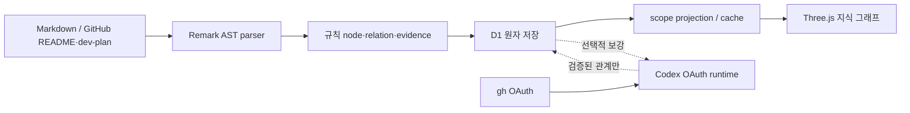

# AI Systems Atlas — 작업 핸드오프

작성일: `2026-08-10 KST`  
대상 저장소: `https://github.com/coreline-ai/memory_node_graph.git`  
기준 브랜치: `main` · 최종 이어받기 전 `git log -1 --oneline`과 이 문서의 배포 기록을 함께 확인

이 문서는 다른 작업 환경 또는 다른 작업자가 현재 프로젝트를 **안전하게 이어서 작업**할 수 있도록, 코드·데이터·실행 경계와 다음 우선순위를 정리한 정본이다.

---

## 1. 지금 바로 알아야 할 상태

| 항목 | 현재 상태 |
|---|---|
| Git | 기능 기준 `91eb9a3`, 공개 source 정책·snapshot 기준 `35cc2d8`까지 GitHub `main` push 완료. 최신 이어받기 commit은 `git log -1`로 확인한다. |
| 로컬 웹 서버 | 정적 QA는 `npm run preview:vercel`, 전체 로컬 앱은 `npm run dev:web`을 사용한다. |
| 최근 검증 | `npm test` **216 passed**, lint·TypeScript·공개 artifact·Vercel 정적 output 검사 통과. |
| GitHub CI | 배포 기준 `Public Atlas static checks` 성공: <https://github.com/coreline-ai/memory_node_graph/actions/runs/31639959848> |
| Clean clone | GitHub main clone에서 `npm ci`, 공개 검증, Vercel build 성공. |
| Vercel Production | <https://ai-systems-atlas.vercel.app> · `READY` · 로그인 없이 공개 · 실브라우저 QA 통과. |
| Vercel Preview | <https://ai-systems-atlas-8tb620h0y-corelines-projects-277c5e1c.vercel.app> · `READY`이나 팀 기본 SSO 보호로 로그인 없는 QA는 대기. |
| Git 자동 배포 | `2026-08-13` GitHub `main` push가 Production을 자동 생성했고 deployment metadata의 branch와 commit SHA 일치를 확인했다. |
| 기본 그래프 | Markdown 규칙 파싱만으로 동작하며 OAuth/LLM 없이도 조회 가능. |
| Codex 보강 | OAuth 기반 선택 기능. API Key/LightRAG/외부 RAG를 사용하지 않는다. |
| 마지막 UI 수정 | 스크롤바 다크 테마 및 루트 가로 스크롤 차단. `8dd4c71`. |

### 최근 핵심 커밋

| 커밋 | 내용 |
|---|---|
| `8dd4c71` | 전역 WebKit/Firefox 다크 스크롤바, `100vw` 제거, 대시보드 루트 가로 스크롤 차단 |
| `cf212fe` | 의미 앵커 기반 component 추출·chunk 문맥·관계 후보 점수 v2·후보 검토 UI |
| `b6942b0` | Codex/GitHub OAuth 통합 런타임·그래프 갱신 |

---

## 2. 빠른 시작과 안전한 실행 방식

```bash
cd /Volumes/Eprojects/project_202608/node_wiki
npm ci

# UI만 확인할 때 권장: Codex/GitHub 통합 런타임을 시작하지 않음
npm run dev:web

# 전체 테스트 (build + runtime TypeScript + tests)
npm test

# D1/OAuth/API 없이 공개 앱 빌드·확인
npm run graph:verify-public
npm run build:vercel
npm run preview:vercel
```

### 중요: `npm run dev`는 주의

`npm run dev`는 웹앱 뒤에 **통합 Codex/GitHub OAuth runtime**도 시작한다. 현재 provider의 queued enrichment job이 있으므로, 단순 화면 확인에는 `npm run dev:web`를 우선 사용한다.

- UI 주소: `http://localhost:3000/`
- 운영 대시보드: `http://localhost:3000/dashboard`
- OAuth 상태만 확인: `npm run verify:oauth`
- 규칙/그래프 감사: `npm run db:baseline && npm run graph:audit`

`.env.example`의 값은 선택적인 timeout/polling 조정이다. **OpenAI API Key, GitHub PAT, 별도 runtime token은 추가하지 않는다.**

### Vercel 공개 앱

- 진입점: `public-app/index.html`, `public-app/main.tsx`
- 빌드: `vite.public.config.ts` → `dist-vercel/`
- 배포 설정: `vercel.json`
- 데이터: `public/atlas/atlas-graph-snapshot.json`과 검증된 Gold snapshot
- CI: `.github/workflows/public-atlas-check.yml`
- 상세 절차: [`vercel-static-deployment.md`](./vercel-static-deployment.md)

이 target은 현재 Three.js GUI만 재사용하고 Vercel Function, D1, SQLite, `/api/*`, OAuth, 환경 변수를 사용하지 않는다. Public Corpus는 500노드·1,372 실제 관계·400 display 선이고, Gold 68/101 및 Max 500/2,000은 각각 검토 표본과 합성 데모로 표시한다.

---

## 3. 현재 로컬 D1 데이터 기준선

`npm run db:baseline`과 `npm run graph:audit`를 2026-08-13 KST에 다시 실행해 확인했다.

| 항목 | 현재 수량 |
|---|---:|
| GitHub 원본 저장소 | 111 |
| Markdown 문서 | 853 |
| 근거 block | 148,655 |
| 문서별 node/mention 합계 | 99,393 |
| 고유 entity | 89,669 |
| 저장 relation | 94,576 |
| 규칙 relation / Codex relation | 94,487 / 89 |
| enrichment job | 10,982 |
| `queued` / `completed` / `stale` / `warning` | 10,825 / 73 / 78 / 6 |
| 현재 Codex provider queued | 0 |
| legacy queued (자동 실행 금지) | 10,825 |

무결성은 `SQLite ok`, orphan 0, duplicate relation 0, staging row 0이다. 현재 fingerprint는 아래 값이다.

```text
736d816a546c01f1c154be9ade3b76b38931eeb55055c6f41be71d3d62c99ab0
```

### 데이터의 위치와 이동 시 주의점

- 개발 환경의 정본은 Cloudflare 원격 D1이 아니라 **로컬 Miniflare D1 SQLite**다.
- `.wrangler/`는 Git에 포함되지 않는다. 다른 머신으로 clone하면 이 853문서 데이터가 자동 복제되지 않는다.
- 다른 PC의 공개 읽기 전용 배포를 위해 `public/atlas/`에는 실제 D1에서 안전하게 선별한 500노드·2,000선 snapshot·manifest·SHA-256을 포함한다.
- 공개 snapshot은 현재 78개 공개 저장소·519문서에서 만든 53,377개 공개 전용 node·56,406개 저장 관계의 제한 투영이며, 원본 D1·전체 문서·evidence·OAuth/job 정보가 아니다.
- 다른 PC는 원본 D1 없이 `npm run graph:verify-public`로 이 artifact를 검증할 수 있다. 재생성에는 로컬 D1과 `gh` OAuth가 필요하다.
- `npm run build:vercel && npm run preview:vercel`로 공개 JSON 전용 GUI를 실행할 수 있다. 이 모드는 graph/document/revision API를 호출하지 않고 문서 관리와 세부 D1 scope를 노출하지 않는다.
- 현재 DB object 파일명은 기기별이므로 경로를 코드에 하드코딩하지 말고 `scripts/lib/local-d1.mjs` 및 `npm run db:baseline`으로 탐색한다.
- 실제 local corpus를 다른 작업 환경에서 이어야 하면, 원본 SQLite/백업을 **별도 안전 채널**로 전달하거나 GitHub collection flow를 명시적으로 다시 실행해야 한다. private repository metadata·근거가 포함될 수 있으므로 Git에 넣지 않는다.

---

## 4. 앱 구조와 핵심 진입점



| 책임 | 주요 파일 |
|---|---|
| 그래프 화면 | `app/knowledge-graph.tsx`, `app/graph/*`, `app/globals.css` |
| 대시보드 | `app/dashboard/dashboard-client.tsx`, `app/dashboard/dashboard.css` |
| graph API·scope 투영 | `app/api/graph/*`, `app/lib/graph/scope-projection.ts`, `app/lib/storage/graph-repository.ts` |
| Markdown 파싱 | `app/lib/markdown/parse-markdown.ts`, `extract-graph.ts`, `explicit-rules.ts`, `parser-profiles.ts` |
| D1 schema/migrations | `db/schema.ts`, `drizzle/0001_*` ~ `0016_*` |
| Codex job 계약·검증 | `app/lib/llm/enrichment-contracts.ts`, `enrichment-result-validator.ts`, `relationship-candidate-score.ts` |
| Codex 실행 | `server/codex/codex-engine.ts`, `server/runtime/*` |
| GitHub discovery/preview/apply | `server/github/github-source-engine.ts`, `app/lib/github/*`, `app/lib/storage/github-source-job-repository.ts` |

### 그래프 데이터 구분

- **실제 corpus**: D1의 89,669 entity / 94,576 relation에서 관계 중심 최대 500노드·2,000선을 화면에 투영한다.
- **Gold Graph**: 68노드·101관계의 온톨로지 검토 fixture다. 전체 corpus가 아니다.
- **Max density fixture**: 500노드·2,000선의 시각·성능용 fixture다. D1 사실 관계가 아니다.
- `display` edge는 시각 연결선일 뿐 D1, RAG, 사실 관계 수, 분석 지표에 저장되지 않는다.

---

## 5. OAuth·보안·작업 큐 경계

정본 문서: [`current-oauth-runtime.md`](./current-oauth-runtime.md)

- Codex는 공식 `@openai/codex-sdk` + 기존 `codex login` OAuth 세션만 사용한다.
- GitHub 수집은 로컬 `gh` OAuth keyring만 사용한다.
- 브라우저, D1 일반 테이블, 로그에 토큰·PAT·내부 IPC secret을 남기지 않는다.
- API Key, LightRAG, 외부 벡터 DB, 새 LLM dependency는 현재 정책 밖이다.
- public read와 인증된 write를 분리한다. 비공개 저장소 이름·경로·원문 링크를 공개 화면에 노출하지 않는다.

### 절대 자동 실행 금지 항목

1. legacy queued 10,825개를 current provider로 변환/claim/실행하지 않는다.
2. 853문서 전체 재처리나 GitHub 전체 apply를 사용자 승인 없이 시작하지 않는다.
3. Codex 보강 전에는 backup·restore check, 선택 job ID, 최대 job 수, timeout, 사후 audit을 제시한다.
4. 기존 Codex relation 89개를 삭제·복구·변경하지 않는다.

작업 runtime의 기본 정책은 `server/runtime/run-policy.ts`에 있다. 실제 selected run은 최대 25개까지 허용하지만, 관계 품질 검토에서는 **10개 이하**만 별도 승인 후 실행한다.

---

## 6. 의미 앵커 기반 관계 후보 v2

계획/결과 정본: [`../dev-plan/implement_20260808_234515.md`](../dev-plan/implement_20260808_234515.md)

### 완료된 구현

- `app/lib/llm/semantic-anchor-resolver.ts`
  - component, API, file, package/technology, Phase/Task를 현재 evidence block 안에서만 해석한다.
  - document/repository/section/generic heading은 endpoint가 될 수 없다.
- `app/lib/markdown/explicit-rules.ts`, `parser-profiles.ts`
  - 책임 문맥이 있는 `snake_case` 서비스명만 source-local component node로 승격한다.
  - GitHub parser version은 코드상 `remark-ast-github-*-5`다.
- `app/lib/llm/enrichment-contracts.ts`
  - chunk에 앵커 node를 일반 document/repository context보다 먼저 보존한다.
- `app/lib/llm/relationship-candidate-score.ts`
  - high는 양쪽 resolved anchor, 명시 동사, ontology 방향, 현재 evidence, non-duplicate를 모두 요구한다.
- `/api/enrichment-jobs/candidates` 및 dashboard 패널
  - `source → relation → target`이 결정된 경우에만 최소 정보로 표시한다.
  - `high`만 선택 가능하고 UI는 최대 10개 실행 **미리보기**만 만든다.

### 당시 후보 감사 결과와 현재 해석

2026-08-08 당시 current provider queued 68개를 읽기 전용 재점수화한 결과는 아래와 같았다.

| high | review | excluded | resolved pair |
|---:|---:|---:|---:|
| 0 | 64 | 4 | 0 |

앵커는 53개 중 21개만 당시 job input node로 해석됐고 32개는 미해결이었다. 이것은 점수 임계값 문제가 아니라 **현 D1이 parser v4로 이미 생성된 상태**이기 때문이다. 2026-08-13 최종 감사에서는 current provider queued가 `0`이므로 이 68개를 다시 실행할 대기 작업으로 해석하면 안 된다. 코드의 v5 parser는 다음 승인된 reindex/new job부터 적용된다.

따라서 다음 구현/운영 단계는 아래 순서여야 한다.

1. v5 parser가 실제로 필요로 하는 문서/저장소 범위를 사용자와 확정한다.
2. backup + restore check와 preview/dry-run을 남긴다.
3. 승인된 최소 범위만 reindex해 v5 component/API node와 새 enrichment input을 만든다.
4. candidates API를 읽기 전용으로 다시 확인한다.
5. `high`가 생긴 경우에만 10개 이하를 별도 승인받아 실행하고 D1 audit을 비교한다.

점수 threshold를 낮추거나 구조 relation을 Codex로 다시 만들면 안 된다.

---

## 7. 역사 문서 해석 원칙

과거 dev-plan과 `local-d1-baseline.md`의 날짜별 영수증은 당시 실행 기록이므로 이전 수량을 그대로 보존한다. 현재 구현·운영 판단에는 이 handoff의 2026-08-13 기준선과 `npm run db:baseline`의 실제 출력을 우선한다.

- 현재 D1: 853문서 · 89,669 entity · 94,576 relation(규칙 94,487 / Codex 89)
- 현재 job: legacy queued 10,825 · completed 73 · stale 78 · warning 6
- 현재 fingerprint: `736d816a546c01f1c154be9ade3b76b38931eeb55055c6f41be71d3d62c99ab0`
- 공개 정적 snapshot: 500노드 · 1,372 factual + 400 display · SHA-256 `8fcc13b2...d2`

---

## 8. 검증 명령

```bash
# 전체 회귀: build + server runtime TypeScript + 216 tests
npm test

# 정적 검사
npm run lint
npx tsc --noEmit
git diff --check

# 로컬 D1 읽기 전용 감사
npm run db:baseline
npm run graph:audit
```

`npm test` 로그의 의도된 failure scenario 출력(예: test fixture의 `[github-source-api] unhandled Error`)은 테스트가 이를 검증하는 과정에서 나오는 것이며, 최종 결과가 `pass 216 / fail 0`이면 정상이다.

---

## 9. 이어서 작업할 때 권장 프롬프트

```text
프로젝트: /Volumes/Eprojects/project_202608/node_wiki
먼저 docs/HANDOFF_20260810.md, docs/current-oauth-runtime.md,
dev-plan/implement_20260808_234515.md, docs/knowledge-graph-ontology-v1.md를 읽어라.

현재 main HEAD는 8dd4c71이며 local D1은 Git에 포함되지 않는다.
화면 확인만 필요하면 npm run dev:web를 사용하고 npm run dev로 runtime을 자동 시작하지 마라.

OpenAI API Key, LightRAG, 외부 RAG/벡터 DB를 도입하지 않는다.
legacy 10,825 queued job, 전체 853문서 재처리, Codex job claim/D1 write는
명시적인 사용자 승인·backup·restore check·bounded job list 없이는 수행하지 마라.

현재 parser 코드는 v5지만 D1 corpus는 v4다. 관계 후보 v2의 high 0은
threshold 문제가 아니라 기존 job input의 resolved anchor pair 부족이다.
다음 변경 전 npm run db:baseline과 npm run graph:audit으로 기준선을 확인하고,
변경 후 npm test, npm run lint, npx tsc --noEmit, git diff --check을 실행하라.
```

---

## 10. 관련 문서

- [`README.md`](../README.md) — 제품 개요·화면·기능
- [`current-oauth-runtime.md`](./current-oauth-runtime.md) — OAuth/runtime 경계
- [`knowledge-graph-ontology-v1.md`](./knowledge-graph-ontology-v1.md) — relation type·방향·근거 계약
- [`local-d1-baseline.md`](./local-d1-baseline.md) — 로컬 D1 backup/audit 절차
- [`public-graph-snapshot.md`](./public-graph-snapshot.md) — 공개 JSON 계약·SHA·갱신
- [`vercel-static-deployment.md`](./vercel-static-deployment.md) — 정적 배포·QA·rollback
- [`../dev-plan/implement_20260810_213534.md`](../dev-plan/implement_20260810_213534.md) — Phase 1~6 정본 계획
- [`../dev-plan/implement_20260808_222109.md`](../dev-plan/implement_20260808_222109.md) — 후보 선별 실행 계획
- [`../dev-plan/implement_20260808_234515.md`](../dev-plan/implement_20260808_234515.md) — 의미 앵커 v2 구현·검증 기록
