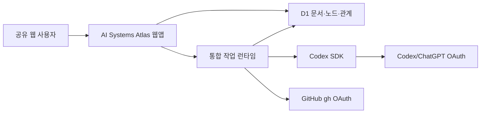
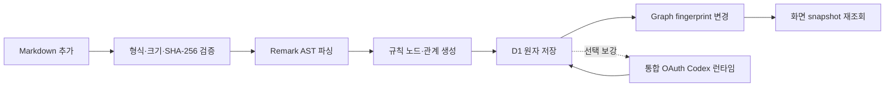

# 현재 OAuth 통합 런타임

최근 업데이트: `2026-08-13 KST`

이 문서는 AI Systems Atlas의 현재 인증·실행·Markdown 갱신 구조의 정본이다. 과거 계획은 당시 개발 이력으로 보존하며, 새 변경 판단은 이 문서와 [최신 구현 계획](../dev-plan/implement_20260807_220621.md)을 우선한다.

## 확정 요구사항

- OpenAI 유료 API·API Key와 LightRAG를 사용하지 않는다.
- Codex 관계 보강과 Graph RAG 답변은 `@openai/codex-sdk` 및 기존 Codex/ChatGPT OAuth 로그인 세션으로 실행한다.
- GitHub 문서 읽기는 로컬 `gh` OAuth keyring 세션으로 실행한다.
- `npm run dev` 한 번으로 웹앱과 Codex·GitHub 작업 런타임을 함께 시작한다.
- 브라우저·D1·로그에는 OAuth 토큰, GitHub PAT, 내부 IPC secret을 저장하거나 노출하지 않는다.
- OAuth가 만료되면 `로그인 필요` 또는 `재로그인 필요`로 안내한다.
- OAuth가 사용할 수 없어도 규칙 기반 Markdown 그래프의 저장·조회는 정상 동작한다.

## 용어 경계

`API를 사용하지 않는다`는 OpenAI 유료 API·API Key 기반 모델 호출을 사용하지 않는다는 의미다. 문서 업로드, D1 저장, 그래프 조회, 작업 제어를 위한 Atlas 내부 HTTP Route는 유지한다.

## 실행 구조

| 구분 | 현재 동작 |
|---|---|
| 사용자 실행 | `npm run dev` 한 번 |
| Codex 인증 | 로컬 `codex login` OAuth |
| GitHub 인증 | 로컬 `gh auth` OAuth keyring |
| 작업 실행 | `server/runtime` singleton poller |
| 상태 Route | `/api/runtime/codex/status`, `/api/runtime/github/status` |
| 내부 상태 기록 | `runtime_status`, `github_runtime_status` |
| OpenAI API Key | 사용하지 않음 |

- 공유 웹의 서버 런타임은 Codex 프로세스와 OAuth 세션을 안전하게 보관할 수 있는 상시 Node 환경이어야 한다.
- Cloudflare 정적 배포 또는 Worker-only 환경은 Codex CLI 프로세스를 직접 실행할 수 없으므로 이 로컬 OAuth 실행 구조의 단독 호스트가 될 수 없다.
- D1 작업 큐, Lease, 결과 검증, 인용 재검증은 장애 복구와 무결성을 위해 유지한다.

## Markdown 추가·갱신 흐름

1. `.md`·`.mdx` 파일을 검증하고 SHA-256으로 중복을 확인한다.
2. 규칙 기반 파서가 문서·섹션·개념·Phase·Task·명시 관계와 근거 블록을 생성한다.
3. 문서 단위로 D1에 원자 저장한다. 실패하면 이전 정상 그래프를 보존한다.
4. graph revision이 바뀌면 corpus cache를 무효화한다.
5. 열린 그래프 화면은 cross-tab 알림과 5초 revision polling으로 새 snapshot을 요청한다.
6. 선택적 Codex 보강이 실패해도 규칙 기반 결과는 되돌리지 않는다.
7. 전체 D1 데이터는 보존하고 기본 화면에는 관계 중심 최대 500노드·2,000선을 투영한다.

## UI 상태 계약

| 상태 | 의미 | 사용자 동작 |
|---|---|---|
| `OAuth 연결됨` | 해당 OAuth 세션 사용 가능 | 없음 |
| `로그인 필요` | 최초 OAuth 승인 필요 | 로그인 시작 |
| `문서 분석 중` | 규칙 기반 파싱·저장 중 | 진행률 확인 |
| `관계 보강 중` | Codex SDK가 근거 관계 분석 중 | 취소 가능 |
| `완료` | 규칙 그래프 또는 보강까지 반영됨 | 그래프 열기 |
| `재로그인 필요` | OAuth 만료·철회 | 다시 로그인 |
| `실패` | 문서 또는 작업 실패 | 원인 확인·재시도 |

상태 API는 토큰·세션 원문 없이 `connected`, `login_required`, `reauth_required`, `running`, `failed`, `forbidden`, `rate_limited`, `unavailable`만 반환한다.

## 구현 결과

- `server/codex`: 구조화 출력, 근거 검증, OAuth preflight를 담당한다.
- `server/github`: 읽기 전용 GitHub 명령, discovery·preview·apply, Blob SHA 재검증을 담당한다.
- `server/runtime`: singleton lock, claim·lease·timeout·retry·cancel, graceful shutdown, 상태 동기화를 담당한다.
- 통합 런타임은 `atlas-integrated-github-runtime-1`과 `codex-sdk-0.146.0+atlas-runtime.1` generation만 claim한다. 과거 대기열은 자동 소비하지 않는다.
- 프로세스 내부 secret은 실행 시 생성되고, Codex·GitHub 자식 환경에서 제거된다.
- 공개 상태 Route는 인증 상태와 작업 상태만 공개하며, 계정명·저장소명·경로·원문 링크를 포함하지 않는다.

## 현재 데이터 기준선

- Markdown 문서: 853개
- 저장소: 111개
- 근거 블록: 148,655개
- 고유 엔티티: 89,669개
- 저장 관계: 94,576개 (규칙 94,487 · 검증된 Codex 89)
- 기본 corpus 투영: 최대 500노드·2,000선
- 무결성: orphan 0 · 중복 관계 0 · stage row 0 · SQLite `ok`
- enrichment job: 완료 73 · legacy queued 10,825 · stale 78 · warning 6
- data fingerprint: `736d816a546c01f1c154be9ade3b76b38931eeb55055c6f41be71d3d62c99ab0`

이 기준선은 런타임 전환 중 데이터 회귀 확인용이다. 문서 증분 동기화 또는 재처리 후에는 `npm run db:baseline` 결과로 갱신한다.

## 보안 원칙

- OAuth 토큰·쿠키·원문 전체를 브라우저 번들, D1 일반 테이블, 로그, 작업 영수증에 남기지 않는다.
- 공개 그래프 읽기와 인증된 쓰기·저장소 동기화를 분리한다.
- 비공개 저장소 이름·경로·원문 링크는 인증되지 않은 공유 화면에서 숨긴다.
- Codex 출력은 허용 노드, relation ontology, source block evidence, citation ID로 재검증한다.
- OAuth 실패·프로세스 재시작·작업 timeout에서도 기존 규칙 그래프를 보존한다.
