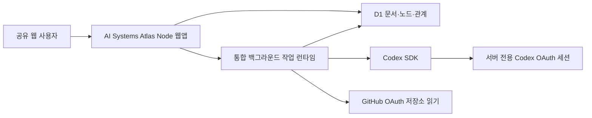
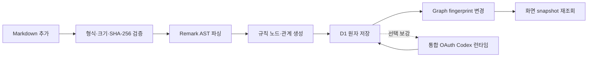

# 현재 OAuth 런타임 방향

작성 일시: `2026-08-07 20:35:34 KST`

최근 업데이트: `2026-08-07 KST` — GitHub 스타일 README와 현재 앱 스크린샷 기준선을 추가했다. 현재 `NO SIGNAL` 화면은 분리형 Connector 구현 이력이며 목표 UI가 아님을 README와 [스크린샷 카탈로그](./screenshots/README.md)에 명시했다.

이 문서는 AI Systems Atlas의 인증·Codex 실행·Markdown 갱신 구조에 관한 현재 정본이다. 과거 개발 계획의 Connector 설명은 구현 이력으로 보존하지만, 이후 변경 판단은 이 문서와 `dev-plan/implement_20260807_203534.md`를 우선한다.

## 확정 요구사항

- OpenAI API와 OpenAI API Key를 사용하지 않는다.
- `OPENAI_API_KEY`, `LIGHTRAG_API_KEY`를 요구하지 않는다.
- Codex 관계 보강과 Graph RAG 답변은 `@openai/codex-sdk`가 Codex/ChatGPT OAuth 로그인 세션을 사용해 실행한다.
- 사용자가 별도 터미널에서 `npm run connector:start`를 계속 실행하지 않게 한다.
- 대시보드에서 Connector heartbeat와 `NO SIGNAL`을 제거한다.
- OAuth가 만료되면 장치 신호 오류가 아니라 `로그인 필요` 또는 `재로그인 필요`로 표시한다.
- OAuth나 Codex가 실패해도 규칙 기반 Markdown 그래프는 정상 저장·조회한다.

## 용어 경계

`API를 사용하지 않는다`는 요구는 OpenAI 유료 API·API Key 기반 모델 호출을 사용하지 않는다는 의미다. 브라우저와 서버가 통신하기 위한 Atlas 내부 HTTP Route, D1 저장 접근, GitHub OAuth가 승인한 저장소 읽기 경로까지 제거한다는 의미가 아니다. 웹앱은 내부 Route 없이 업로드·저장·조회·권한 검증을 수행할 수 없다.

## 현재 구현과 목표

| 구분 | 현재 구현 | 승인된 목표 |
|---|---|---|
| Codex 인증 | 로컬 `codex login` OAuth | 서버 전용 Codex/ChatGPT OAuth 세션 |
| Codex 실행 | 별도 Atlas Connector | 웹앱 배포 단위의 통합 작업 런타임 |
| 사용자 실행 | `npm run connector:start` 필요 | 별도 실행 불필요 |
| 상태 표시 | ONLINE/OFFLINE/NO SIGNAL | OAuth 연결됨/로그인 필요/처리 중/완료/재로그인 필요 |
| OpenAI API Key | 사용하지 않음 | 사용하지 않음 |
| 규칙 기반 파싱 | Connector 없이 가능 | 동일하게 항상 가능 |
| GitHub 인증 | 로컬 `gh auth` | 별도 GitHub OAuth 서버 세션 |

## 목표 배포 구조

- 브라우저에는 Codex·GitHub 액세스 토큰을 전달하지 않는다.
- 공유 웹의 서버 런타임은 Codex 프로세스 실행과 OAuth 세션의 안전한 영속화가 가능한 상시 Node 환경이어야 한다.
- Cloudflare 정적 배포 또는 Worker-only 환경은 Codex CLI 프로세스를 직접 실행할 수 없으므로 최종 단독 런타임으로 사용하지 않는다.
- D1 작업 큐, Lease, 결과 검증, 인용 재검증은 장애 복구와 무결성을 위해 내부 구현으로 유지할 수 있지만 외부 Connector heartbeat 개념은 제거한다.

## Markdown 추가·갱신 흐름

1. `.md`·`.mdx` 파일을 검증하고 SHA-256으로 중복 여부를 확인한다.
2. 규칙 기반 파서가 문서·섹션·개념·Phase·Task·명시 관계와 근거 블록을 생성한다.
3. 문서 단위로 D1에 원자 저장하며 실패하면 이전 정상 그래프를 유지한다.
4. 문서·엔티티·관계 fingerprint가 바뀌면 corpus cache를 무효화한다.
5. 열린 그래프 화면은 작업 완료 이벤트 또는 짧은 상태 polling 후 새 snapshot을 요청한다.
6. 선택적 Codex 보강은 통합 OAuth 런타임에서 처리하고, 실패하더라도 1~5단계 결과를 되돌리지 않는다.
7. 전체 D1 노드는 보존하되 기본 화면은 관계 중심 최대 500노드·2,000선 투영을 유지한다.

## UI 상태 계약

| 상태 | 의미 | 사용자 동작 |
|---|---|---|
| `OAuth 연결됨` | 서버 OAuth 세션 사용 가능 | 없음 |
| `로그인 필요` | 최초 OAuth 승인 필요 | 로그인 시작 |
| `문서 분석 중` | 규칙 기반 파싱·저장 중 | 진행률 확인 |
| `관계 보강 중` | Codex SDK가 근거 관계 분석 중 | 취소 가능 |
| `완료` | 규칙 그래프 또는 보강까지 반영됨 | 그래프 열기 |
| `재로그인 필요` | OAuth 만료·철회 | 다시 로그인 |
| `실패` | 문서 또는 작업 실패 | 원인 확인·재시도 |

`NO SIGNAL`, Connector 온라인 여부, heartbeat 시간, `npm run connector:start` 복구 문구는 목표 UI에 표시하지 않는다.

## 보안 원칙

- OAuth 토큰·쿠키·원문 전체를 브라우저 번들, D1 일반 테이블, 로그, 작업 영수증에 남기지 않는다.
- 공개 그래프와 인증된 쓰기·저장소 동기화를 분리한다.
- 비공개 저장소 이름·경로·원문 링크는 인증되지 않은 공유 화면에서 숨긴다.
- Codex 출력은 기존 허용 노드, relation ontology, source block evidence, citation ID로 다시 검증한다.
- OAuth 실패·프로세스 재시작·작업 timeout에서 기존 규칙 그래프를 보존한다.

## 현재 데이터 기준선

- Markdown 문서: 853개
- 저장소: 111개
- 근거 블록: 148,655개
- 고유 엔티티: 89,669개
- 저장 관계: 94,488개
- 기본 corpus 투영: 최대 500노드·2,000선

이 수치는 런타임 전환 전 데이터 회귀 기준이며, 문서 증분 동기화 또는 재처리 후에는 감사 결과로 갱신한다.

## 시각 기준선

- 전체 corpus 별자리·성운, overview 궤도, repository, Gold, max fixture를 캡처했다.
- 대시보드는 overview, 저장소 반영, 대상 파일, 문서 라이브러리, 인덱싱 상태를 분할 캡처했다.
- 현재 화면 목록과 재촬영 조건은 [스크린샷 카탈로그](./screenshots/README.md)를 따른다.
- 통합 OAuth 런타임 Phase 5 완료 후 `NO SIGNAL`이 없는 대시보드로 다시 촬영한다.
