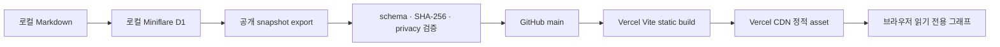

# Vercel 공개 정적 배포

작성일: `2026-08-10 KST`

이 문서는 Cloudflare D1, SQLite, OAuth, API Key, Vercel Function 없이 AI Systems Atlas의 공개 읽기 전용 그래프를 Vercel에 배포하고 갱신·복구하는 절차의 정본이다.

## 배포 경계



- 원본 D1과 OAuth는 **snapshot을 만드는 로컬 승인 환경**에만 존재한다.
- Vercel은 `public/atlas/*.json`을 정적 파일로 제공한다.
- 공개 브라우저는 `/atlas/atlas-graph-snapshot.json`과 manifest만 읽으며 `/api/*`를 호출하지 않는다.
- 문서 업로드·삭제·재색인·GitHub Apply·Codex job은 공개 배포에 포함하지 않는다.
- Vercel 환경 변수, DB 연결, Function은 모두 `0`개가 정상 상태다.

## 공개 데이터 구분

| 데이터 | 용도 | 수량 | 사실성 |
|---|---|---:|---|
| Public Corpus | 공개 Markdown에서 만든 실제 관계 투영 | 500노드 · 1,495 실제 관계 + 505 display 선 | 실제 관계와 시각선 분리 |
| Gold Graph | 온톨로지 품질 검토 표본 | 68노드 · 101관계 | 전체 corpus 아님 |
| Max Density | 렌더링·시각 성능 데모 | 500노드 · 2,000선 | 합성 fixture |

Public Corpus snapshot SHA-256:

```text
dbbafdc40f25bc02fd39a8ae6ee3b300c8473ef5498f669fba9c6f76aba065c7
```

Gold Graph snapshot SHA-256:

```text
9b41847f7938dc03934753776af9cf297294997d826c4c73c0c914ba2ed2b336
```

## 다른 PC에서 빌드

원본 D1, GitHub/Codex OAuth, `.env`가 필요하지 않다.

```bash
git clone https://github.com/coreline-ai/memory_node_graph.git
cd memory_node_graph
npm ci
npm run graph:verify-public
npm run build:vercel
npm run preview:vercel
```

기본 preview 주소는 `http://localhost:4173/`이다. `/dashboard`와 임의 직접 경로도 공개 그래프로 안전하게 연결된다.

## Vercel 프로젝트 설정

### GitHub 연동

1. Vercel에서 `coreline-ai/memory_node_graph` 저장소를 Import한다.
2. Production branch를 `main`으로 선택한다.
3. Root Directory는 저장소 루트로 둔다.
4. Framework Preset은 `Other` 또는 저장소의 `vercel.json` 자동 설정을 사용한다.
5. 환경 변수는 추가하지 않는다.

`vercel.json`의 정본 값:

| 항목 | 값 |
|---|---|
| Install Command | `npm ci` |
| Build Command | `npm run build:vercel` |
| Output Directory | `dist-vercel` |
| Runtime Functions | 없음 |

PR/비-main branch push는 Preview, `main` push는 Production으로 운영한다. 배포 전에 GitHub Actions의 `Public Atlas static checks`가 성공해야 한다.

### CLI 배포

Vercel 로그인이 이미 되어 있는 환경에서는 다음을 사용할 수 있다.

```bash
# 최초 1회 프로젝트 연결 또는 Preview
npx vercel@latest --yes

# Production
npx vercel@latest --prod --yes
```

CLI가 로그인 또는 scope 선택을 요구하면 브라우저 인증 후 다시 실행한다. 인증이 없다는 이유로 token을 저장소나 `.env`에 추가하지 않는다.

## 빌드 검증

```bash
npm run graph:verify-public-sources
npm run graph:verify-public
npm run graph:verify-public-fixtures
npm run build:vercel
npm run lint
npx tsc --noEmit
npm test
git diff --check
```

`scripts/verify-vercel-static-output.mjs`는 다음을 발견하면 빌드를 실패시킨다.

- snapshot 누락, schema/SHA-256/수량 불일치
- Vercel Function, `api`, `server`, `.wrangler` 경로
- SQLite/DB 파일, source map, private key, token, 로컬 절대경로
- Cloudflare runtime, D1 client, Drizzle DB client, Codex SDK, 내부 `/api/*` 호출이 포함된 브라우저 bundle

GitHub Actions는 커밋된 snapshot을 **검증만** 한다. Actions에서 원본 D1 snapshot을 생성하거나 수정하지 않는다.

## Markdown 추가 후 공개 데이터 갱신

```bash
# 1. 승인된 Markdown을 로컬 앱/D1에 반영
# 2. 쓰기 전후 기준선과 관계 무결성 확인
npm run db:baseline
npm run graph:audit

# 3. 공개 source 정책·D1 기준선·export·검증
npm run graph:prepare-public

# 4. 공개 diff와 정적 build 검토
git diff -- public/atlas config/public-graph-sources.json
npm run build:vercel

# 5. 승인된 변경만 commit/push
git add public/atlas config/public-graph-sources.json
git commit -m "data: refresh public graph snapshot"
git push github main
```

`graph:export-public` 결과가 `mode: unchanged`이면 D1 fingerprint와 공개 source 정책이 동일하므로 데이터 파일 커밋과 불필요한 재배포를 생략할 수 있다. 문서를 추가·삭제하면 provenance 안전성을 다시 고정하기 위해 revision과 checksum이 갱신될 수 있으며, 최종 D1 상태를 원복한 뒤 다시 export하면 기존 checksum으로 복구된다.

## 배포 후 QA

- 로그인 없이 Public Corpus가 `500 노드 / 2,000 관계`로 표시된다.
- 공개 원본 `53,377노드 / 56,341관계`와 화면 투영이 구분된다.
- Gold는 `68/101`, Max Density는 `500/2,000 DEMO`로 표시된다.
- 검색·필터·노드 선택·별자리·성운·궤도·pan·zoom·발광·커스텀이 동작한다.
- 360px, 768px, 1280px에서 페이지 가로 스크롤이 없고 커스텀 메뉴와 데이터 메뉴가 화면 안에 있다.
- 네트워크에는 정적 HTML/JS/CSS/이미지와 `/atlas/*`만 있고 `/api/*`, OAuth, D1, DB 요청이 없다.
- 브라우저 콘솔에 uncaught error가 없다.

## Rollback

### Git 기준 복구

1. Vercel에서 정상 동작하던 Production deployment가 가리키는 Git commit을 확인한다.
2. 현재 `main`을 강제 reset하지 않는다.
3. 문제 commit을 `git revert <commit>`으로 되돌리는 새 commit을 만든다.
4. 검증 명령을 모두 통과한 뒤 `main`에 push한다.
5. 새 Production이 이전 snapshot SHA-256과 GUI를 복구했는지 확인한다.

### Vercel 즉시 복구

Vercel Deployments에서 직전 정상 Production을 선택해 **Promote to Production**한다. 이후 Git 정본도 반드시 revert commit으로 일치시킨다.

## 문제 해결

| 증상 | 확인·조치 |
|---|---|
| snapshot SHA 오류 | JSON만 수정하지 말고 로컬 승인 환경에서 `graph:prepare-public`을 다시 실행한다. |
| Gold drift 오류 | `npm run graph:export-public-fixtures` 후 diff를 검토한다. CI에서는 생성하지 않는다. |
| 정적 화면이 ERROR | `/atlas/atlas-graph-snapshot.json`과 manifest 응답·cache를 확인한다. fixture fallback은 사용하지 않는다. |
| `/dashboard` 직접 접근 404 | 프로젝트가 저장소 루트의 `vercel.json`을 사용하고 있는지 확인한다. |
| Function이 생성됨 | Vercel Build Command와 Output Directory가 각각 `build:vercel`, `dist-vercel`인지 확인한다. |
| 로컬 build와 결과가 다름 | Node `22.14.0+`, lockfile 기반 `npm ci`, 환경 변수 없음 조건을 맞춘다. |

## 현재 배포 기록

| 항목 | 현재 기록 |
|---|---|
| 기능 구현 commit | `1998f9bb65627b7b7df2cea764d60514535205c1` |
| CI 최종 commit | `734fdc7259174359ba24bca279d0f45e8161ac15` |
| GitHub main push | 완료 |
| GitHub Actions | [Public Atlas static checks · success](https://github.com/coreline-ai/memory_node_graph/actions/runs/31395439664) |
| Clean clone | `npm ci && npm run graph:verify-public && npm run build:vercel` 성공 |
| Vercel CLI 인증 | `hwanchoiganda-7455` 계정 확인 |
| Vercel Preview/Production | 외부 프로젝트 업로드에 대한 실행 승인이 없어 미생성 |

실제 Preview/Production URL은 아직 없다. URL이 없는 현재 상태를 외부 배포 완료로 보고하지 않으며, 사용자가 Vercel 외부 업로드를 명시적으로 승인한 다음 이 기록을 갱신한다.
